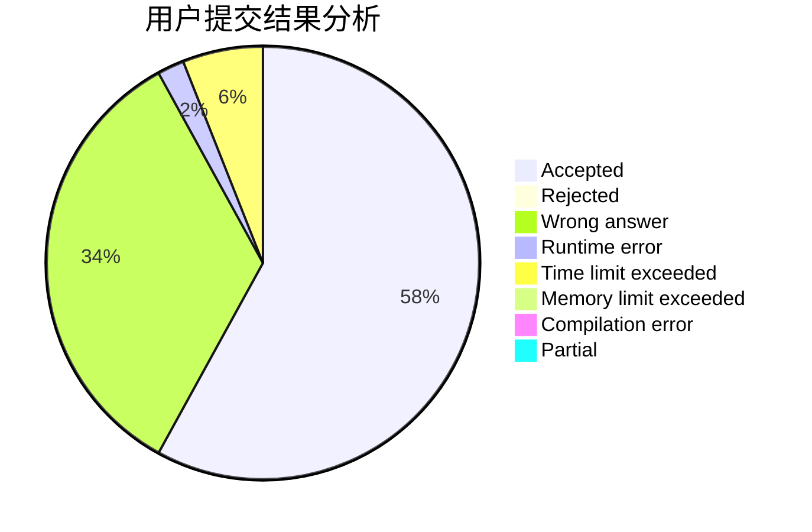
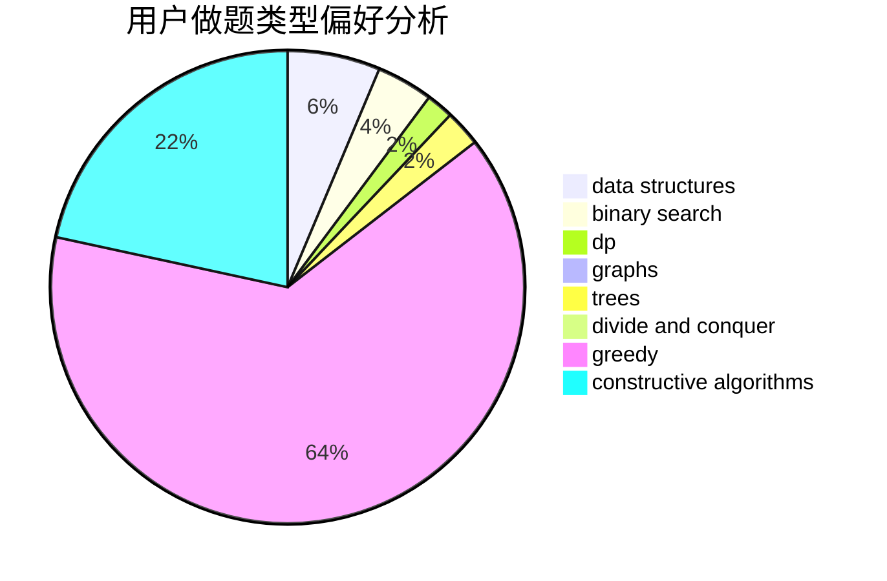
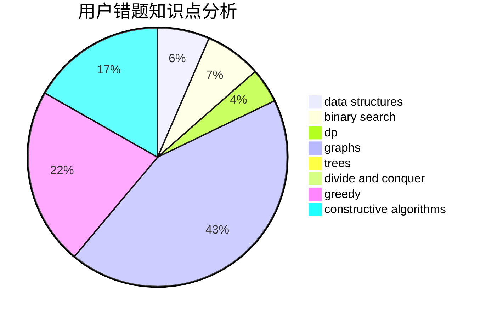

# changzi

<!-- tabs:start -->

#### **用户提交结果分析**

#### **用户做题类型偏好分析**

#### **用户错题知识点分析**

<!-- tabs:end -->
# 推荐题目
[156C](https://codeforces.com/contest/156/problem/C)		combinatorics,
                        dp		  
[1146D](https://codeforces.com/contest/1146/problem/D)		dfs and similar,
                        math,
                        number theory		  
[6E](https://codeforces.com/contest/6/problem/E)		binary search,
                        data structures,
                        dsu,
                        trees,
                        two pointers		  
[1071A](https://codeforces.com/contest/1071/problem/A)		dsu,graphs,sortings,trees		  
[53A](https://codeforces.com/contest/53/problem/A)		implementation		  
[367D](https://codeforces.com/contest/367/problem/D)		bitmasks,
                        dfs and similar		  
[620A](https://codeforces.com/contest/620/problem/A)		implementation,
                        math		  
[1313C1](https://codeforces.com/contest/1313C/problem/1)		brute force,
                        data structures,
                        dp,
                        greedy		  
[717I](https://codeforces.com/contest/717/problem/I)		geometry		  
[149E](https://codeforces.com/contest/149/problem/E)		string suffix structures,
                        strings		  
