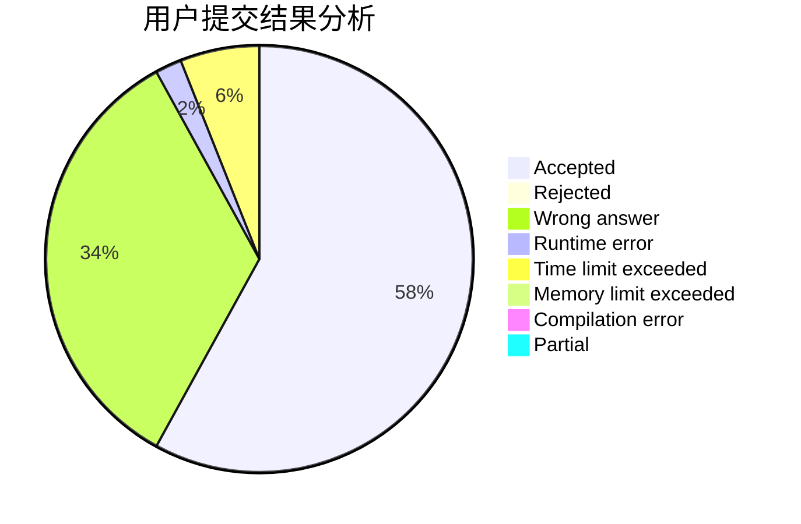
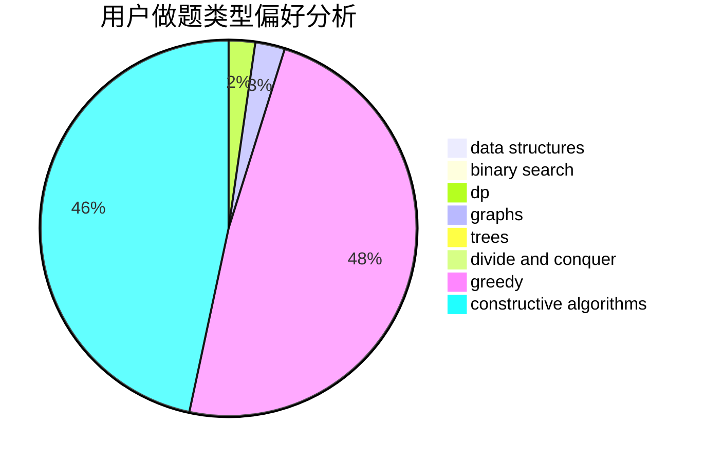
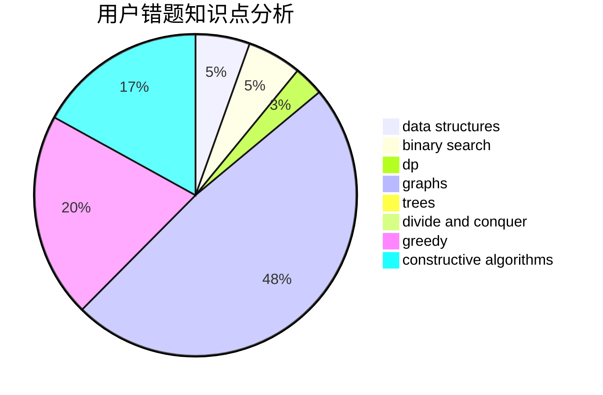

# changzi

<!-- tabs:start -->

#### **用户提交结果分析**

#### **用户做题类型偏好分析**

#### **用户错题知识点分析**

<!-- tabs:end -->
# 推荐题目
[1771](https://codeforces.com/contest/177/problem/1)		dsu,graphs,sortings,trees		  
[1148D](https://codeforces.com/contest/1148/problem/D)		greedy,
                        sortings		  
[717I](https://codeforces.com/contest/717/problem/I)		geometry		  
[1071D](https://codeforces.com/contest/1071/problem/D)		dsu,graphs,sortings,trees		  
[55D](https://codeforces.com/contest/55/problem/D)		dp,
                        number theory		  
[398C](https://codeforces.com/contest/398/problem/C)		constructive algorithms		  
[643D](https://codeforces.com/contest/643/problem/D)		nan		  
[1322F](https://codeforces.com/contest/1322/problem/F)		dp,
                        trees		  
[735C](https://codeforces.com/contest/735/problem/C)		combinatorics,
                        constructive algorithms,
                        greedy,
                        math		  
[1510A](https://codeforces.com/contest/1510/problem/A)		nan		  
