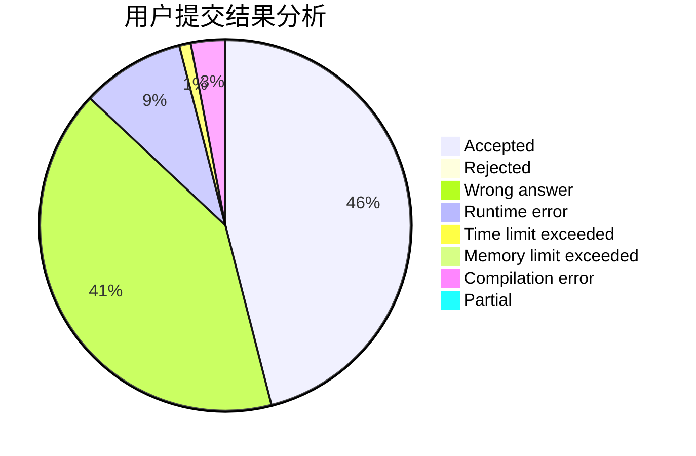
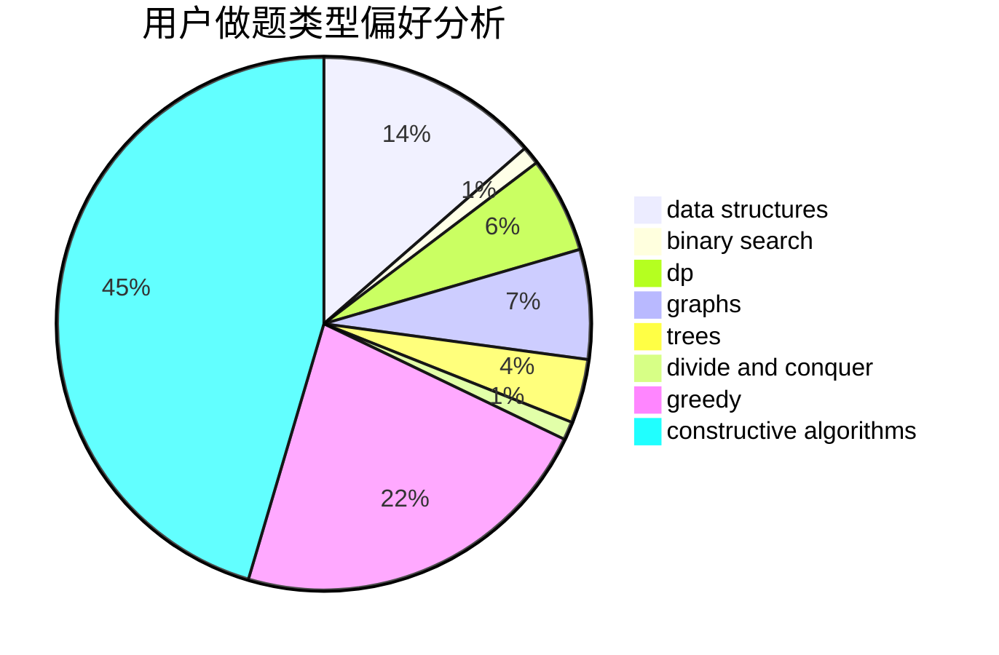
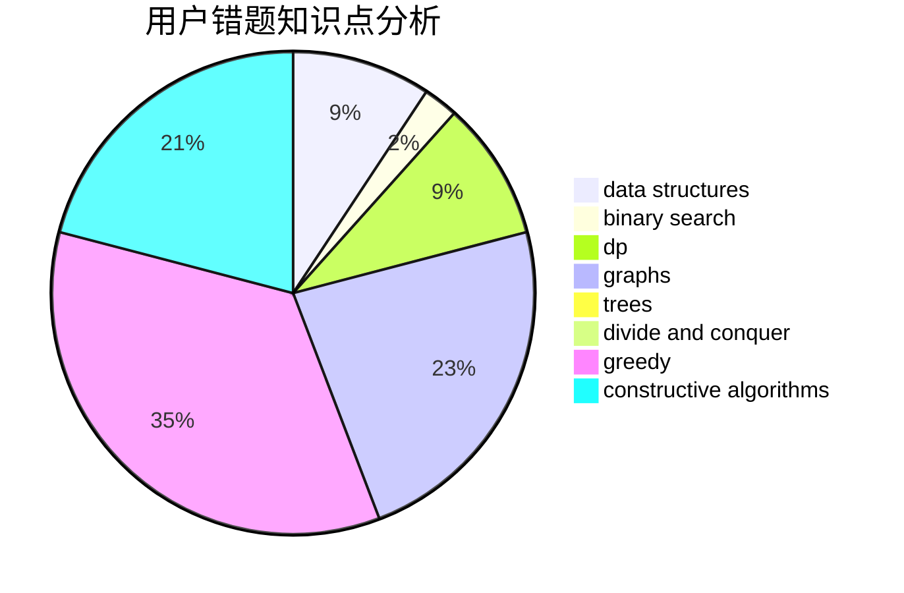

# charlie_wang

<!-- tabs:start -->

#### **用户提交结果分析**

#### **用户做题类型偏好分析**

#### **用户错题知识点分析**

<!-- tabs:end -->
# 推荐题目
[600D](https://codeforces.com/contest/600/problem/D)		geometry		  
[1147A](https://codeforces.com/contest/1147/problem/A)		graphs		  
[13992](https://codeforces.com/contest/1399/problem/2)		dsu,graphs,sortings,trees		  
[710E](https://codeforces.com/contest/710/problem/E)		dfs and similar,
                        dp		  
[34C](https://codeforces.com/contest/34/problem/C)		expression parsing,
                        implementation,
                        sortings,
                        strings		  
[899F](https://codeforces.com/contest/899/problem/F)		data structures,
                        strings		  
[660D](https://codeforces.com/contest/660/problem/D)		geometry		  
[741A](https://codeforces.com/contest/741/problem/A)		dfs and similar,
                        math		  
[1103D](https://codeforces.com/contest/1103/problem/D)		bitmasks,
                        dp		  
[494E](https://codeforces.com/contest/494/problem/E)		data structures,
                        games		  
