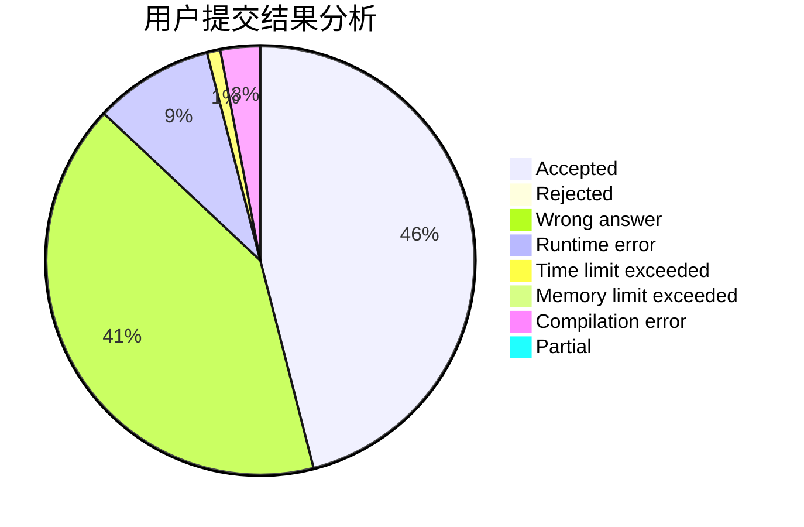
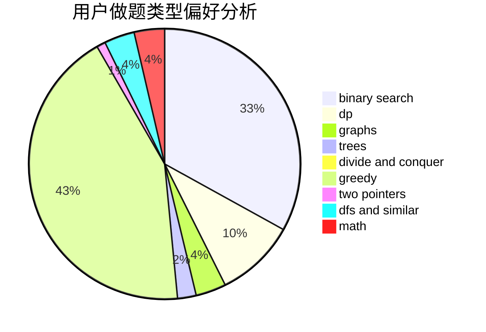

# charlie_wang

<!-- tabs:start -->

#### **用户提交结果分析**

#### **用户做题类型偏好分析**

<!-- tabs:end -->
# 推荐题目
[600D](https://codeforces.com/contest/600/problem/D)
[1147A](https://codeforces.com/contest/1147/problem/A)
[13992](https://codeforces.com/contest/1399/problem/2)
[710E](https://codeforces.com/contest/710/problem/E)
[34C](https://codeforces.com/contest/34/problem/C)
[899F](https://codeforces.com/contest/899/problem/F)
[660D](https://codeforces.com/contest/660/problem/D)
[741A](https://codeforces.com/contest/741/problem/A)
[1103D](https://codeforces.com/contest/1103/problem/D)
[494E](https://codeforces.com/contest/494/problem/E)
