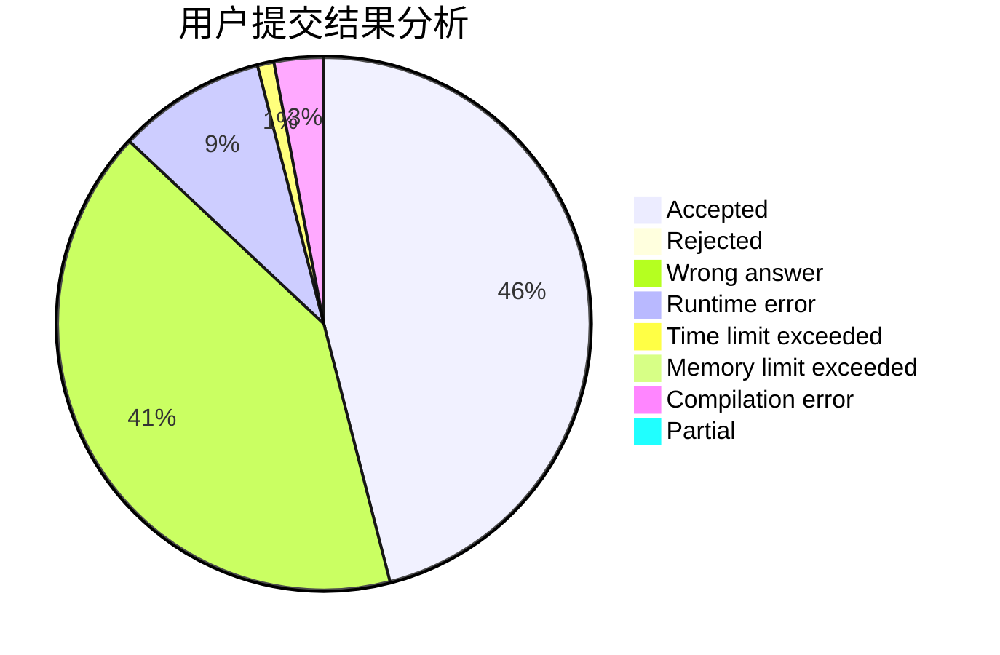
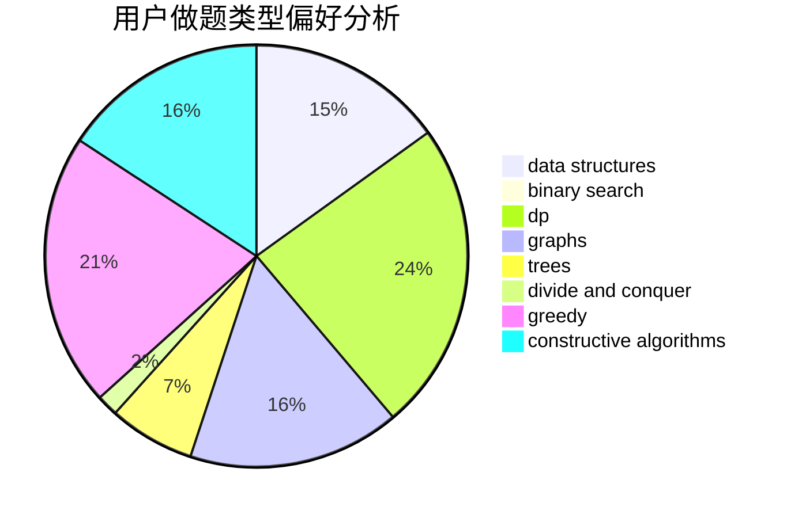
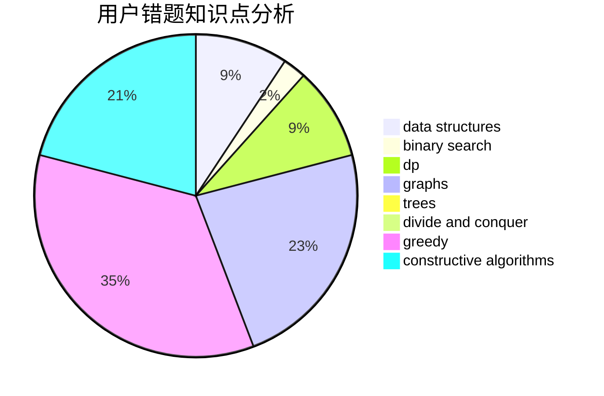

# charlie_wang

<!-- tabs:start -->

#### **用户提交结果分析**

#### **用户做题类型偏好分析**

#### **用户错题知识点分析**

<!-- tabs:end -->
# 推荐题目
[580B](https://codeforces.com/contest/580/problem/B)		binary search,
                        sortings,
                        two pointers		  
[1144G](https://codeforces.com/contest/1144/problem/G)		dp,
                        greedy		  
[1389F](https://codeforces.com/contest/1389/problem/F)		data structures,
                        dp,
                        graph matchings,
                        sortings		  
[691A](https://codeforces.com/contest/691/problem/A)		implementation		  
[319C](https://codeforces.com/contest/319/problem/C)		dp,
                        geometry		  
[879B](https://codeforces.com/contest/879/problem/B)		data structures,
                        implementation		  
[630I](https://codeforces.com/contest/630/problem/I)		combinatorics,
                        math		  
[723D](https://codeforces.com/contest/723/problem/D)		dfs and similar,
                        dsu,
                        graphs,
                        greedy,
                        implementation		  
[1103A](https://codeforces.com/contest/1103/problem/A)		constructive algorithms,
                        implementation		  
[476A](https://codeforces.com/contest/476/problem/A)		implementation,
                        math		  
