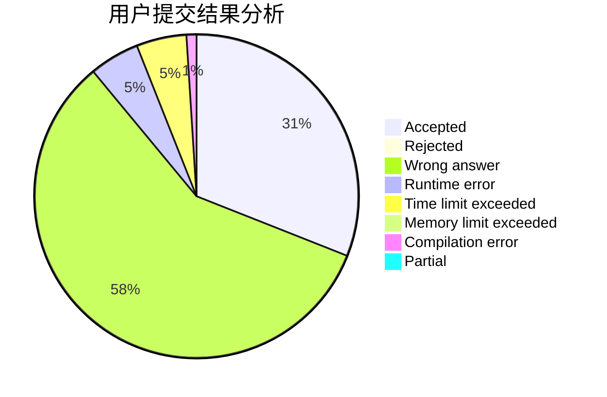
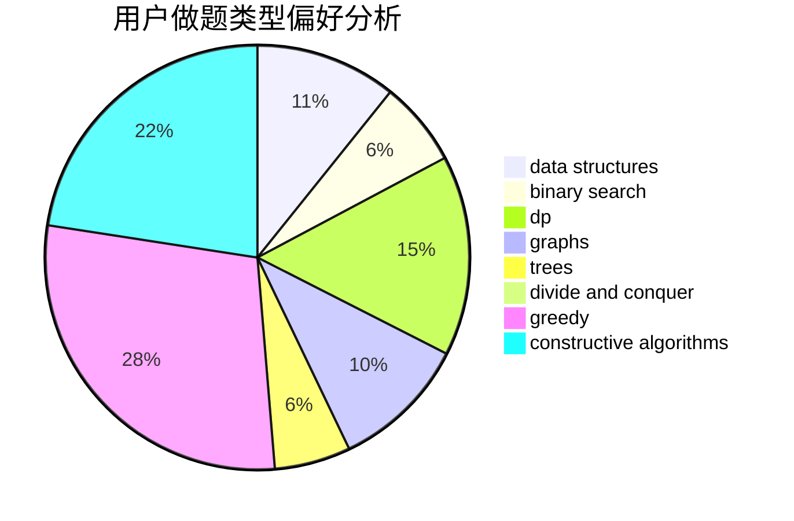
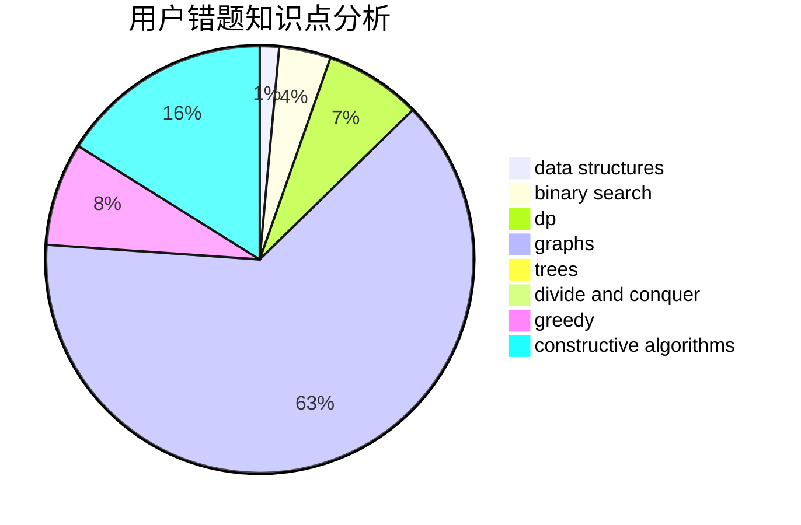

# chase_

<!-- tabs:start -->

#### **用户提交结果分析**

#### **用户做题类型偏好分析**

#### **用户错题知识点分析**

<!-- tabs:end -->
# 推荐题目
[1473A](https://codeforces.com/contest/1473/problem/A)		greedy,
                        implementation,
                        math,
                        sortings		  
[566C](https://codeforces.com/contest/566/problem/C)		dfs and similar,
                        divide and conquer,
                        trees		  
[425E](https://codeforces.com/contest/425/problem/E)		dp		  
[1300A](https://codeforces.com/contest/1300/problem/A)		implementation,
                        math		  
[1029F](https://codeforces.com/contest/1029/problem/F)		binary search,
                        brute force,
                        math,
                        number theory		  
[1373B](https://codeforces.com/contest/1373/problem/B)		games		  
[753C](https://codeforces.com/contest/753/problem/C)		brute force,
                        constructive algorithms,
                        interactive		  
[1463D](https://codeforces.com/contest/1463/problem/D)		binary search,
                        constructive algorithms,
                        greedy,
                        two pointers		  
[200B](https://codeforces.com/contest/200/problem/B)		implementation,
                        math		  
[1029D](https://codeforces.com/contest/1029/problem/D)		implementation,
                        math		  
