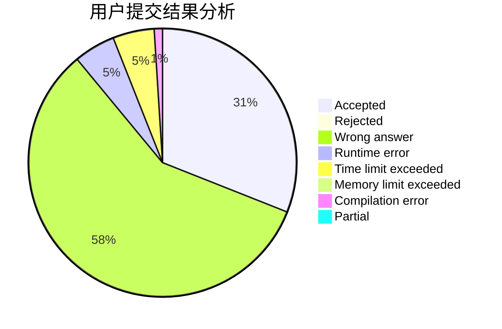
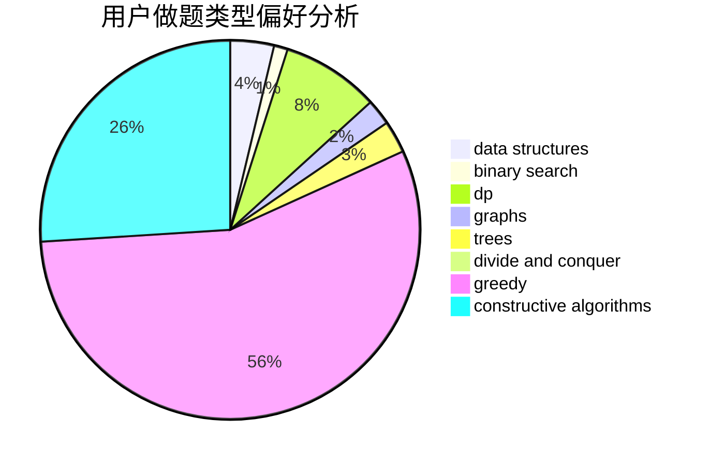
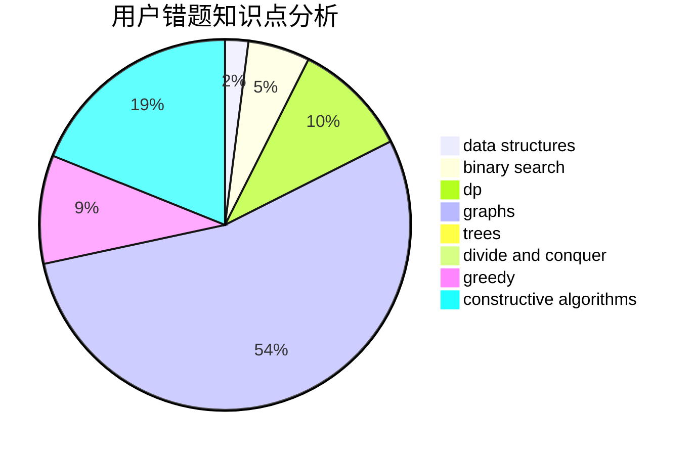

# chase_

<!-- tabs:start -->

#### **用户提交结果分析**

#### **用户做题类型偏好分析**

#### **用户错题知识点分析**

<!-- tabs:end -->
# 推荐题目
[1481D](https://codeforces.com/contest/1481/problem/D)		brute force,
                        constructive algorithms,
                        graphs,
                        greedy,
                        implementation		  
[585B](https://codeforces.com/contest/585/problem/B)		dfs and similar,
                        graphs,
                        shortest paths		  
[449C](https://codeforces.com/contest/449/problem/C)		constructive algorithms,
                        number theory		  
[1307F](https://codeforces.com/contest/1307/problem/F)		dfs and similar,
                        dsu,
                        trees		  
[1030A](https://codeforces.com/contest/1030/problem/A)		implementation		  
[1381E](https://codeforces.com/contest/1381/problem/E)		geometry,
                        math,
                        sortings		  
[771E](https://codeforces.com/contest/771/problem/E)		dp,
                        greedy		  
[1470E](https://codeforces.com/contest/1470/problem/E)		binary search,
                        combinatorics,
                        data structures,
                        dp,
                        graphs,
                        implementation,
                        two pointers		  
[225D](https://codeforces.com/contest/225/problem/D)		bitmasks,
                        dfs and similar,
                        graphs,
                        implementation		  
[102A](https://codeforces.com/contest/102/problem/A)		brute force		  
