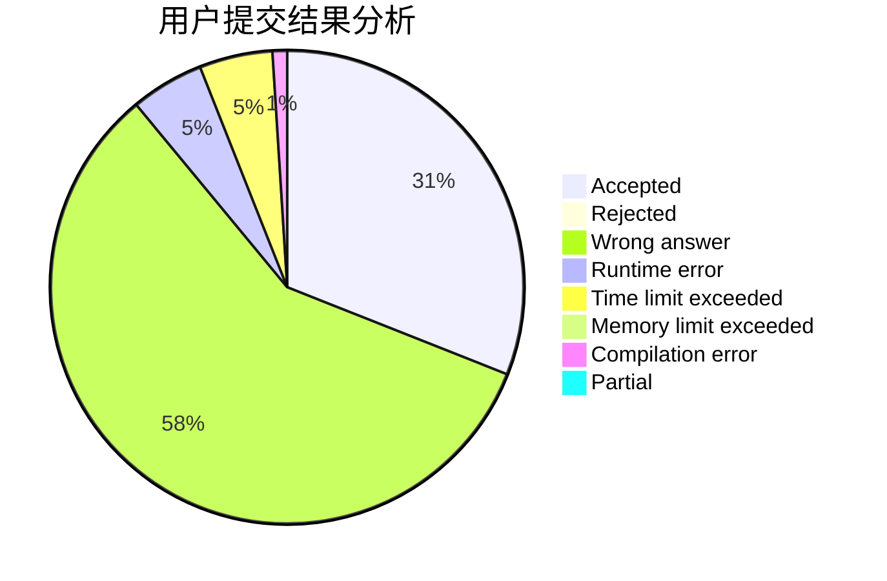
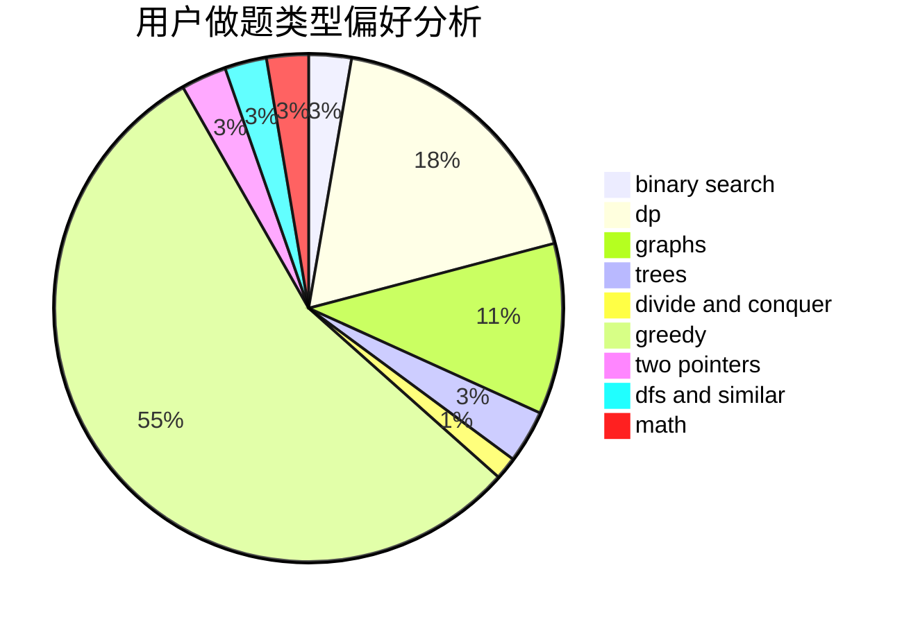

# chase_

<!-- tabs:start -->

#### **用户提交结果分析**

#### **用户做题类型偏好分析**

<!-- tabs:end -->
# 推荐题目
[1481D](https://codeforces.com/contest/1481/problem/D)
[585B](https://codeforces.com/contest/585/problem/B)
[449C](https://codeforces.com/contest/449/problem/C)
[1307F](https://codeforces.com/contest/1307/problem/F)
[1030A](https://codeforces.com/contest/1030/problem/A)
[1381E](https://codeforces.com/contest/1381/problem/E)
[771E](https://codeforces.com/contest/771/problem/E)
[1470E](https://codeforces.com/contest/1470/problem/E)
[225D](https://codeforces.com/contest/225/problem/D)
[102A](https://codeforces.com/contest/102/problem/A)
