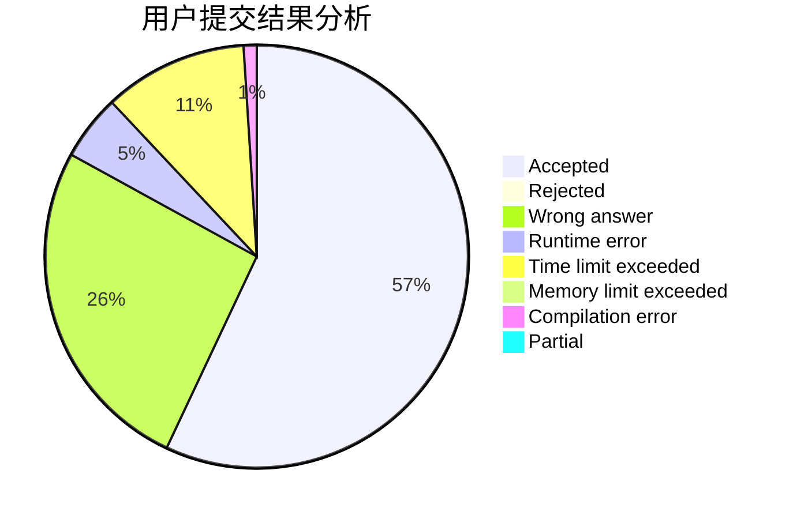
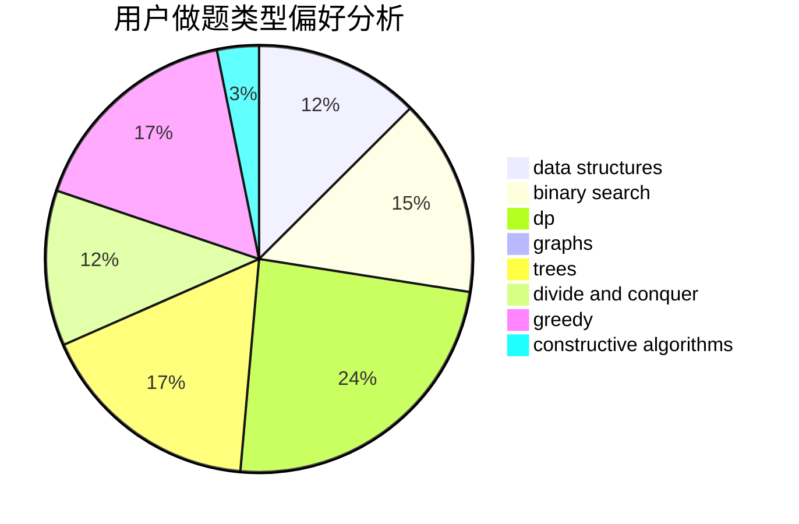
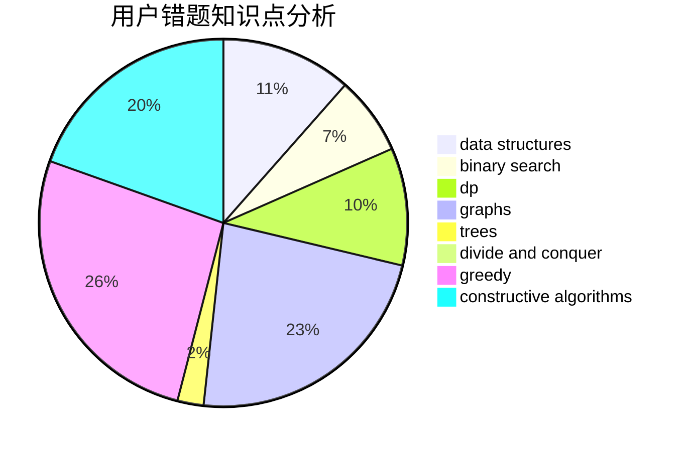

# 1101_

<!-- tabs:start -->

#### **用户提交结果分析**

#### **用户做题类型偏好分析**

#### **用户错题知识点分析**

<!-- tabs:end -->
# 推荐题目
[1100A](https://codeforces.com/contest/1100/problem/A)		implementation		  
[1099F](https://codeforces.com/contest/1099/problem/F)		binary search,
                        data structures,
                        dfs and similar,
                        dp,
                        games,
                        trees		  
[1097B](https://codeforces.com/contest/1097/problem/B)		bitmasks,
                        brute force,
                        dp		  
[109A](https://codeforces.com/contest/109/problem/A)		brute force,
                        implementation		  
[1095F](https://codeforces.com/contest/1095/problem/F)		dsu,
                        graphs,
                        greedy		  
[1098E](https://codeforces.com/contest/1098/problem/E)		binary search,
                        implementation,
                        math,
                        number theory		  
[1099E](https://codeforces.com/contest/1099/problem/E)		dsu,graphs,sortings,trees		  
[1097C](https://codeforces.com/contest/1097/problem/C)		greedy,
                        implementation		  
[1100B](https://codeforces.com/contest/1100/problem/B)		data structures,
                        implementation		  
[10B](https://codeforces.com/contest/10/problem/B)		dp,
                        implementation		  
