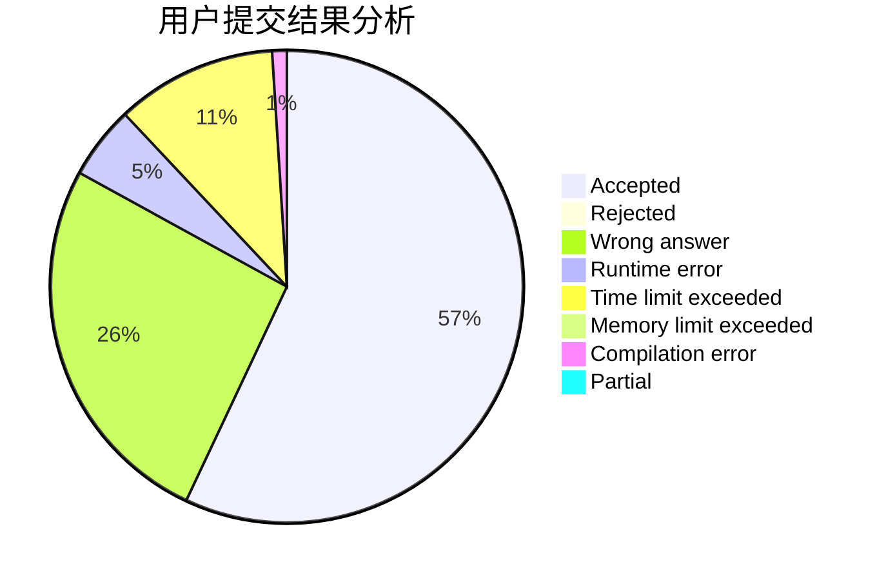
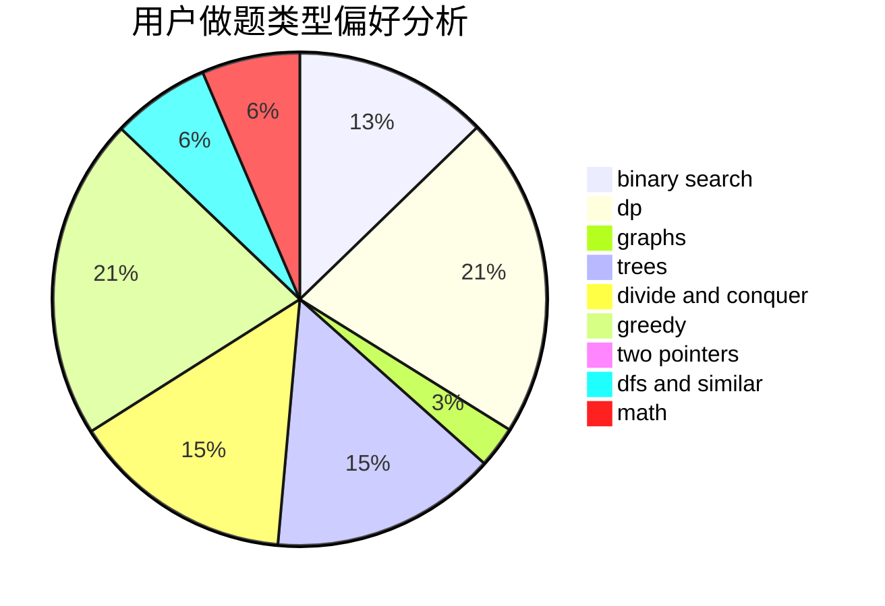

# 1101_

<!-- tabs:start -->

#### **用户提交结果分析**

#### **用户做题类型偏好分析**

<!-- tabs:end -->
# 推荐题目
[1100A](https://codeforces.com/contest/1100/problem/A)
[1099F](https://codeforces.com/contest/1099/problem/F)
[1097B](https://codeforces.com/contest/1097/problem/B)
[109A](https://codeforces.com/contest/109/problem/A)
[1095F](https://codeforces.com/contest/1095/problem/F)
[1098E](https://codeforces.com/contest/1098/problem/E)
[1099E](https://codeforces.com/contest/1099/problem/E)
[1097C](https://codeforces.com/contest/1097/problem/C)
[1100B](https://codeforces.com/contest/1100/problem/B)
[10B](https://codeforces.com/contest/10/problem/B)
