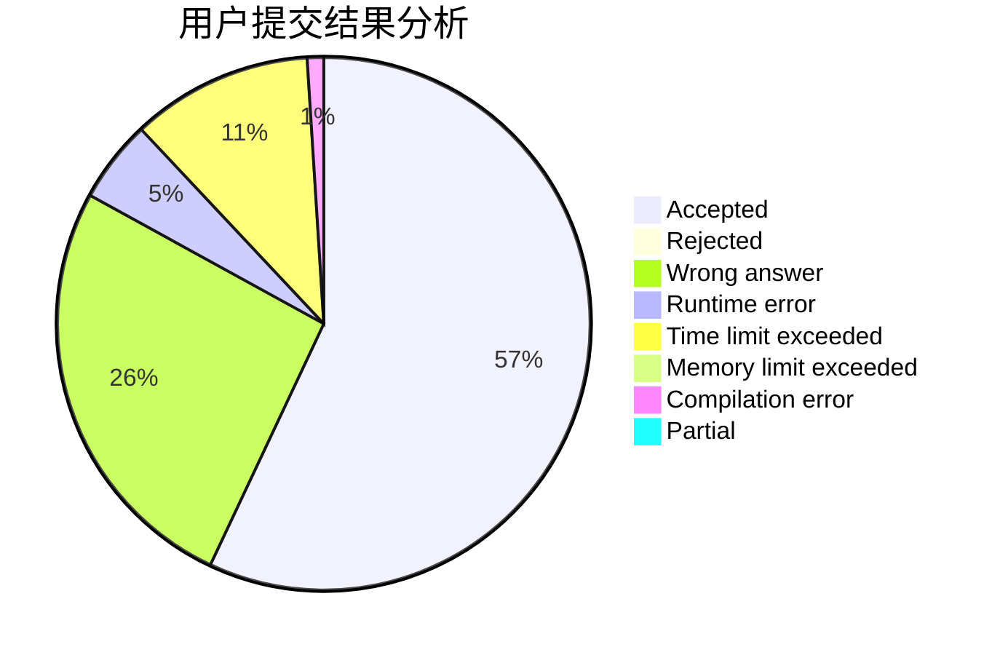
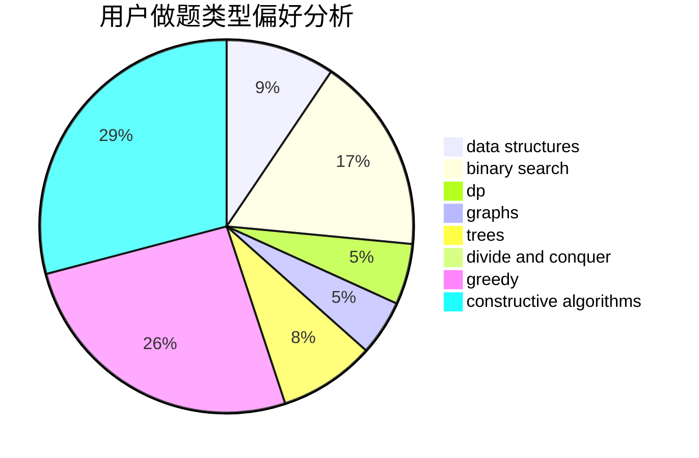
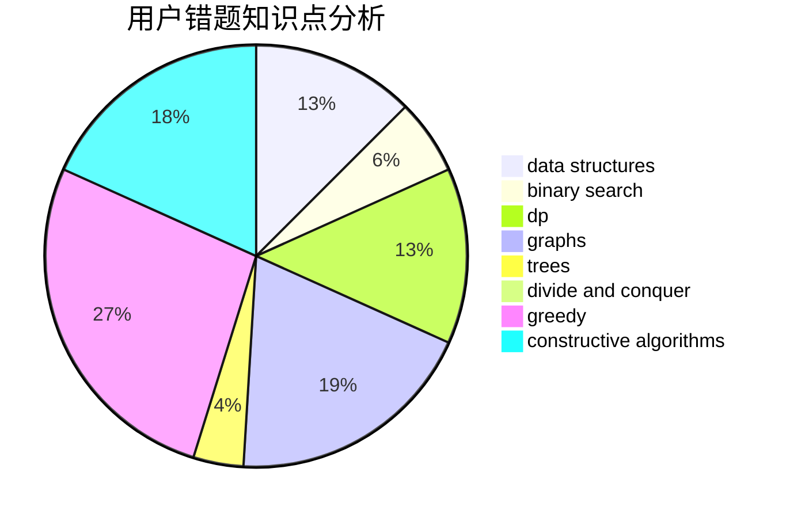

# 1101_

<!-- tabs:start -->

#### **用户提交结果分析**

#### **用户做题类型偏好分析**

#### **用户错题知识点分析**

<!-- tabs:end -->
# 推荐题目
[10C](https://codeforces.com/contest/10/problem/C)		number theory		  
[1099C](https://codeforces.com/contest/1099/problem/C)		constructive algorithms,
                        implementation		  
[1096F](https://codeforces.com/contest/1096/problem/F)		dp,
                        math,
                        probabilities		  
[1099D](https://codeforces.com/contest/1099/problem/D)		dsu,graphs,sortings,trees		  
[1095C](https://codeforces.com/contest/1095/problem/C)		bitmasks,
                        greedy		  
[1098B](https://codeforces.com/contest/1098/problem/B)		brute force,
                        constructive algorithms,
                        greedy,
                        math		  
[1099B](https://codeforces.com/contest/1099/problem/B)		binary search,
                        constructive algorithms,
                        math		  
[1096G](https://codeforces.com/contest/1096/problem/G)		divide and conquer,
                        dp,
                        fft		  
[10D](https://codeforces.com/contest/10/problem/D)		dp		  
[1099F](https://codeforces.com/contest/1099/problem/F)		binary search,
                        data structures,
                        dfs and similar,
                        dp,
                        games,
                        trees		  
