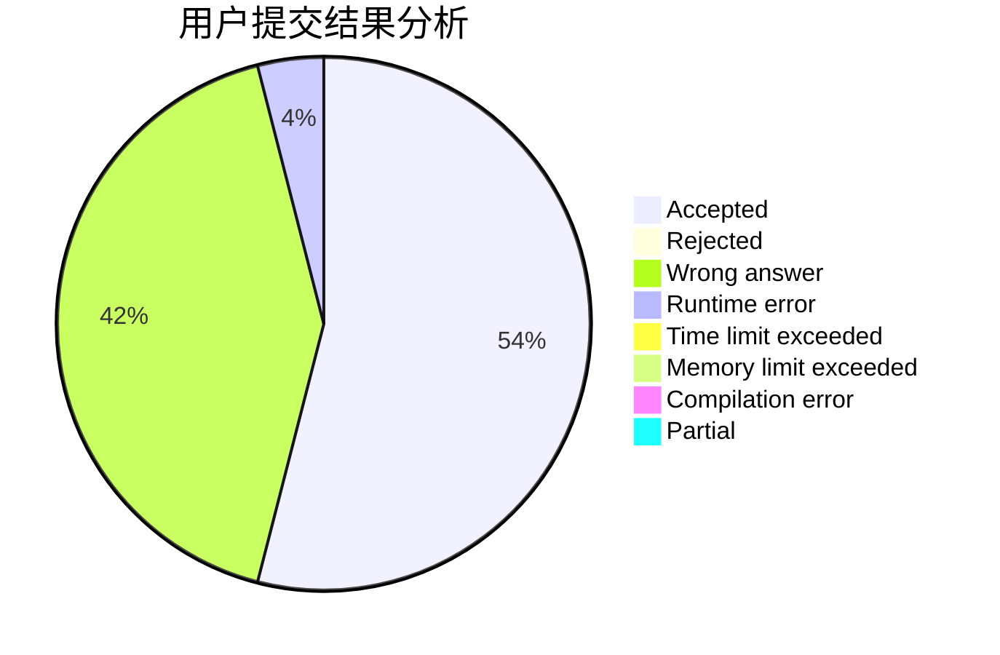
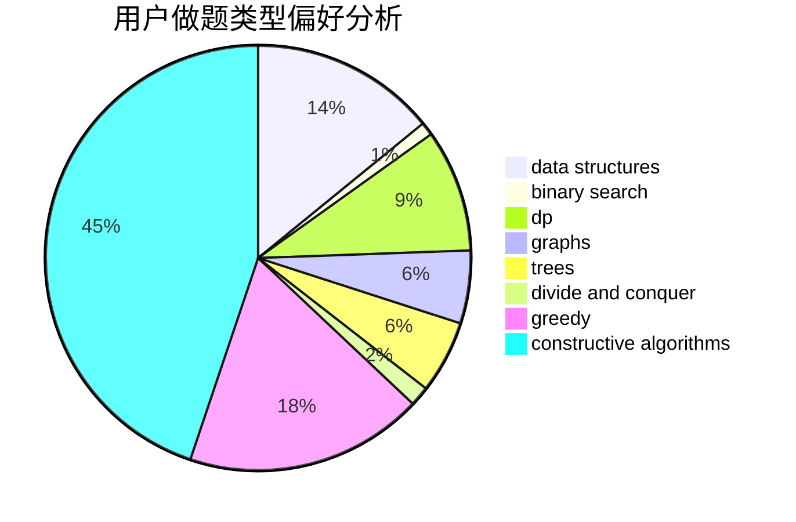
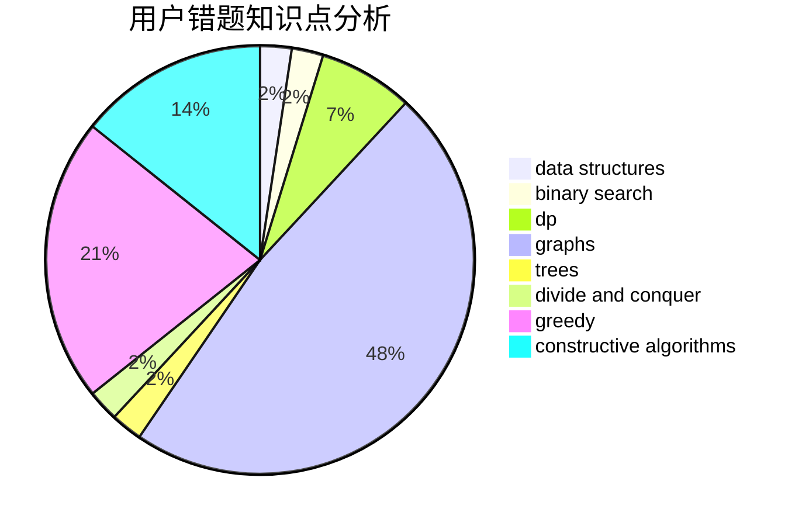

# Aoyeshangshenti.

<!-- tabs:start -->

#### **用户提交结果分析**

#### **用户做题类型偏好分析**

#### **用户错题知识点分析**

<!-- tabs:end -->
# 推荐题目
[377B](https://codeforces.com/contest/377/problem/B)		binary search,
                        data structures,
                        greedy,
                        sortings		  
[1425B](https://codeforces.com/contest/1425/problem/B)		divide and conquer,
                        dp		  
[246D](https://codeforces.com/contest/246/problem/D)		brute force,
                        dfs and similar,
                        graphs		  
[379D](https://codeforces.com/contest/379/problem/D)		bitmasks,
                        brute force,
                        dp		  
[379C](https://codeforces.com/contest/379/problem/C)		greedy,
                        sortings		  
[174B](https://codeforces.com/contest/174/problem/B)		dp,
                        greedy,
                        implementation		  
[283E](https://codeforces.com/contest/283/problem/E)		combinatorics,
                        data structures,
                        math		  
[1225F](https://codeforces.com/contest/1225/problem/F)		constructive algorithms,
                        greedy,
                        trees		  
[377D](https://codeforces.com/contest/377/problem/D)		data structures		  
[377E](https://codeforces.com/contest/377/problem/E)		dp,
                        geometry		  
