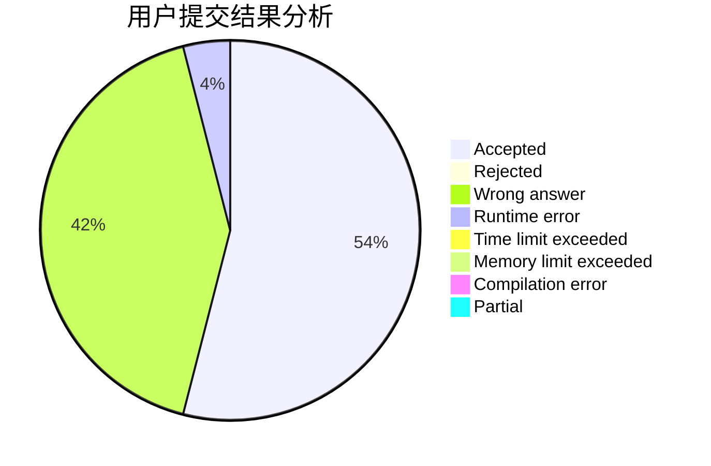
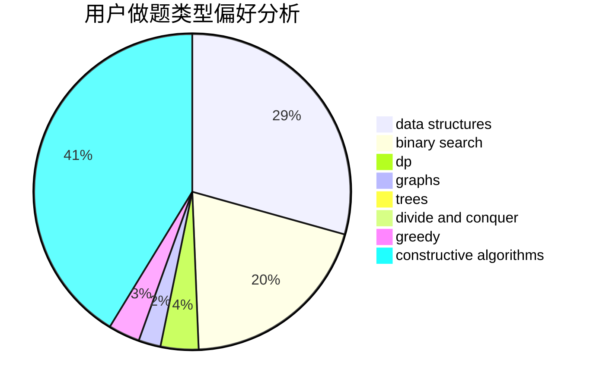
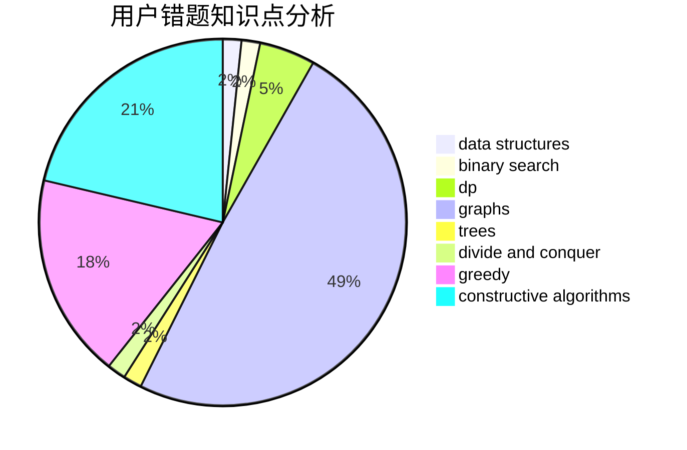

# Aoyeshangshenti.

<!-- tabs:start -->

#### **用户提交结果分析**

#### **用户做题类型偏好分析**

#### **用户错题知识点分析**

<!-- tabs:end -->
# 推荐题目
[34D](https://codeforces.com/contest/34/problem/D)		dfs and similar,
                        graphs		  
[1417E](https://codeforces.com/contest/1417/problem/E)		dsu,graphs,sortings,trees		  
[228D](https://codeforces.com/contest/228/problem/D)		data structures		  
[352E](https://codeforces.com/contest/352/problem/E)		dsu,graphs,sortings,trees		  
[352A](https://codeforces.com/contest/352/problem/A)		brute force,
                        implementation,
                        math		  
[1513F](https://codeforces.com/contest/1513/problem/F)		brute force,
                        constructive algorithms,
                        data structures,
                        sortings		  
[268D](https://codeforces.com/contest/268/problem/D)		dp		  
[1218H](https://codeforces.com/contest/1218/problem/H)		dfs and similar		  
[351B](https://codeforces.com/contest/351/problem/B)		combinatorics,
                        dp,
                        probabilities		  
[351C](https://codeforces.com/contest/351/problem/C)		dp,
                        matrices		  
