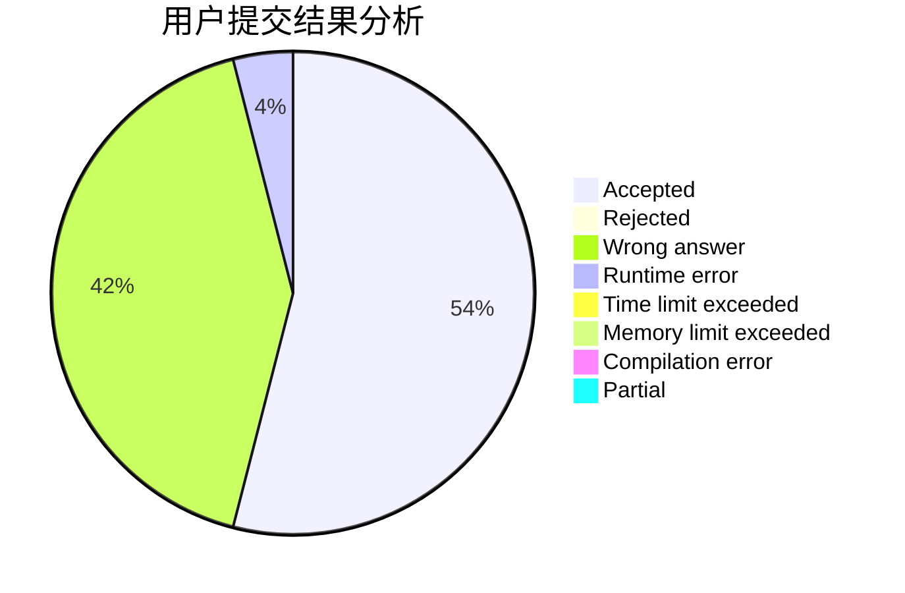
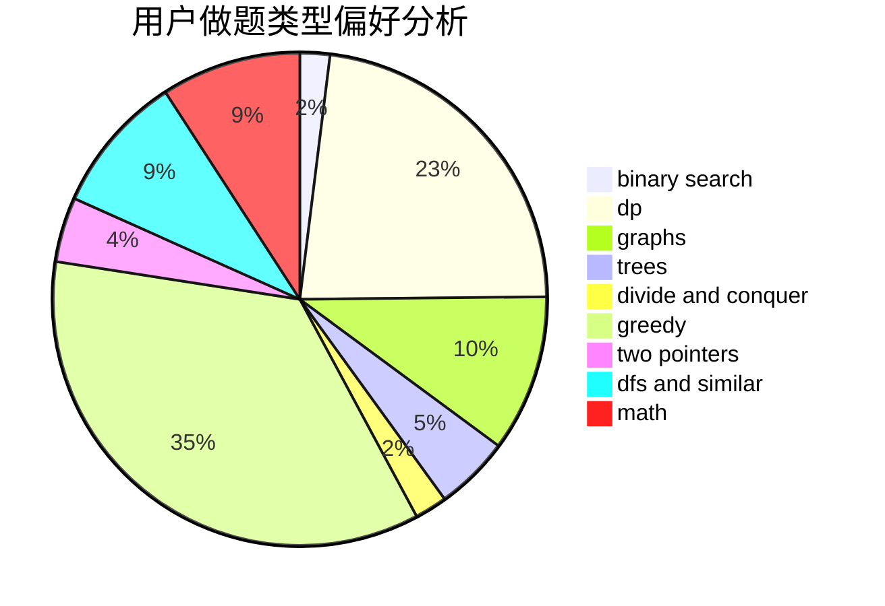

# Aoyeshangshenti.

<!-- tabs:start -->

#### **用户提交结果分析**

#### **用户做题类型偏好分析**

<!-- tabs:end -->
# 推荐题目
[377B](https://codeforces.com/contest/377/problem/B)
[1425B](https://codeforces.com/contest/1425/problem/B)
[246D](https://codeforces.com/contest/246/problem/D)
[379D](https://codeforces.com/contest/379/problem/D)
[379C](https://codeforces.com/contest/379/problem/C)
[174B](https://codeforces.com/contest/174/problem/B)
[283E](https://codeforces.com/contest/283/problem/E)
[1225F](https://codeforces.com/contest/1225/problem/F)
[377D](https://codeforces.com/contest/377/problem/D)
[377E](https://codeforces.com/contest/377/problem/E)
