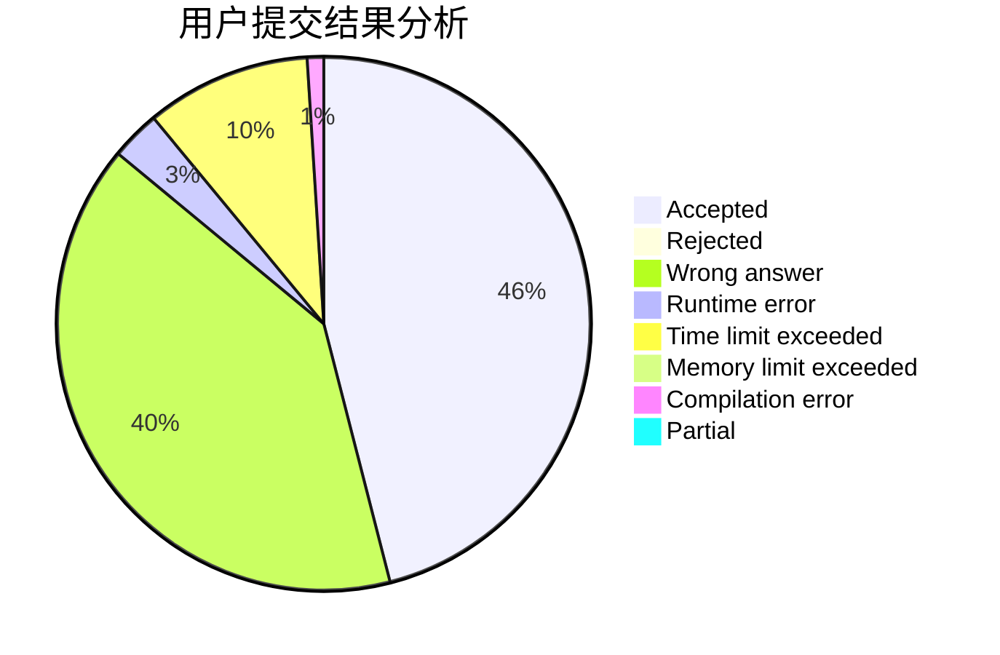
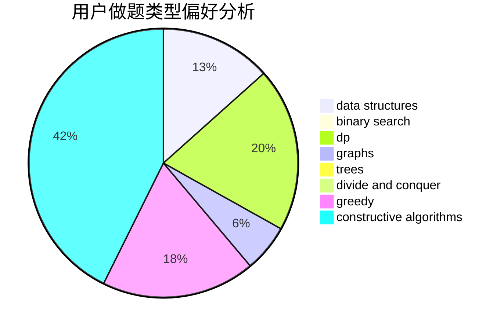
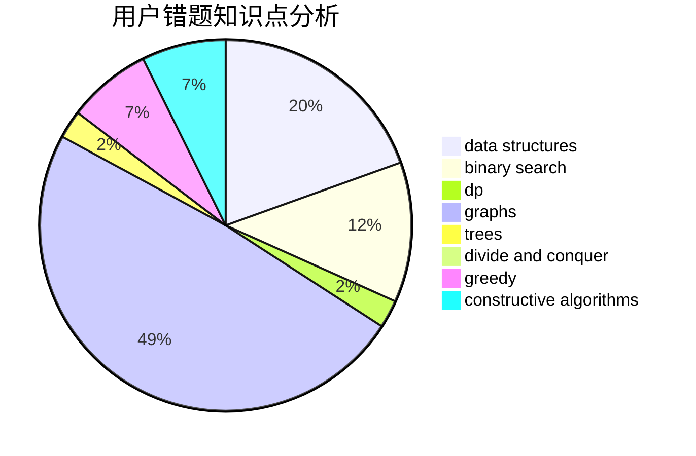

# chellam
<!-- tabs:start -->
#### **用户提交结果分析**

#### **用户做题类型偏好分析**

#### **用户错题知识点分析**

<!-- tabs:end -->
# 推荐题目
[Arena](http://codeforces.com/problemset/problem/1487/A)		implementation,
                        sortings		  
[Grow The Tree](http://codeforces.com/problemset/problem/1248/B)		greedy,
                        math,
                        sortings		  
[Maria Breaks the Self-isolation](http://codeforces.com/problemset/problem/1358/B)		greedy,
                        sortings		  
[Roads and Ramen](https://codeforces.com/contest/1434/problem/D)		data structures,
                        trees		  
[Isolation](http://codeforces.com/problemset/problem/1129/D)		data structures,
                        dp		  
[Anatoly and Cockroaches](http://codeforces.com/problemset/problem/719/B)		greedy		  
[Test](http://codeforces.com/problemset/problem/25/E)		hashing,
                        strings		  
[Complicated GCD](http://codeforces.com/problemset/problem/664/A)		math,
                        number theory		  
[Solitaire](http://codeforces.com/problemset/problem/208/B)		dfs and similar,
                        dp		  
[Anton and Fairy Tale](http://codeforces.com/problemset/problem/785/C)		binary search,
                        math		  
<!-- tabs:start -->
#### **data structures**
[Arena](https://codeforces.com/contest/1434/problem/D)		data structures,
                        trees		  
[Grow The Tree](http://codeforces.com/problemset/problem/1129/D)		data structures,
                        dp		  
[Maria Breaks the Self-isolation](http://codeforces.com/problemset/problem/567/C)		binary search,
                        data structures,
                        dp		  
[Roads and Ramen](https://codeforces.com/contest/1291/problem/C)		brute force,
                        data structures,
                        implementation		  
[Isolation](http://codeforces.com/problemset/problem/1492/C)		binary search,
                        data structures,
                        dp,
                        greedy,
                        two pointers		  
[Anatoly and Cockroaches](http://codeforces.com/problemset/problem/1490/G)		binary search,
                        data structures,
                        math		  
[Test](http://codeforces.com/problemset/problem/1479/D)		binary search,
                        bitmasks,
                        brute force,
                        data structures,
                        probabilities,
                        trees		  
[Complicated GCD](http://codeforces.com/problemset/problem/1497/A)		brute force,
                        data structures,
                        greedy,
                        sortings		  
[Solitaire](http://codeforces.com/problemset/problem/1491/C)		brute force,
                        data structures,
                        dp,
                        greedy,
                        implementation		  
[Anton and Fairy Tale](http://codeforces.com/problemset/problem/1492/B)		data structures,
                        greedy,
                        math		  
#### **binary search**
[Arena](http://codeforces.com/problemset/problem/785/C)		binary search,
                        math		  
[Grow The Tree](http://codeforces.com/problemset/problem/567/C)		binary search,
                        data structures,
                        dp		  
[Maria Breaks the Self-isolation](http://codeforces.com/problemset/problem/50/D)		binary search,
                        dp,
                        probabilities		  
[Roads and Ramen](http://codeforces.com/problemset/problem/1492/C)		binary search,
                        data structures,
                        dp,
                        greedy,
                        two pointers		  
[Isolation](http://codeforces.com/problemset/problem/1463/D)		binary search,
                        constructive algorithms,
                        greedy,
                        two pointers		  
[Anatoly and Cockroaches](http://codeforces.com/problemset/problem/1490/G)		binary search,
                        data structures,
                        math		  
[Test](http://codeforces.com/problemset/problem/1479/D)		binary search,
                        bitmasks,
                        brute force,
                        data structures,
                        probabilities,
                        trees		  
[Complicated GCD](http://codeforces.com/problemset/problem/1436/E)		binary search,
                        data structures,
                        two pointers		  
[Solitaire](http://codeforces.com/problemset/problem/1461/D)		binary search,
                        brute force,
                        data structures,
                        divide and conquer,
                        implementation,
                        sortings		  
[Anton and Fairy Tale](http://codeforces.com/problemset/problem/1493/C)		binary search,
                        brute force,
                        constructive algorithms,
                        greedy,
                        strings		  
#### **dp**
[Arena](http://codeforces.com/problemset/problem/1129/D)		data structures,
                        dp		  
[Grow The Tree](http://codeforces.com/problemset/problem/208/B)		dfs and similar,
                        dp		  
[Maria Breaks the Self-isolation](http://codeforces.com/problemset/problem/509/C)		dp,
                        greedy,
                        implementation		  
[Roads and Ramen](http://codeforces.com/problemset/problem/567/C)		binary search,
                        data structures,
                        dp		  
[Isolation](http://codeforces.com/problemset/problem/50/D)		binary search,
                        dp,
                        probabilities		  
[Anatoly and Cockroaches](https://codeforces.com/contest/480/problem/B)		dp,
                        graphs		  
[Test](http://codeforces.com/problemset/problem/1400/F)		brute force,
                        dfs and similar,
                        dp,
                        string suffix structures,
                        strings		  
[Complicated GCD](http://codeforces.com/problemset/problem/1198/D)		dp		  
[Solitaire](http://codeforces.com/problemset/problem/1492/C)		binary search,
                        data structures,
                        dp,
                        greedy,
                        two pointers		  
[Anton and Fairy Tale](https://codeforces.com/contest/1457/problem/C)		brute force,
                        dp,
                        implementation		  
#### **graph**
[Arena](https://codeforces.com/contest/480/problem/B)		dp,
                        graphs		  
[Grow The Tree](http://codeforces.com/problemset/problem/1487/C)		brute force,
                        constructive algorithms,
                        dfs and similar,
                        graphs,
                        greedy,
                        implementation,
                        math		  
[Maria Breaks the Self-isolation](http://codeforces.com/problemset/problem/1437/C)		dp,
                        flows,
                        graph matchings,
                        greedy,
                        math,
                        sortings		  
[Roads and Ramen](http://codeforces.com/problemset/problem/1470/D)		constructive algorithms,
                        dfs and similar,
                        graph matchings,
                        graphs,
                        greedy		  
[Isolation](http://codeforces.com/problemset/problem/1476/C)		dp,
                        graphs,
                        greedy		  
[Anatoly and Cockroaches](http://codeforces.com/problemset/problem/1304/D)		constructive algorithms,
                        graphs,
                        greedy,
                        two pointers		  
[Test](http://codeforces.com/problemset/problem/1475/C)		combinatorics,
                        graphs,
                        math		  
[Complicated GCD](http://codeforces.com/problemset/problem/553/E)		dp,
                        fft,
                        graphs,
                        math,
                        probabilities		  
[Solitaire](http://codeforces.com/problemset/problem/1495/C)		constructive algorithms,
                        graphs		  
[Anton and Fairy Tale](http://codeforces.com/problemset/problem/1510/K)		brute force,
                        graphs,
                        implementation		  
#### **trees**
[Arena](https://codeforces.com/contest/1434/problem/D)		data structures,
                        trees		  
[Grow The Tree](http://codeforces.com/problemset/problem/1479/D)		binary search,
                        bitmasks,
                        brute force,
                        data structures,
                        probabilities,
                        trees		  
[Maria Breaks the Self-isolation](http://codeforces.com/problemset/problem/1511/C)		brute force,
                        data structures,
                        implementation,
                        trees		  
[Roads and Ramen](http://codeforces.com/problemset/problem/1499/F)		combinatorics,
                        dfs and similar,
                        dp,
                        trees		  
[Isolation](http://codeforces.com/problemset/problem/1491/E)		brute force,
                        dfs and similar,
                        divide and conquer,
                        number theory,
                        trees		  
[Anatoly and Cockroaches](http://codeforces.com/problemset/problem/1466/D)		data structures,
                        greedy,
                        sortings,
                        trees		  
[Test](http://codeforces.com/problemset/problem/1495/D)		combinatorics,
                        dfs and similar,
                        graphs,
                        math,
                        shortest paths,
                        trees		  
[Complicated GCD](http://codeforces.com/problemset/problem/1303/G)		data structures,
                        divide and conquer,
                        geometry,
                        trees		  
[Solitaire](http://codeforces.com/problemset/problem/1454/E)		combinatorics,
                        dfs and similar,
                        graphs,
                        trees		  
[Anton and Fairy Tale](http://codeforces.com/problemset/problem/1494/D)		constructive algorithms,
                        data structures,
                        dfs and similar,
                        divide and conquer,
                        dsu,
                        greedy,
                        sortings,
                        trees		  
#### **divide and conquer**
[Arena](http://codeforces.com/problemset/problem/1461/D)		binary search,
                        brute force,
                        data structures,
                        divide and conquer,
                        implementation,
                        sortings		  
[Grow The Tree](http://codeforces.com/problemset/problem/1466/G)		combinatorics,
                        divide and conquer,
                        hashing,
                        math,
                        string suffix structures,
                        strings		  
[Maria Breaks the Self-isolation](http://codeforces.com/problemset/problem/1490/D)		dfs and similar,
                        divide and conquer,
                        implementation		  
[Roads and Ramen](https://codeforces.com/contest/1483/problem/C)		data structures,
                        divide and conquer,
                        dp		  
[Isolation](http://codeforces.com/problemset/problem/1491/E)		brute force,
                        dfs and similar,
                        divide and conquer,
                        number theory,
                        trees		  
[Anatoly and Cockroaches](http://codeforces.com/problemset/problem/1303/G)		data structures,
                        divide and conquer,
                        geometry,
                        trees		  
[Test](http://codeforces.com/problemset/problem/1494/D)		constructive algorithms,
                        data structures,
                        dfs and similar,
                        divide and conquer,
                        dsu,
                        greedy,
                        sortings,
                        trees		  
[Complicated GCD](http://codeforces.com/problemset/problem/1482/E)		data structures,
                        divide and conquer,
                        dp		  
[Solitaire](http://codeforces.com/problemset/problem/566/C)		dfs and similar,
                        divide and conquer,
                        trees		  
[Anton and Fairy Tale](http://codeforces.com/problemset/problem/1428/F)		binary search,
                        data structures,
                        divide and conquer,
                        dp,
                        two pointers		  
#### **greedy**
[Arena](http://codeforces.com/problemset/problem/1248/B)		greedy,
                        math,
                        sortings		  
[Grow The Tree](http://codeforces.com/problemset/problem/1358/B)		greedy,
                        sortings		  
[Maria Breaks the Self-isolation](http://codeforces.com/problemset/problem/719/B)		greedy		  
[Roads and Ramen](http://codeforces.com/problemset/problem/509/C)		dp,
                        greedy,
                        implementation		  
[Isolation](https://codeforces.com/contest/606/problem/C)		constructive algorithms,
                        greedy		  
[Anatoly and Cockroaches](http://codeforces.com/problemset/problem/1492/C)		binary search,
                        data structures,
                        dp,
                        greedy,
                        two pointers		  
[Test](https://codeforces.com/contest/1496/problem/C)		geometry,
                        greedy,
                        math,
                        sortings		  
[Complicated GCD](http://codeforces.com/problemset/problem/1493/A)		constructive algorithms,
                        greedy		  
[Solitaire](http://codeforces.com/problemset/problem/1463/D)		binary search,
                        constructive algorithms,
                        greedy,
                        two pointers		  
[Anton and Fairy Tale](http://codeforces.com/problemset/problem/1462/C)		brute force,
                        greedy,
                        math		  
#### **constructive algorithms**
[Arena](https://codeforces.com/contest/606/problem/C)		constructive algorithms,
                        greedy		  
[Grow The Tree](http://codeforces.com/problemset/problem/1059/C)		constructive algorithms,
                        math		  
[Maria Breaks the Self-isolation](http://codeforces.com/problemset/problem/1493/A)		constructive algorithms,
                        greedy		  
[Roads and Ramen](http://codeforces.com/problemset/problem/1463/D)		binary search,
                        constructive algorithms,
                        greedy,
                        two pointers		  
[Isolation](https://codeforces.com/contest/1456/problem/B)		bitmasks,
                        brute force,
                        constructive algorithms		  
[Anatoly and Cockroaches](http://codeforces.com/problemset/problem/1492/D)		bitmasks,
                        constructive algorithms,
                        greedy,
                        math		  
[Test](https://codeforces.com/contest/1504/problem/D)		constructive algorithms,
                        games,
                        interactive		  
[Complicated GCD](https://codeforces.com/contest/1483/problem/A)		brute force,
                        constructive algorithms,
                        greedy,
                        implementation		  
[Solitaire](https://codeforces.com/contest/1457/problem/D)		bitmasks,
                        brute force,
                        constructive algorithms		  
[Anton and Fairy Tale](http://codeforces.com/problemset/problem/1513/A)		constructive algorithms,
                        implementation		  
#### **sortings**
[Arena](http://codeforces.com/problemset/problem/1487/A)		implementation,
                        sortings		  
[Grow The Tree](http://codeforces.com/problemset/problem/1248/B)		greedy,
                        math,
                        sortings		  
[Maria Breaks the Self-isolation](http://codeforces.com/problemset/problem/1358/B)		greedy,
                        sortings		  
[Roads and Ramen](https://codeforces.com/contest/1496/problem/C)		geometry,
                        greedy,
                        math,
                        sortings		  
[Isolation](http://codeforces.com/problemset/problem/1495/A)		geometry,
                        greedy,
                        math,
                        sortings		  
[Anatoly and Cockroaches](http://codeforces.com/problemset/problem/1497/A)		brute force,
                        data structures,
                        greedy,
                        sortings		  
[Test](http://codeforces.com/problemset/problem/1427/A)		math,
                        sortings		  
[Complicated GCD](http://codeforces.com/problemset/problem/1461/D)		binary search,
                        brute force,
                        data structures,
                        divide and conquer,
                        implementation,
                        sortings		  
[Solitaire](http://codeforces.com/problemset/problem/1437/C)		dp,
                        flows,
                        graph matchings,
                        greedy,
                        math,
                        sortings		  
[Anton and Fairy Tale](http://codeforces.com/problemset/problem/1473/A)		greedy,
                        implementation,
                        math,
                        sortings		  
<!-- tabs:end -->
