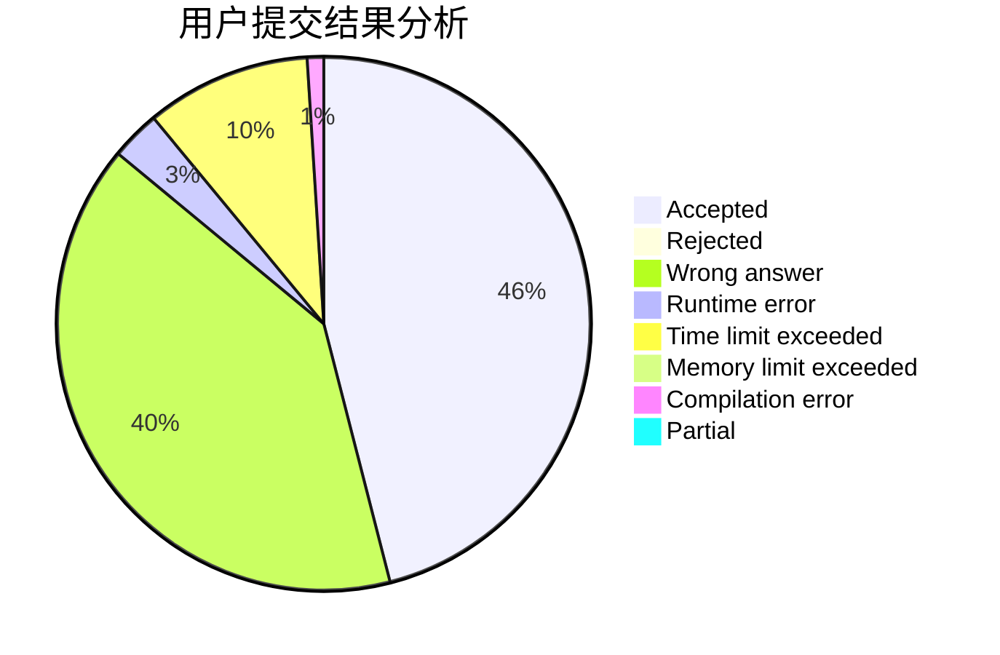
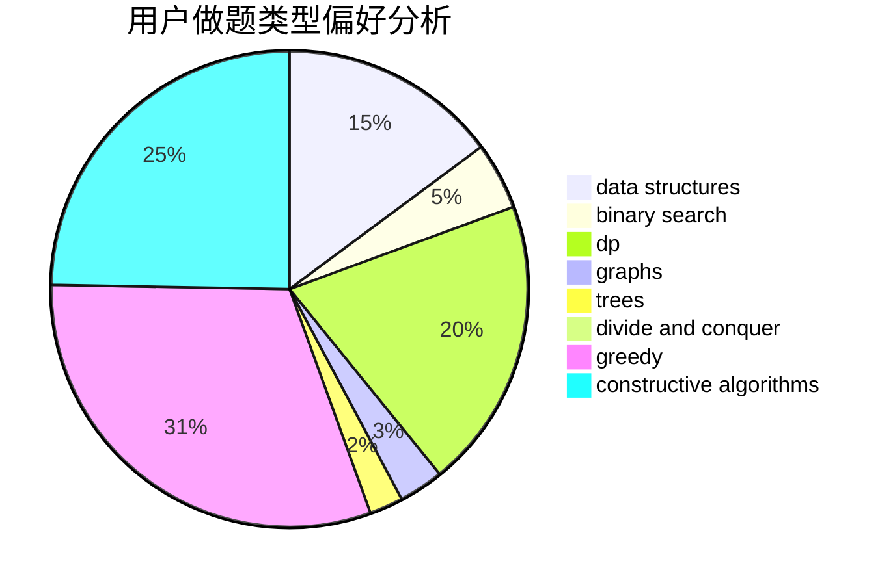
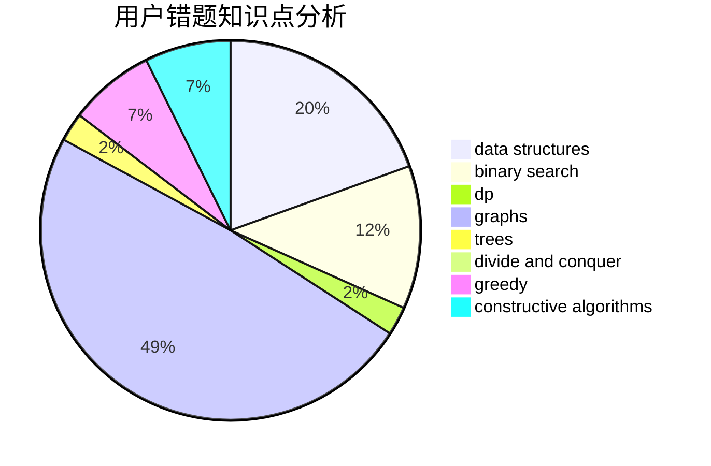

# chellam

<!-- tabs:start -->

#### **用户提交结果分析**

#### **用户做题类型偏好分析**

#### **用户错题知识点分析**

<!-- tabs:end -->
# 推荐题目
[1444D](https://codeforces.com/contest/1444/problem/D)		constructive algorithms,
                        dp,
                        geometry		  
[1131D](https://codeforces.com/contest/1131/problem/D)		dfs and similar,
                        dp,
                        dsu,
                        graphs,
                        greedy		  
[683B](https://codeforces.com/contest/683/problem/B)		*special problem		  
[277E](https://codeforces.com/contest/277/problem/E)		flows,
                        trees		  
[1252C](https://codeforces.com/contest/1252/problem/C)		data structures,
                        implementation		  
[1411A](https://codeforces.com/contest/1411/problem/A)		implementation		  
[625B](https://codeforces.com/contest/625/problem/B)		constructive algorithms,
                        greedy,
                        strings		  
[736C](https://codeforces.com/contest/736/problem/C)		dsu,graphs,sortings,trees		  
[22C](https://codeforces.com/contest/22/problem/C)		graphs		  
[105B](https://codeforces.com/contest/105/problem/B)		brute force,
                        probabilities		  
