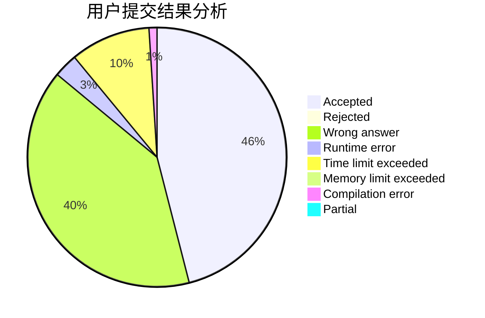
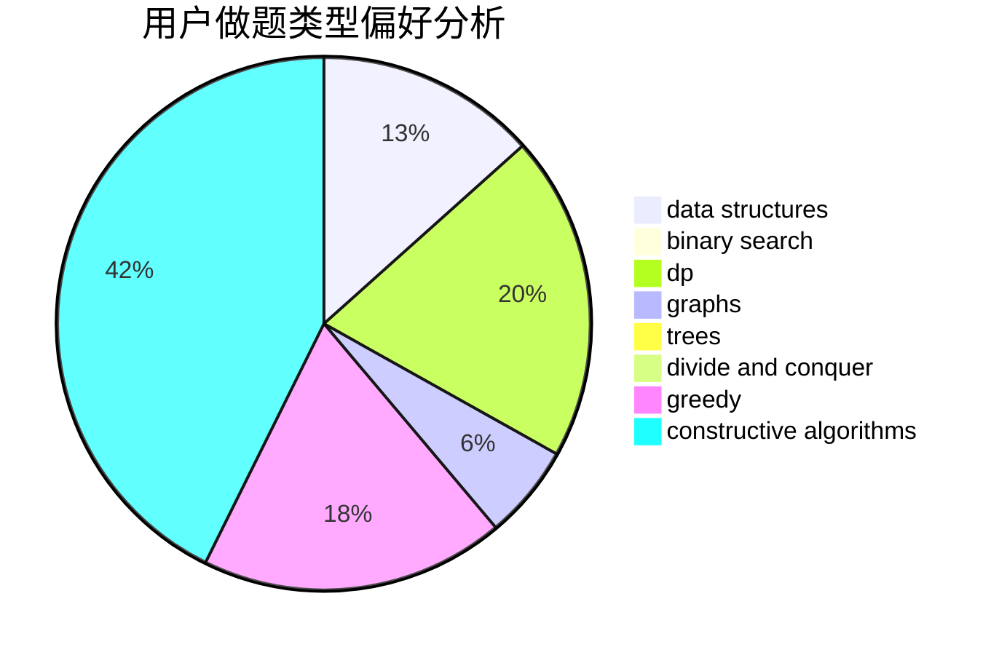
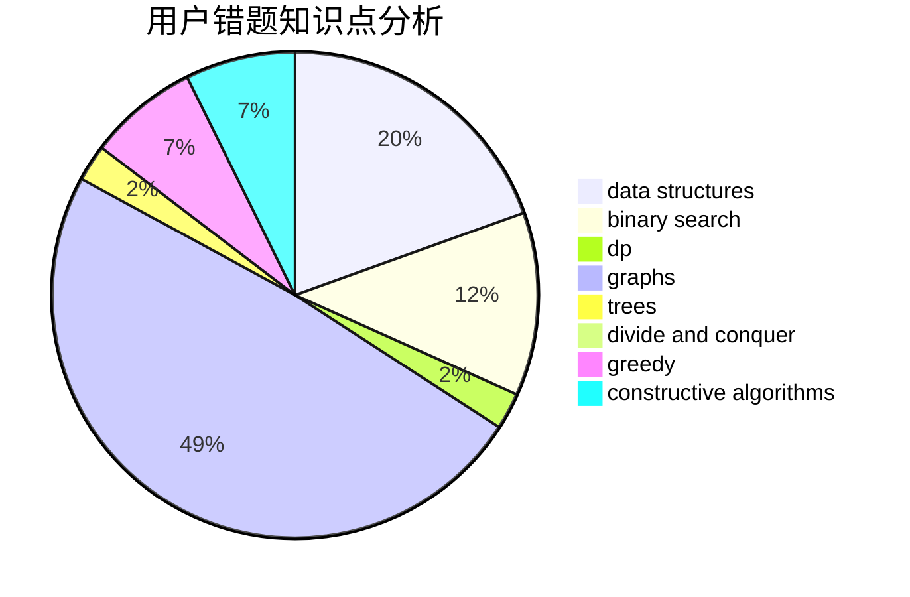

# chellam

<!-- tabs:start -->

#### **用户提交结果分析**

#### **用户做题类型偏好分析**

#### **用户错题知识点分析**

<!-- tabs:end -->
# 推荐题目
[1434D](https://codeforces.com/contest/1434/problem/D)		dsu,graphs,sortings,trees		  
[1129D](https://codeforces.com/contest/1129/problem/D)		data structures,
                        dp		  
[664A](https://codeforces.com/contest/664/problem/A)		math,
                        number theory		  
[25E](https://codeforces.com/contest/25/problem/E)		hashing,
                        strings		  
[1248B](https://codeforces.com/contest/1248/problem/B)		greedy,
                        math,
                        sortings		  
[1400F](https://codeforces.com/contest/1400/problem/F)		brute force,
                        dfs and similar,
                        dp,
                        string suffix structures,
                        strings		  
[606C](https://codeforces.com/contest/606/problem/C)		dsu,graphs,sortings,trees		  
[719B](https://codeforces.com/contest/719/problem/B)		greedy		  
[208B](https://codeforces.com/contest/208/problem/B)		dfs and similar,
                        dp		  
[1059C](https://codeforces.com/contest/1059/problem/C)		constructive algorithms,
                        math		  
