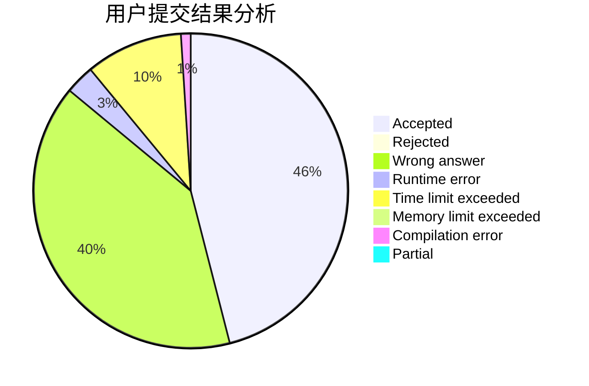
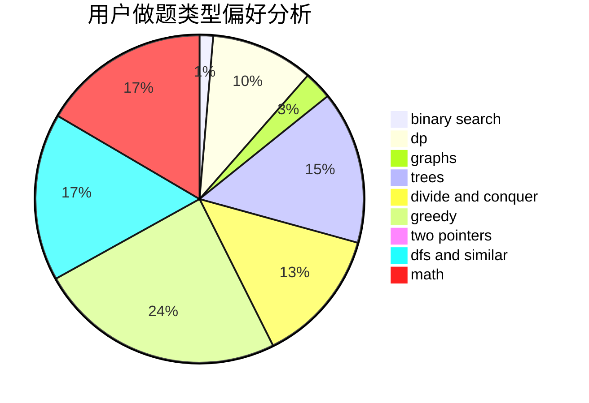

# chellam

<!-- tabs:start -->

#### **用户提交结果分析**

#### **用户做题类型偏好分析**

<!-- tabs:end -->
# 推荐题目
[1444D](https://codeforces.com/contest/1444/problem/D)
[1131D](https://codeforces.com/contest/1131/problem/D)
[683B](https://codeforces.com/contest/683/problem/B)
[277E](https://codeforces.com/contest/277/problem/E)
[1252C](https://codeforces.com/contest/1252/problem/C)
[1411A](https://codeforces.com/contest/1411/problem/A)
[625B](https://codeforces.com/contest/625/problem/B)
[736C](https://codeforces.com/contest/736/problem/C)
[22C](https://codeforces.com/contest/22/problem/C)
[105B](https://codeforces.com/contest/105/problem/B)
