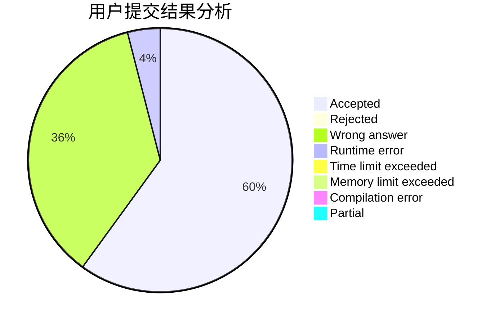
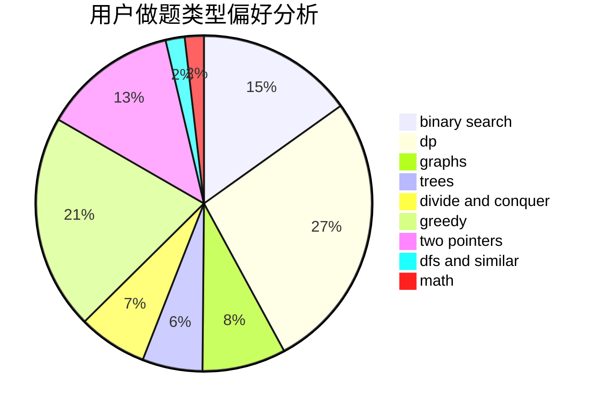

# chen_03

<!-- tabs:start -->

#### **用户提交结果分析**

#### **用户做题类型偏好分析**

<!-- tabs:end -->
# 推荐题目
[787A](https://codeforces.com/contest/787/problem/A)
[1300C](https://codeforces.com/contest/1300/problem/C)
[181B](https://codeforces.com/contest/181/problem/B)
[1295D](https://codeforces.com/contest/1295/problem/D)
[1227B](https://codeforces.com/contest/1227/problem/B)
[1176E](https://codeforces.com/contest/1176/problem/E)
[164C](https://codeforces.com/contest/164/problem/C)
[353D](https://codeforces.com/contest/353/problem/D)
[1403A](https://codeforces.com/contest/1403/problem/A)
[822A](https://codeforces.com/contest/822/problem/A)
