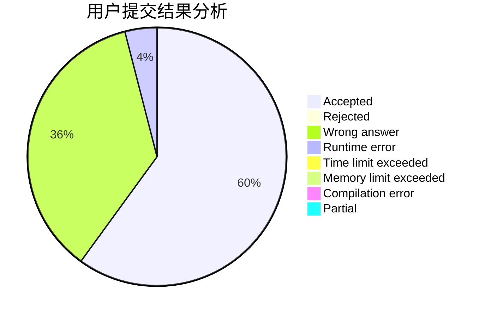
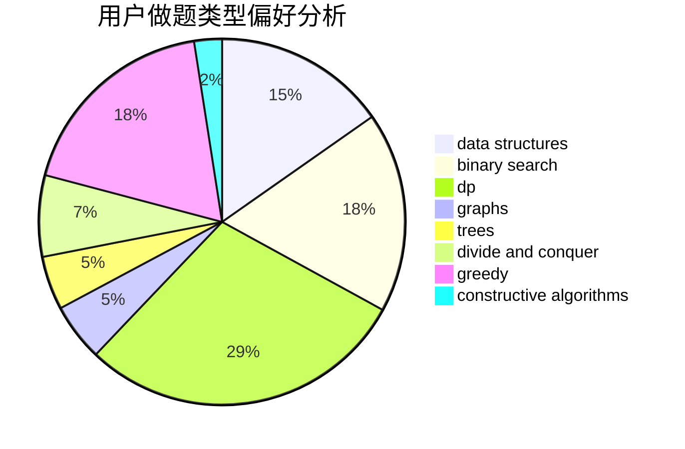

# chen_03

<!-- tabs:start -->

#### **用户提交结果分析**

#### **用户做题类型偏好分析**

#### **用户错题知识点分析**

<!-- tabs:end -->
# 推荐题目
[787A](https://codeforces.com/contest/787/problem/A)		brute force,
                        math,
                        number theory		  
[1300C](https://codeforces.com/contest/1300/problem/C)		dsu,graphs,sortings,trees		  
[181B](https://codeforces.com/contest/181/problem/B)		binary search,
                        brute force		  
[1295D](https://codeforces.com/contest/1295/problem/D)		math,
                        number theory		  
[1227B](https://codeforces.com/contest/1227/problem/B)		constructive algorithms		  
[1176E](https://codeforces.com/contest/1176/problem/E)		dfs and similar,
                        dsu,
                        graphs,
                        shortest paths,
                        trees		  
[164C](https://codeforces.com/contest/164/problem/C)		flows,
                        graphs		  
[353D](https://codeforces.com/contest/353/problem/D)		constructive algorithms,
                        dp		  
[1403A](https://codeforces.com/contest/1403/problem/A)		*special problem,
                        2-sat,
                        binary search,
                        data structures,
                        graphs,
                        interactive,
                        sortings,
                        two pointers		  
[822A](https://codeforces.com/contest/822/problem/A)		implementation,
                        math,
                        number theory		  
