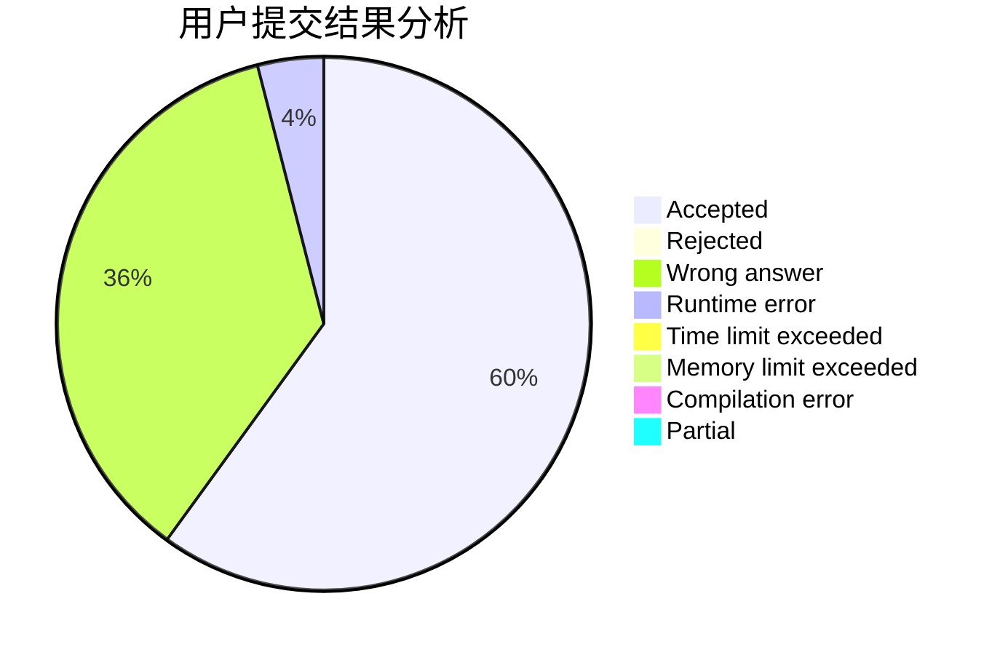
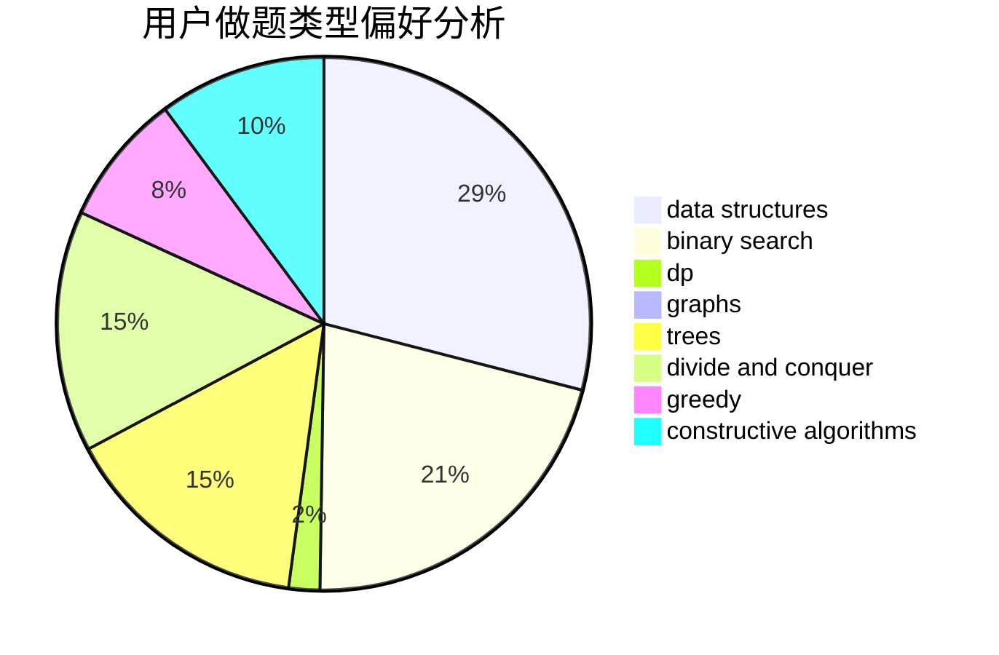
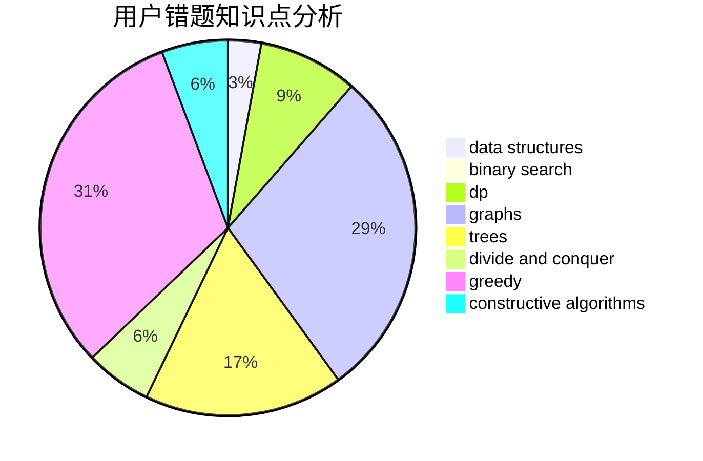

# chen_03

<!-- tabs:start -->

#### **用户提交结果分析**

#### **用户做题类型偏好分析**

#### **用户错题知识点分析**

<!-- tabs:end -->
# 推荐题目
[767D](https://codeforces.com/contest/767/problem/D)		binary search,
                        data structures,
                        greedy,
                        sortings,
                        two pointers		  
[1294A](https://codeforces.com/contest/1294/problem/A)		math		  
[15A](https://codeforces.com/contest/15/problem/A)		implementation,
                        sortings		  
[1288B](https://codeforces.com/contest/1288/problem/B)		math		  
[121D](https://codeforces.com/contest/121/problem/D)		binary search,
                        implementation,
                        two pointers		  
[1174C](https://codeforces.com/contest/1174/problem/C)		constructive algorithms,
                        number theory		  
[1510D](https://codeforces.com/contest/1510/problem/D)		dp,
                        math,
                        number theory		  
[321E](https://codeforces.com/contest/321/problem/E)		data structures,
                        divide and conquer,
                        dp		  
[1394E](https://codeforces.com/contest/1394/problem/E)		strings		  
[805D](https://codeforces.com/contest/805/problem/D)		dsu,graphs,sortings,trees		  
