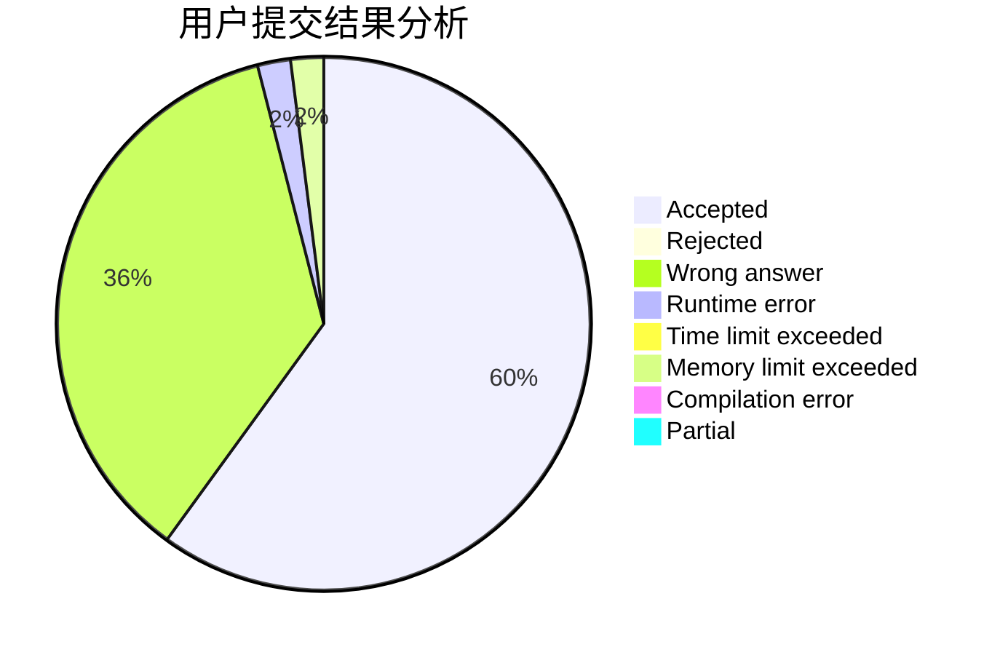
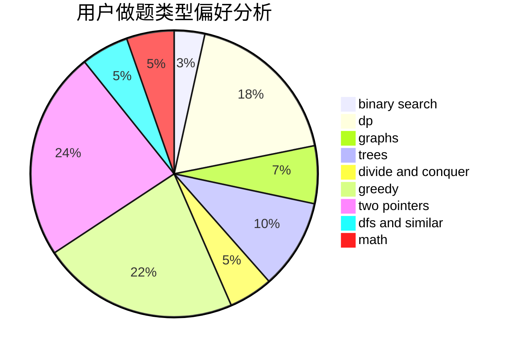

# chen__03

<!-- tabs:start -->

#### **用户提交结果分析**

#### **用户做题类型偏好分析**

<!-- tabs:end -->
# 推荐题目
[515A](https://codeforces.com/contest/515/problem/A)
[828C](https://codeforces.com/contest/828/problem/C)
[988A](https://codeforces.com/contest/988/problem/A)
[376A](https://codeforces.com/contest/376/problem/A)
[107B](https://codeforces.com/contest/107/problem/B)
[1252L](https://codeforces.com/contest/1252/problem/L)
[516B](https://codeforces.com/contest/516/problem/B)
[1001B](https://codeforces.com/contest/1001/problem/B)
[424D](https://codeforces.com/contest/424/problem/D)
[631A](https://codeforces.com/contest/631/problem/A)
