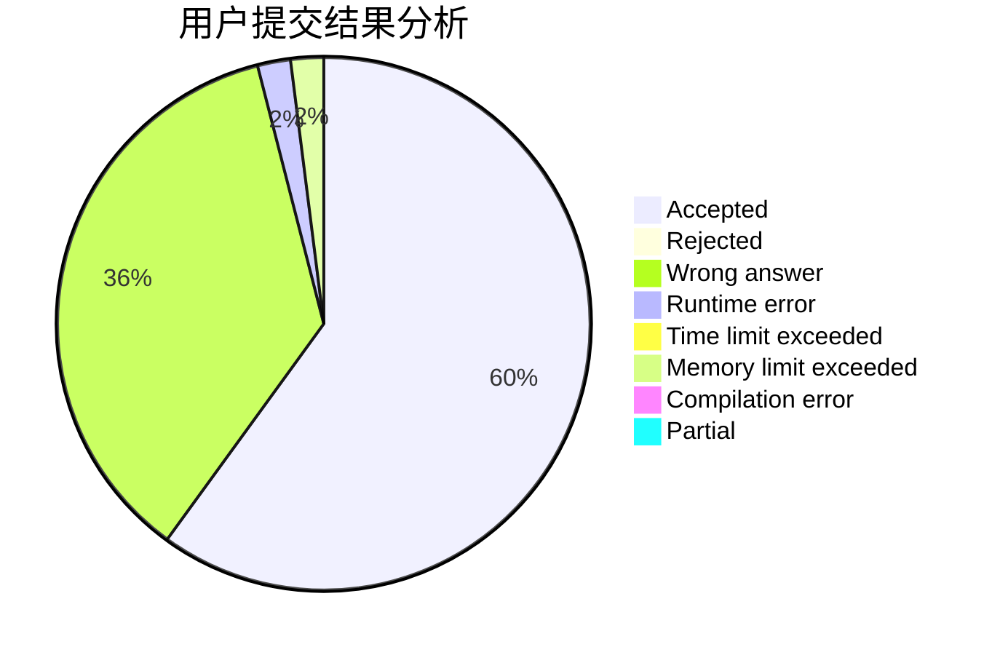
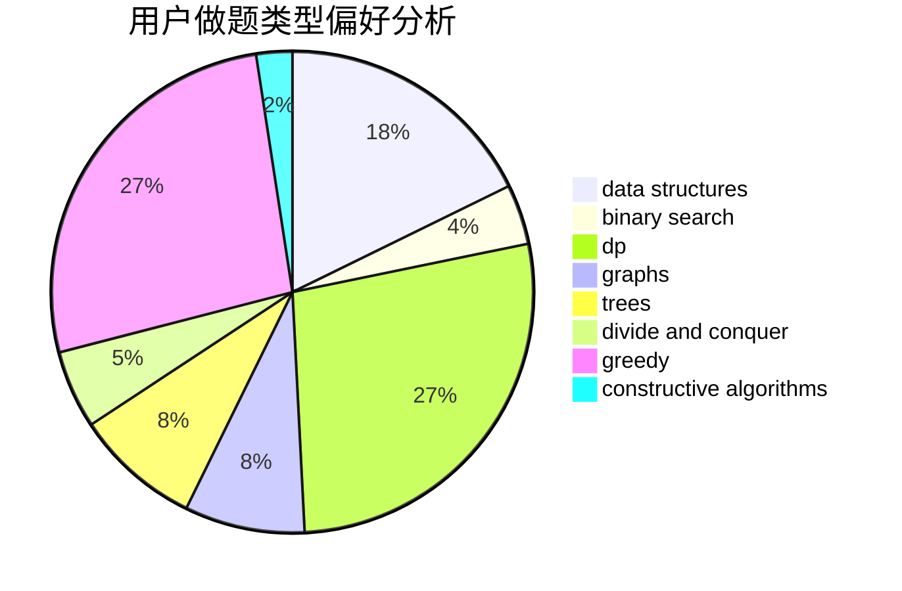
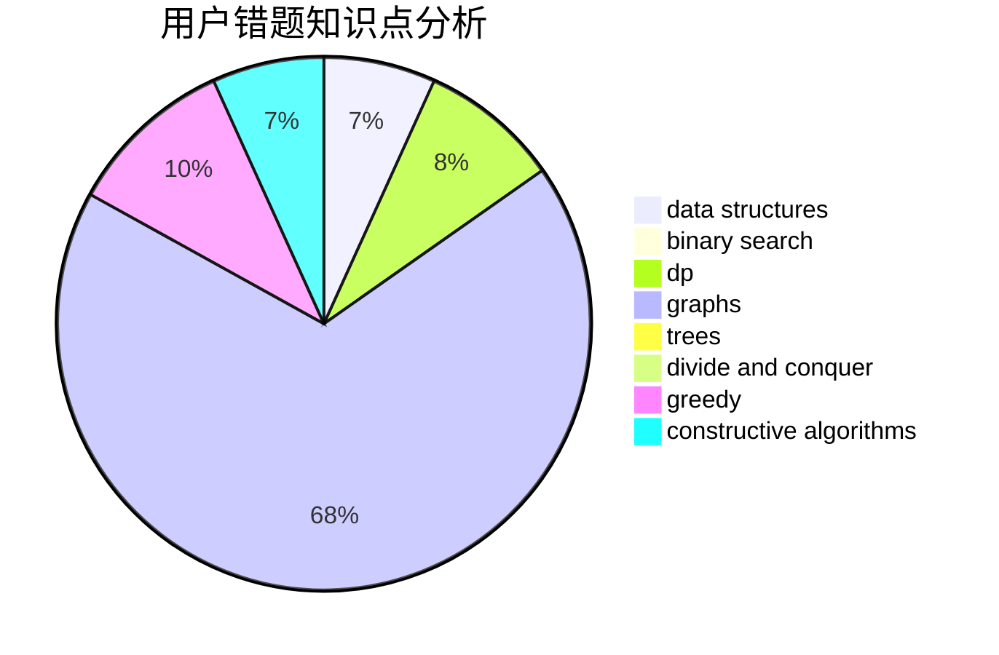

# chen__03

<!-- tabs:start -->

#### **用户提交结果分析**

#### **用户做题类型偏好分析**

#### **用户错题知识点分析**

<!-- tabs:end -->
# 推荐题目
[515A](https://codeforces.com/contest/515/problem/A)		math		  
[828C](https://codeforces.com/contest/828/problem/C)		dsu,graphs,sortings,trees		  
[988A](https://codeforces.com/contest/988/problem/A)		brute force,
                        implementation		  
[376A](https://codeforces.com/contest/376/problem/A)		implementation,
                        math		  
[107B](https://codeforces.com/contest/107/problem/B)		combinatorics,
                        dp,
                        math,
                        probabilities		  
[1252L](https://codeforces.com/contest/1252/problem/L)		flows,
                        graphs		  
[516B](https://codeforces.com/contest/516/problem/B)		dsu,graphs,sortings,trees		  
[1001B](https://codeforces.com/contest/1001/problem/B)		*special problem		  
[424D](https://codeforces.com/contest/424/problem/D)		binary search,
                        brute force,
                        constructive algorithms,
                        data structures,
                        dp		  
[631A](https://codeforces.com/contest/631/problem/A)		brute force,
                        implementation		  
