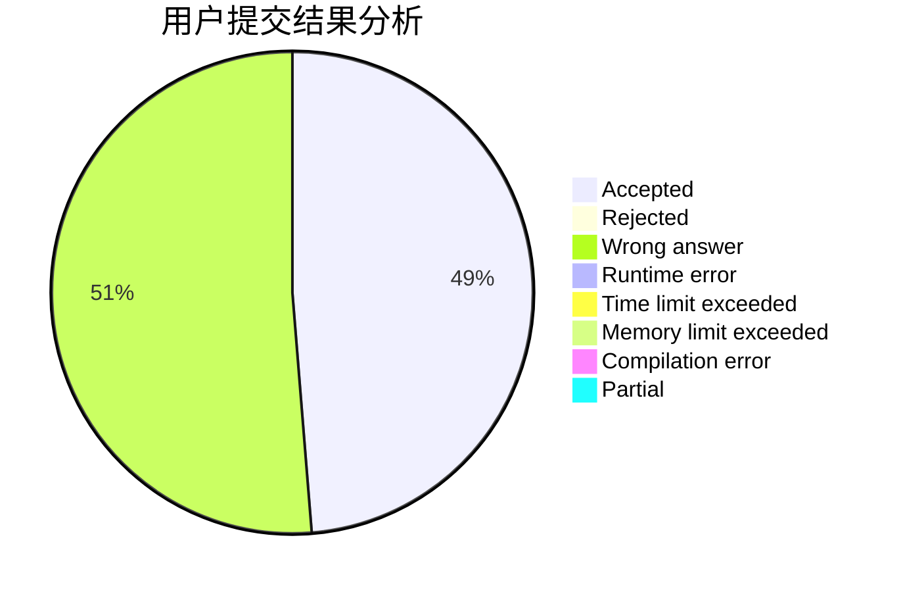
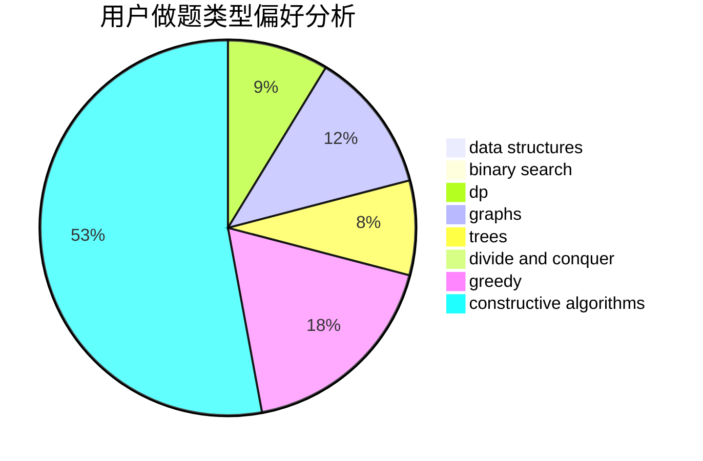

# chen_zhe_

<!-- tabs:start -->

#### **用户提交结果分析**

#### **用户做题类型偏好分析**

#### **用户错题知识点分析**

<!-- tabs:end -->
# 推荐题目
[651D](https://codeforces.com/contest/651/problem/D)		dsu,graphs,sortings,trees		  
[1129B](https://codeforces.com/contest/1129/problem/B)		constructive algorithms		  
[334B](https://codeforces.com/contest/334/problem/B)		sortings		  
[801B](https://codeforces.com/contest/801/problem/B)		constructive algorithms,
                        greedy,
                        strings		  
[908C](https://codeforces.com/contest/908/problem/C)		brute force,
                        geometry,
                        implementation,
                        math		  
[985B](https://codeforces.com/contest/985/problem/B)		implementation		  
[17E](https://codeforces.com/contest/17/problem/E)		strings		  
[28A](https://codeforces.com/contest/28/problem/A)		implementation		  
[584E](https://codeforces.com/contest/584/problem/E)		constructive algorithms,
                        greedy,
                        math		  
[845C](https://codeforces.com/contest/845/problem/C)		data structures,
                        greedy,
                        sortings		  
