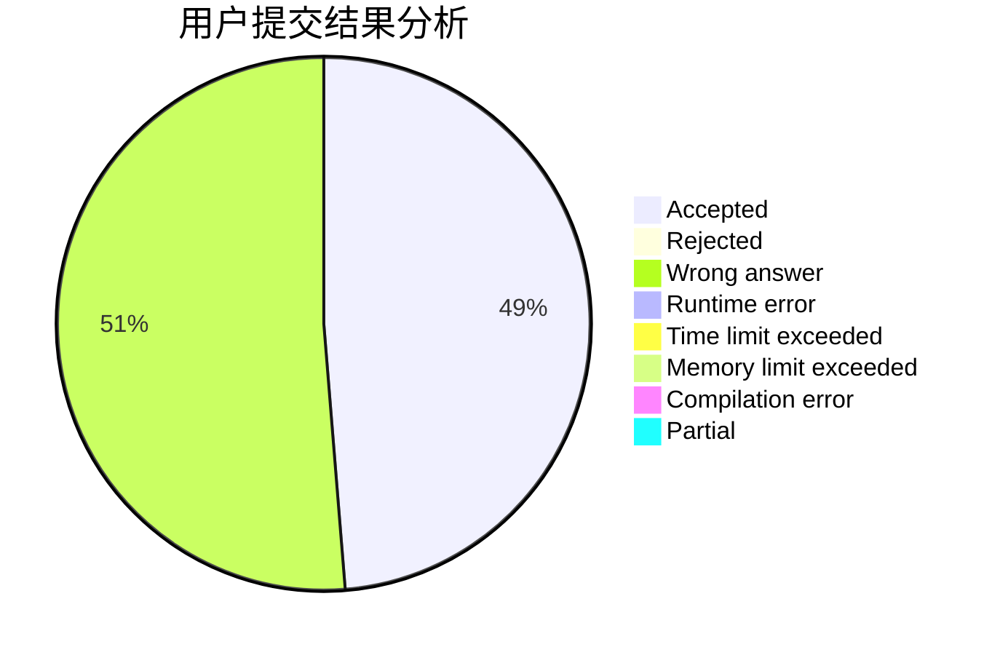
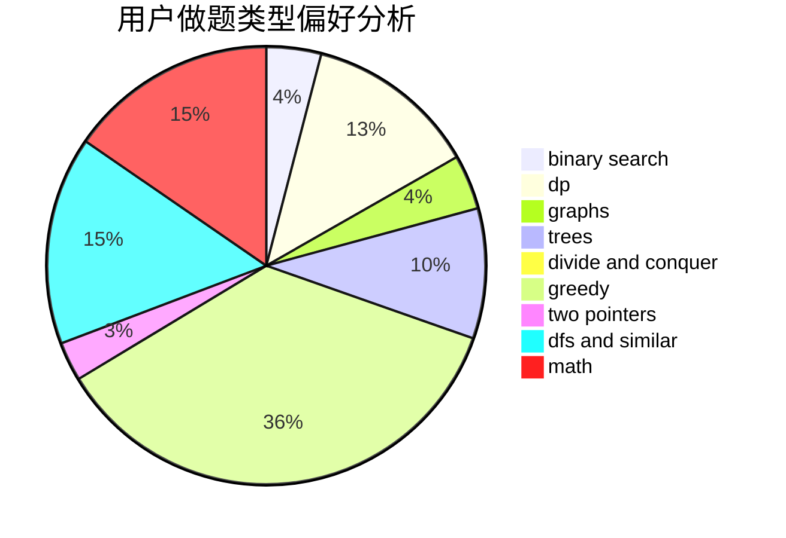

# chen_zhe_

<!-- tabs:start -->

#### **用户提交结果分析**

#### **用户做题类型偏好分析**

<!-- tabs:end -->
# 推荐题目
[651D](https://codeforces.com/contest/651/problem/D)
[1129B](https://codeforces.com/contest/1129/problem/B)
[334B](https://codeforces.com/contest/334/problem/B)
[801B](https://codeforces.com/contest/801/problem/B)
[908C](https://codeforces.com/contest/908/problem/C)
[985B](https://codeforces.com/contest/985/problem/B)
[17E](https://codeforces.com/contest/17/problem/E)
[28A](https://codeforces.com/contest/28/problem/A)
[584E](https://codeforces.com/contest/584/problem/E)
[845C](https://codeforces.com/contest/845/problem/C)
