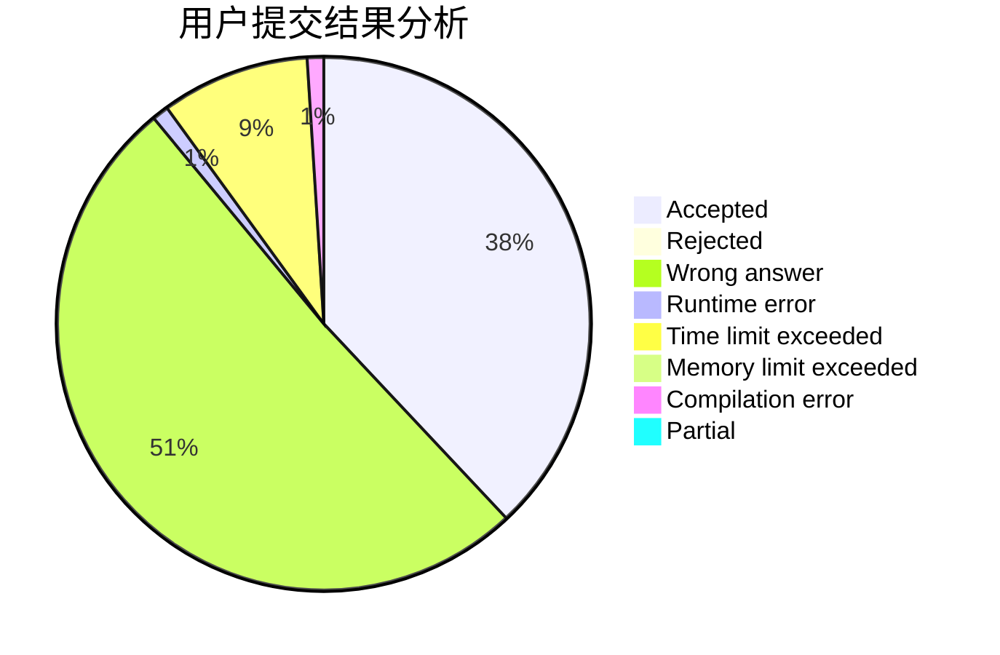
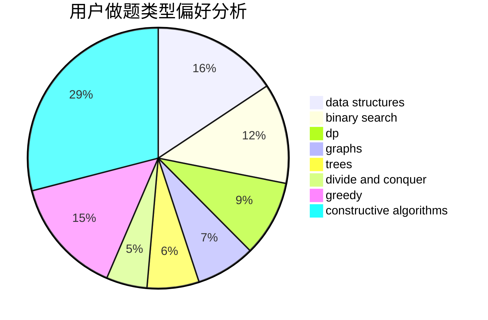

# chenfu1234

<!-- tabs:start -->

#### **用户提交结果分析**

#### **用户做题类型偏好分析**

#### **用户错题知识点分析**

<!-- tabs:end -->
# 推荐题目
[1454F](https://codeforces.com/contest/1454/problem/F)		binary search,
                        data structures,
                        greedy,
                        two pointers		  
[238C](https://codeforces.com/contest/238/problem/C)		dfs and similar,
                        dp,
                        greedy,
                        trees		  
[379D](https://codeforces.com/contest/379/problem/D)		bitmasks,
                        brute force,
                        dp		  
[919E](https://codeforces.com/contest/919/problem/E)		chinese remainder theorem,
                        math,
                        number theory		  
[674F](https://codeforces.com/contest/674/problem/F)		dsu,graphs,sortings,trees		  
[746G](https://codeforces.com/contest/746/problem/G)		constructive algorithms,
                        graphs,
                        trees		  
[223C](https://codeforces.com/contest/223/problem/C)		combinatorics,
                        math,
                        number theory		  
[938G](https://codeforces.com/contest/938/problem/G)		bitmasks,
                        data structures,
                        dsu,
                        graphs		  
[472B](https://codeforces.com/contest/472/problem/B)		nan		  
[1213B](https://codeforces.com/contest/1213/problem/B)		data structures,
                        implementation		  
