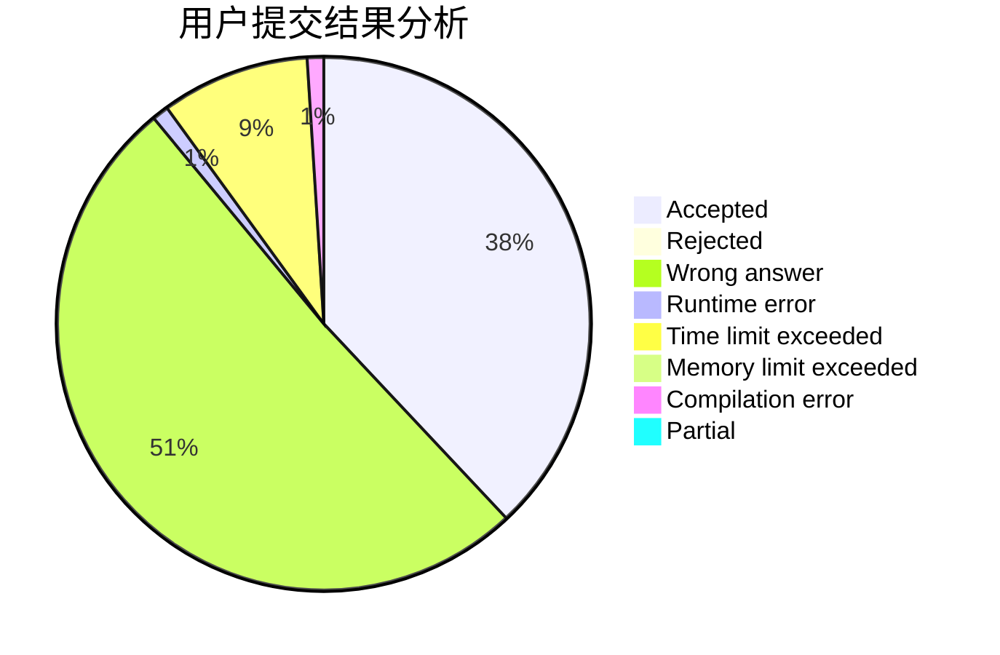
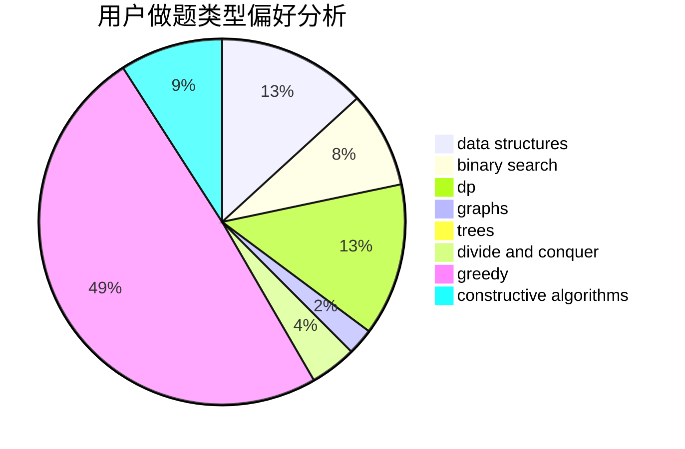

# chenfu1234

<!-- tabs:start -->

#### **用户提交结果分析**

#### **用户做题类型偏好分析**

#### **用户错题知识点分析**

<!-- tabs:end -->
# 推荐题目
[1464C](https://codeforces.com/contest/1464/problem/C)		dsu,graphs,sortings,trees		  
[25E](https://codeforces.com/contest/25/problem/E)		hashing,
                        strings		  
[409B](https://codeforces.com/contest/409/problem/B)		*special problem		  
[939F](https://codeforces.com/contest/939/problem/F)		data structures,
                        dp		  
[699C](https://codeforces.com/contest/699/problem/C)		dsu,graphs,sortings,trees		  
[766C](https://codeforces.com/contest/766/problem/C)		brute force,
                        dp,
                        greedy,
                        strings		  
[241E](https://codeforces.com/contest/241/problem/E)		graphs,
                        shortest paths		  
[960C](https://codeforces.com/contest/960/problem/C)		bitmasks,
                        constructive algorithms,
                        greedy,
                        implementation		  
[490E](https://codeforces.com/contest/490/problem/E)		binary search,
                        brute force,
                        greedy,
                        implementation		  
[1217D](https://codeforces.com/contest/1217/problem/D)		constructive algorithms,
                        dfs and similar,
                        graphs		  
