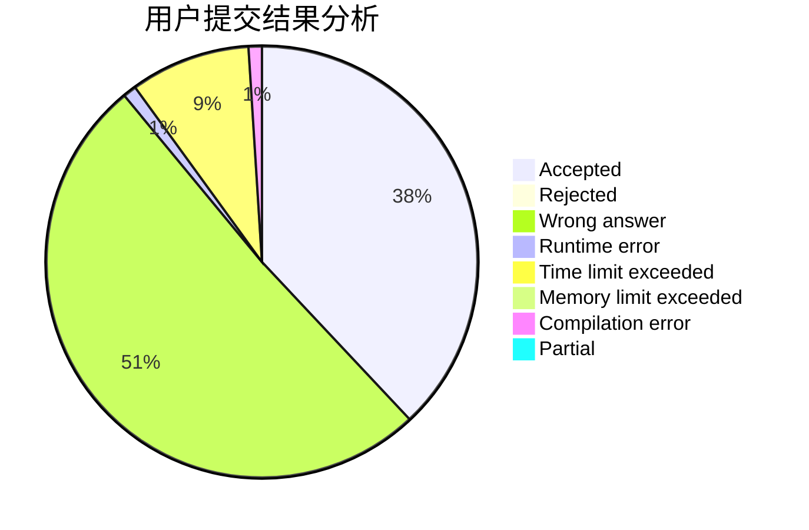
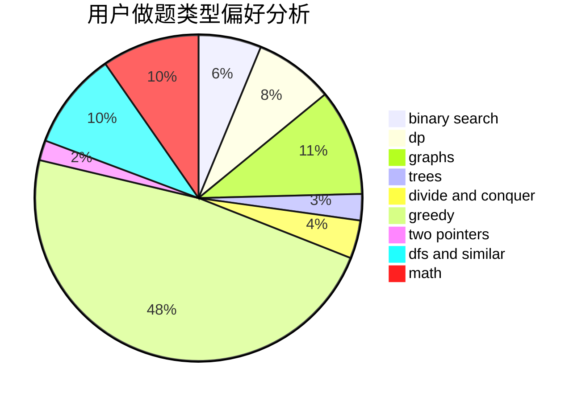

# chenfu1234

<!-- tabs:start -->

#### **用户提交结果分析**

#### **用户做题类型偏好分析**

<!-- tabs:end -->
# 推荐题目
[1464C](https://codeforces.com/contest/1464/problem/C)
[25E](https://codeforces.com/contest/25/problem/E)
[409B](https://codeforces.com/contest/409/problem/B)
[939F](https://codeforces.com/contest/939/problem/F)
[699C](https://codeforces.com/contest/699/problem/C)
[766C](https://codeforces.com/contest/766/problem/C)
[241E](https://codeforces.com/contest/241/problem/E)
[960C](https://codeforces.com/contest/960/problem/C)
[490E](https://codeforces.com/contest/490/problem/E)
[1217D](https://codeforces.com/contest/1217/problem/D)
