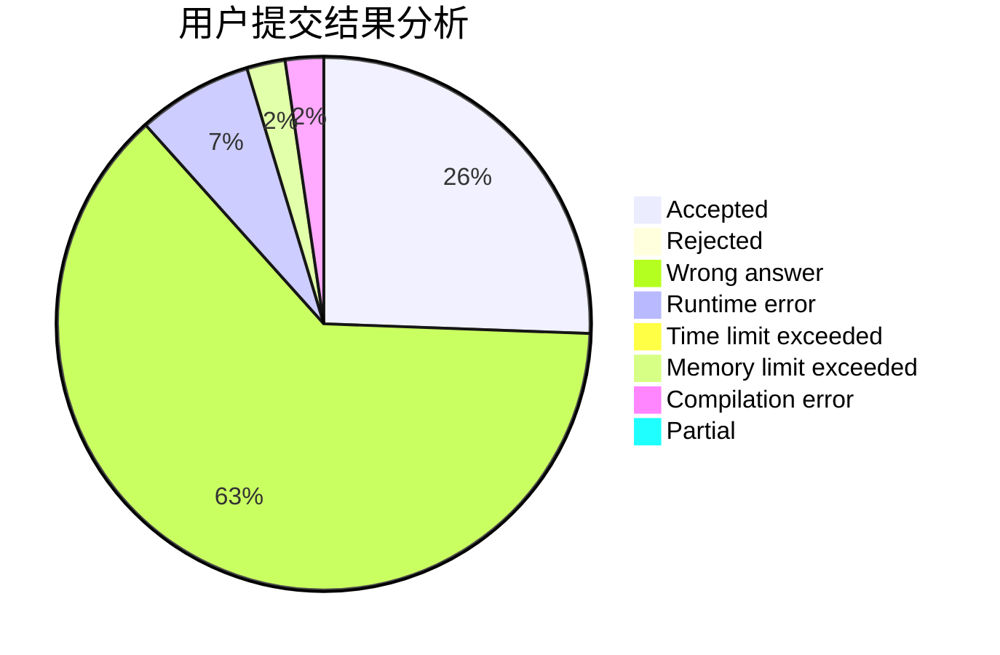
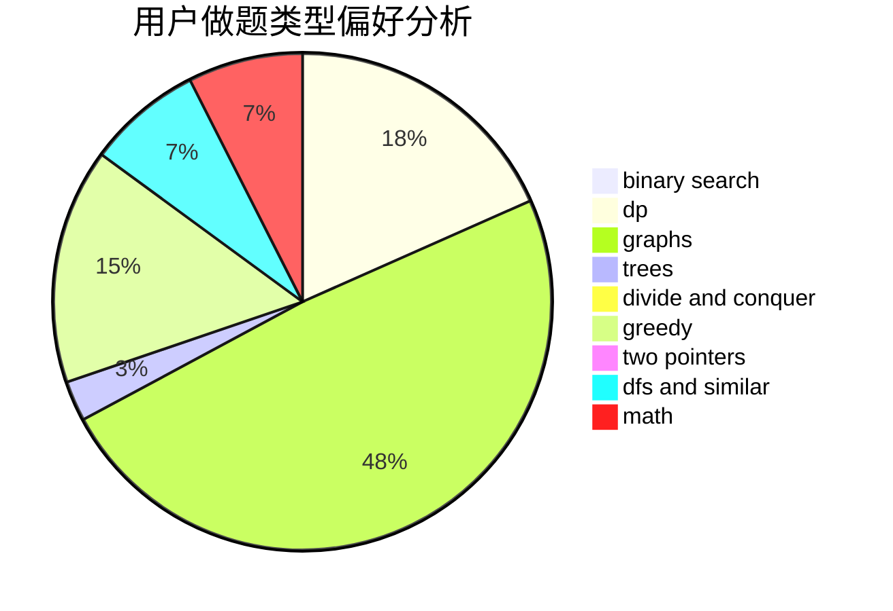

# chengchunhao

<!-- tabs:start -->

#### **用户提交结果分析**

#### **用户做题类型偏好分析**

<!-- tabs:end -->
# 推荐题目
[960G](https://codeforces.com/contest/960/problem/G)
[489F](https://codeforces.com/contest/489/problem/F)
[766E](https://codeforces.com/contest/766/problem/E)
[102A](https://codeforces.com/contest/102/problem/A)
[1432D](https://codeforces.com/contest/1432/problem/D)
[912A](https://codeforces.com/contest/912/problem/A)
[1236D](https://codeforces.com/contest/1236/problem/D)
[1464D](https://codeforces.com/contest/1464/problem/D)
[730H](https://codeforces.com/contest/730/problem/H)
[1162A](https://codeforces.com/contest/1162/problem/A)
