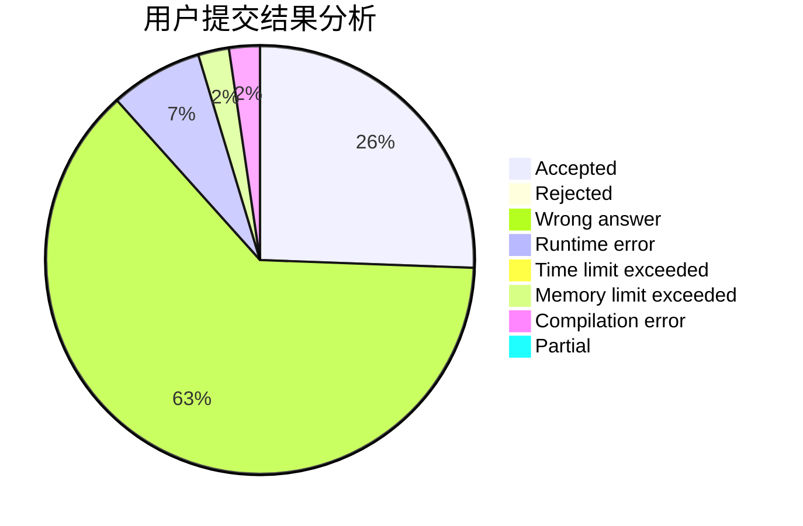
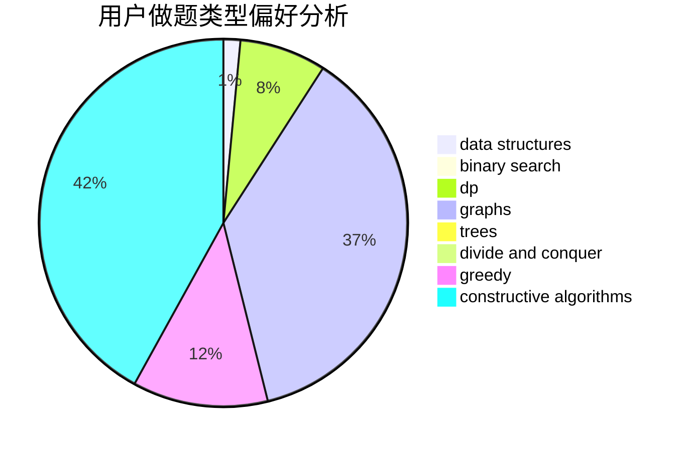

# chengchunhao

<!-- tabs:start -->

#### **用户提交结果分析**

#### **用户做题类型偏好分析**

#### **用户错题知识点分析**

<!-- tabs:end -->
# 推荐题目
[960G](https://codeforces.com/contest/960/problem/G)		combinatorics,
                        dp,
                        fft,
                        math		  
[489F](https://codeforces.com/contest/489/problem/F)		combinatorics,
                        dp		  
[766E](https://codeforces.com/contest/766/problem/E)		bitmasks,
                        constructive algorithms,
                        data structures,
                        dfs and similar,
                        dp,
                        math,
                        trees		  
[102A](https://codeforces.com/contest/102/problem/A)		brute force		  
[1432D](https://codeforces.com/contest/1432/problem/D)		dsu,graphs,sortings,trees		  
[912A](https://codeforces.com/contest/912/problem/A)		implementation		  
[1236D](https://codeforces.com/contest/1236/problem/D)		brute force,
                        data structures,
                        greedy,
                        implementation		  
[1464D](https://codeforces.com/contest/1464/problem/D)		dsu,graphs,sortings,trees		  
[730H](https://codeforces.com/contest/730/problem/H)		constructive algorithms,
                        implementation		  
[1162A](https://codeforces.com/contest/1162/problem/A)		implementation		  
