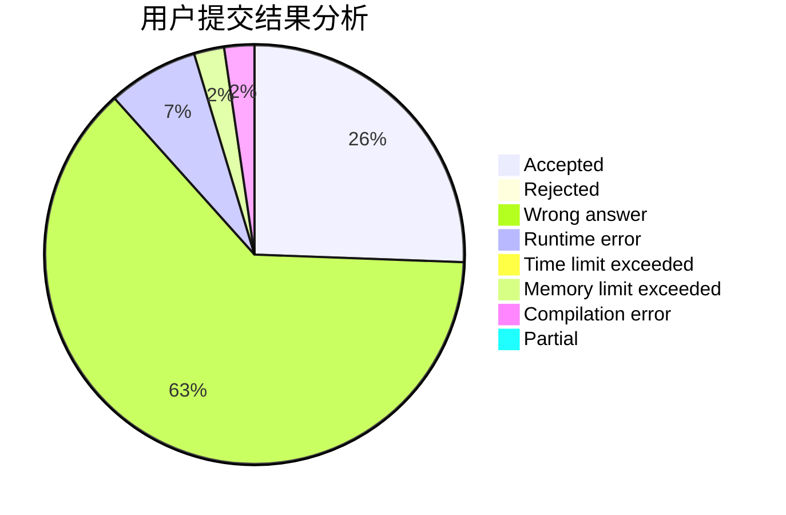
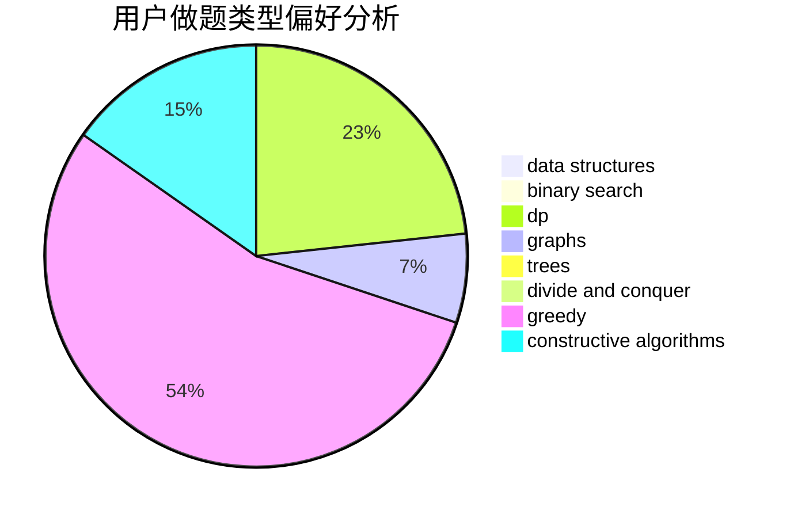

# chengchunhao

<!-- tabs:start -->

#### **用户提交结果分析**

#### **用户做题类型偏好分析**

#### **用户错题知识点分析**

<!-- tabs:end -->
# 推荐题目
[939D](https://codeforces.com/contest/939/problem/D)		dfs and similar,
                        dsu,
                        graphs,
                        greedy,
                        strings		  
[471A](https://codeforces.com/contest/471/problem/A)		implementation		  
[747B](https://codeforces.com/contest/747/problem/B)		implementation,
                        strings		  
[1029D](https://codeforces.com/contest/1029/problem/D)		implementation,
                        math		  
[1423N](https://codeforces.com/contest/1423/problem/N)		nan		  
[894B](https://codeforces.com/contest/894/problem/B)		combinatorics,
                        constructive algorithms,
                        math,
                        number theory		  
[1227F2](https://codeforces.com/contest/1227F/problem/2)		combinatorics,
                        math		  
[1455A](https://codeforces.com/contest/1455/problem/A)		math,
                        number theory		  
[710D](https://codeforces.com/contest/710/problem/D)		math,
                        number theory		  
[1159B](https://codeforces.com/contest/1159/problem/B)		implementation,
                        math		  
