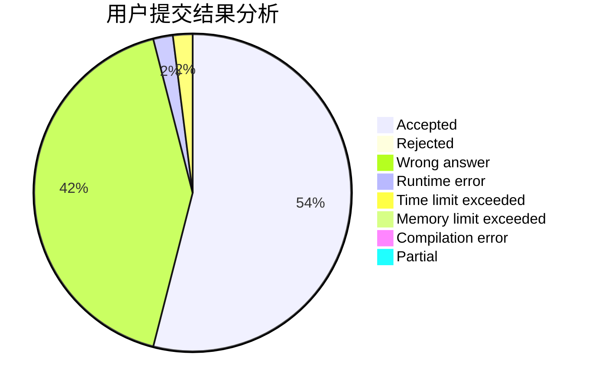
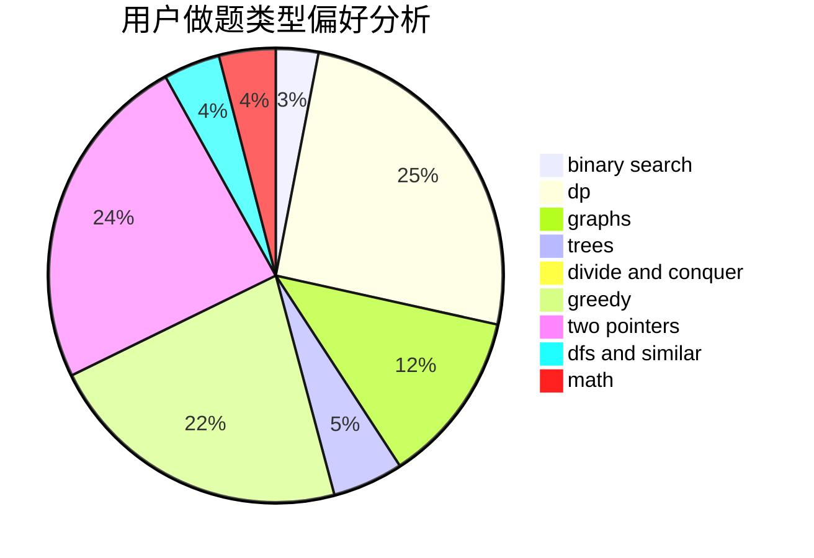

# chengxiangqu

<!-- tabs:start -->

#### **用户提交结果分析**

#### **用户做题类型偏好分析**

<!-- tabs:end -->
# 推荐题目
[12621](https://codeforces.com/contest/1262/problem/1)
[652E](https://codeforces.com/contest/652/problem/E)
[6701](https://codeforces.com/contest/670/problem/1)
[954C](https://codeforces.com/contest/954/problem/C)
[1087E](https://codeforces.com/contest/1087/problem/E)
[10C](https://codeforces.com/contest/10/problem/C)
[570A](https://codeforces.com/contest/570/problem/A)
[995F](https://codeforces.com/contest/995/problem/F)
[832B](https://codeforces.com/contest/832/problem/B)
[993A](https://codeforces.com/contest/993/problem/A)
