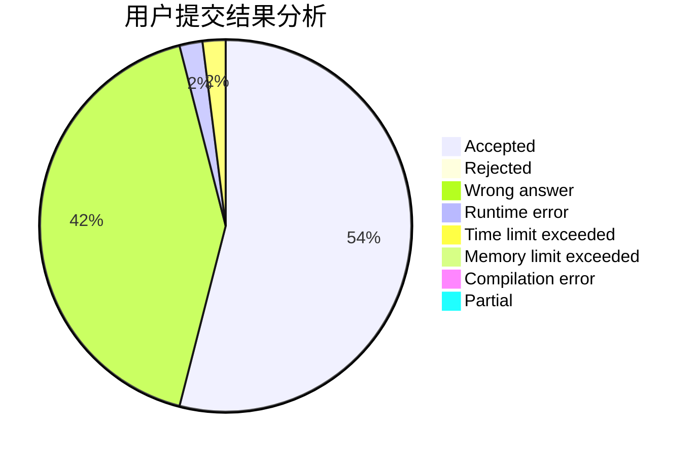
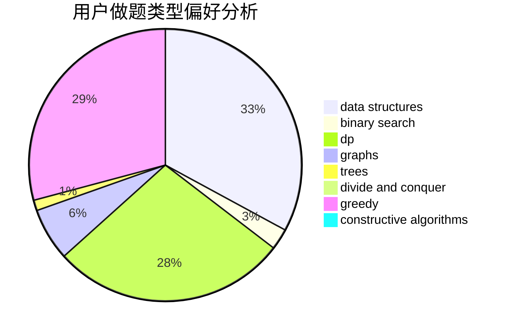
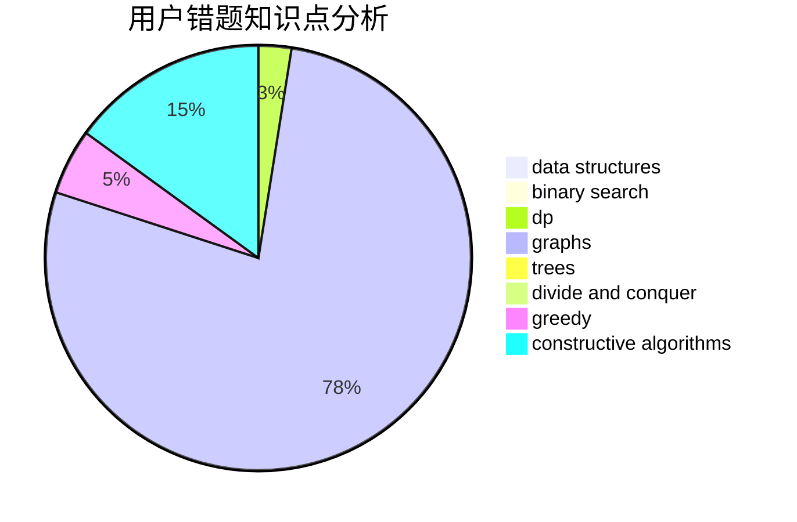

# chengxiangqu

<!-- tabs:start -->

#### **用户提交结果分析**

#### **用户做题类型偏好分析**

#### **用户错题知识点分析**

<!-- tabs:end -->
# 推荐题目
[12621](https://codeforces.com/contest/1262/problem/1)		dsu,graphs,sortings,trees		  
[652E](https://codeforces.com/contest/652/problem/E)		dfs and similar,
                        dsu,
                        graphs,
                        trees		  
[6701](https://codeforces.com/contest/670/problem/1)		dsu,graphs,sortings,trees		  
[954C](https://codeforces.com/contest/954/problem/C)		implementation		  
[1087E](https://codeforces.com/contest/1087/problem/E)		dsu,graphs,sortings,trees		  
[10C](https://codeforces.com/contest/10/problem/C)		number theory		  
[570A](https://codeforces.com/contest/570/problem/A)		implementation		  
[995F](https://codeforces.com/contest/995/problem/F)		combinatorics,
                        dp,
                        math,
                        trees		  
[832B](https://codeforces.com/contest/832/problem/B)		implementation,
                        strings		  
[993A](https://codeforces.com/contest/993/problem/A)		geometry,
                        implementation		  
