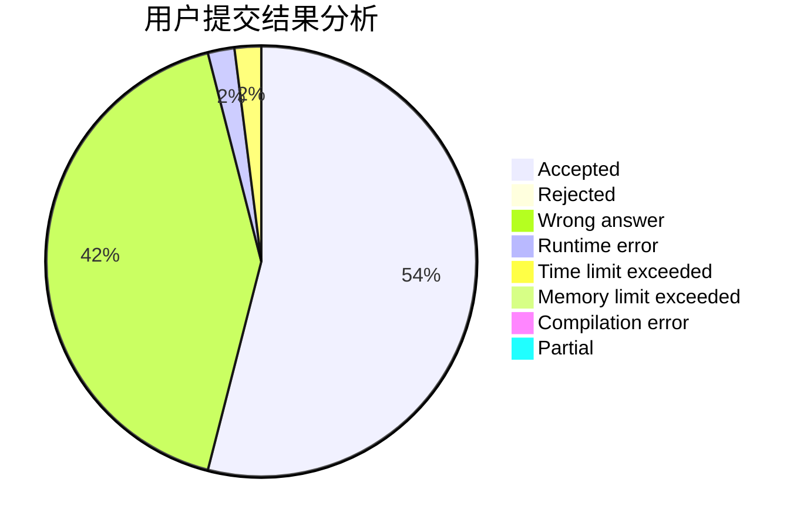
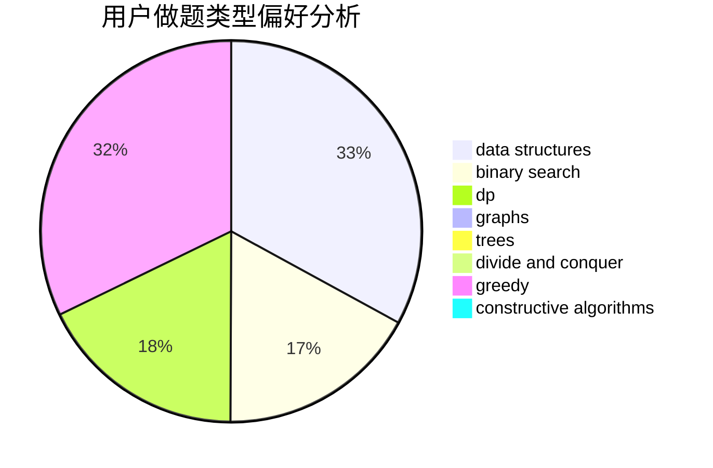
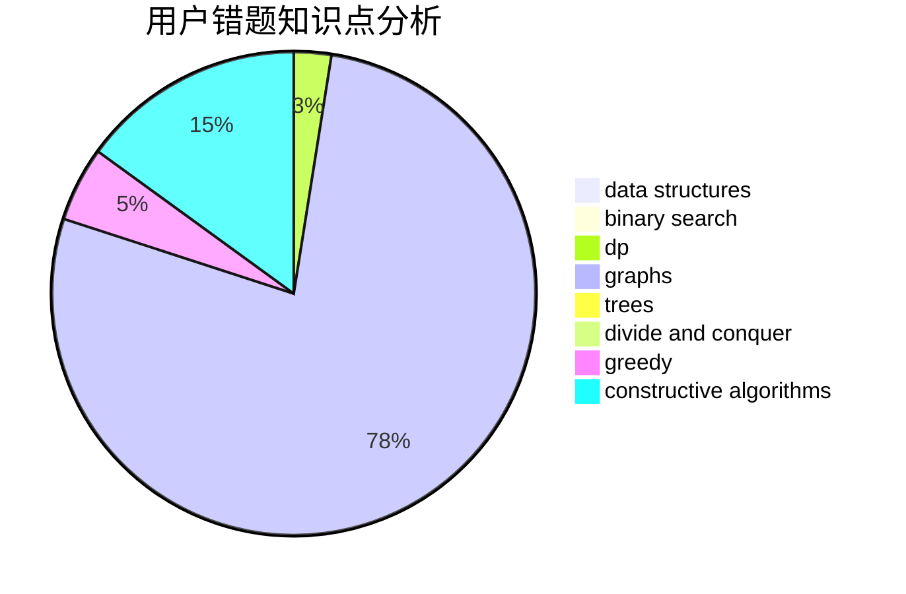

# chengxiangqu

<!-- tabs:start -->

#### **用户提交结果分析**

#### **用户做题类型偏好分析**

#### **用户错题知识点分析**

<!-- tabs:end -->
# 推荐题目
[1254D](https://codeforces.com/contest/1254/problem/D)		data structures,
                        probabilities,
                        trees		  
[626D](https://codeforces.com/contest/626/problem/D)		brute force,
                        combinatorics,
                        dp,
                        probabilities		  
[63C](https://codeforces.com/contest/63/problem/C)		brute force,
                        implementation		  
[932C](https://codeforces.com/contest/932/problem/C)		brute force,
                        constructive algorithms		  
[1087B](https://codeforces.com/contest/1087/problem/B)		dsu,graphs,sortings,trees		  
[109A](https://codeforces.com/contest/109/problem/A)		brute force,
                        implementation		  
[545D](https://codeforces.com/contest/545/problem/D)		greedy,
                        implementation,
                        sortings		  
[980D](https://codeforces.com/contest/980/problem/D)		dp,
                        math,
                        number theory		  
[813F](https://codeforces.com/contest/813/problem/F)		data structures,
                        dsu,
                        graphs		  
[979A](https://codeforces.com/contest/979/problem/A)		math		  
