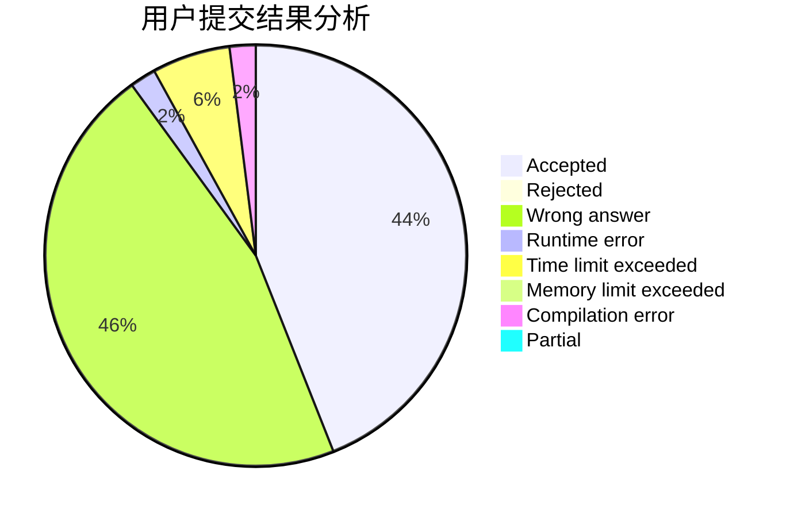
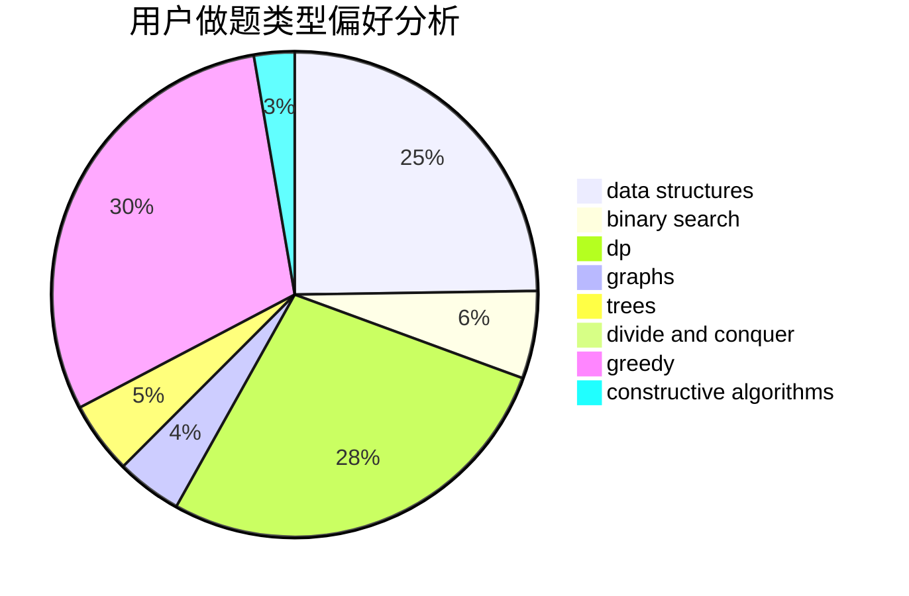

# chenhongta0

<!-- tabs:start -->

#### **用户提交结果分析**

#### **用户做题类型偏好分析**

#### **用户错题知识点分析**

<!-- tabs:end -->
# 推荐题目
[940E](https://codeforces.com/contest/940/problem/E)		data structures,
                        dp,
                        greedy,
                        math		  
[1100A](https://codeforces.com/contest/1100/problem/A)		implementation		  
[174B](https://codeforces.com/contest/174/problem/B)		dp,
                        greedy,
                        implementation		  
[1009G](https://codeforces.com/contest/1009/problem/G)		bitmasks,
                        flows,
                        graph matchings,
                        graphs,
                        greedy		  
[11852](https://codeforces.com/contest/1185/problem/2)		dsu,graphs,sortings,trees		  
[1323B](https://codeforces.com/contest/1323/problem/B)		binary search,
                        greedy,
                        implementation		  
[703E](https://codeforces.com/contest/703/problem/E)		dp,
                        number theory		  
[807C](https://codeforces.com/contest/807/problem/C)		dsu,graphs,sortings,trees		  
[274C](https://codeforces.com/contest/274/problem/C)		brute force,
                        geometry		  
[732A](https://codeforces.com/contest/732/problem/A)		brute force,
                        constructive algorithms,
                        implementation,
                        math		  
