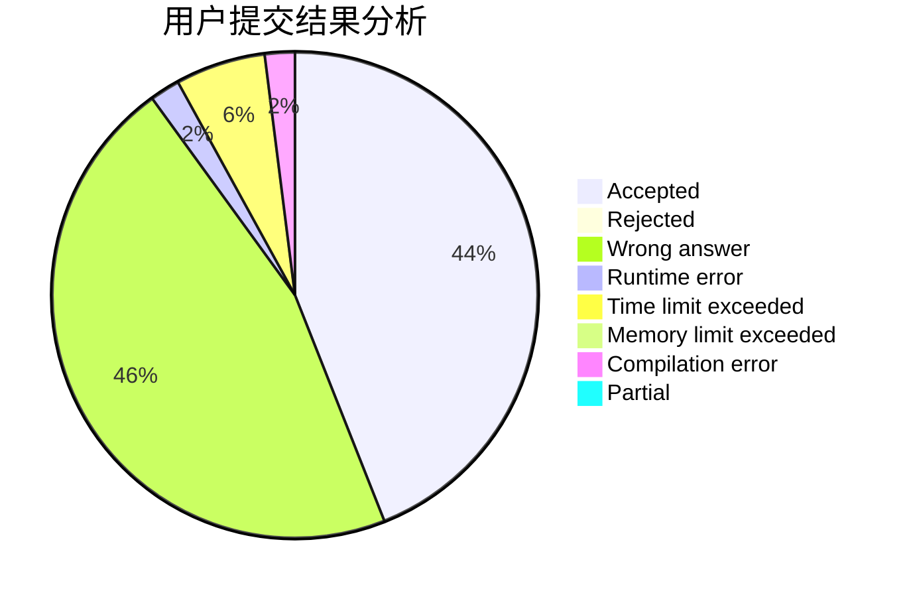
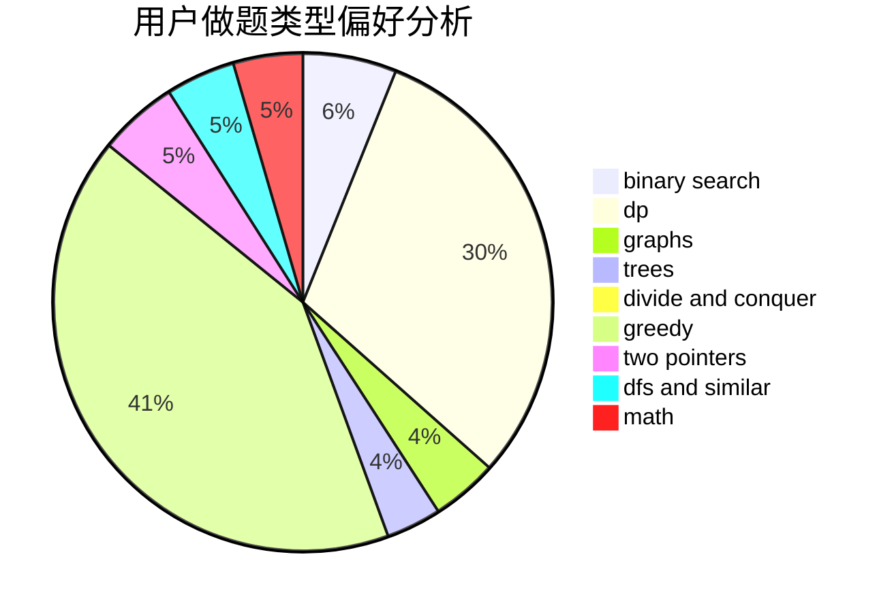

# chenhongta0

<!-- tabs:start -->

#### **用户提交结果分析**

#### **用户做题类型偏好分析**

<!-- tabs:end -->
# 推荐题目
[940E](https://codeforces.com/contest/940/problem/E)
[1100A](https://codeforces.com/contest/1100/problem/A)
[174B](https://codeforces.com/contest/174/problem/B)
[1009G](https://codeforces.com/contest/1009/problem/G)
[11852](https://codeforces.com/contest/1185/problem/2)
[1323B](https://codeforces.com/contest/1323/problem/B)
[703E](https://codeforces.com/contest/703/problem/E)
[807C](https://codeforces.com/contest/807/problem/C)
[274C](https://codeforces.com/contest/274/problem/C)
[732A](https://codeforces.com/contest/732/problem/A)
