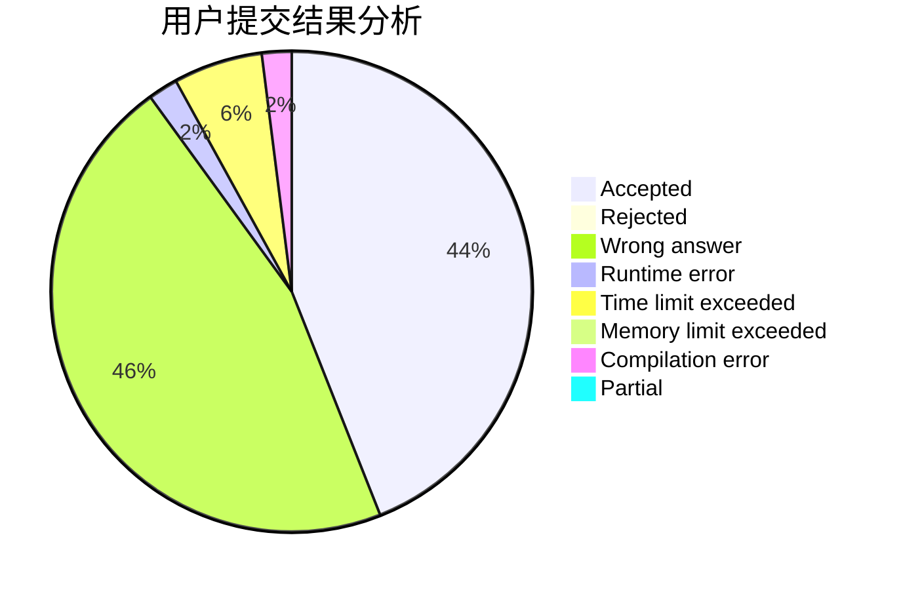
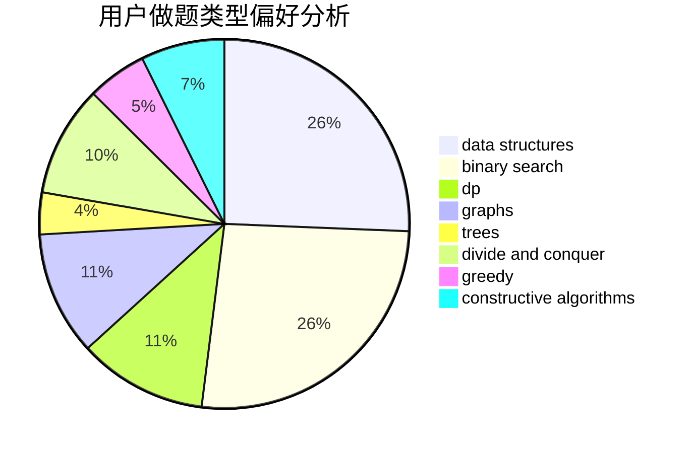

# chenhongta0

<!-- tabs:start -->

#### **用户提交结果分析**

#### **用户做题类型偏好分析**

#### **用户错题知识点分析**

<!-- tabs:end -->
# 推荐题目
[920F](https://codeforces.com/contest/920/problem/F)		brute force,
                        data structures,
                        dsu,
                        number theory		  
[10C](https://codeforces.com/contest/10/problem/C)		number theory		  
[1513F](https://codeforces.com/contest/1513/problem/F)		brute force,
                        constructive algorithms,
                        data structures,
                        sortings		  
[1009D](https://codeforces.com/contest/1009/problem/D)		brute force,
                        constructive algorithms,
                        graphs,
                        greedy,
                        math		  
[1182D](https://codeforces.com/contest/1182/problem/D)		constructive algorithms,
                        dfs and similar,
                        dp,
                        hashing,
                        implementation,
                        trees		  
[1313D](https://codeforces.com/contest/1313/problem/D)		bitmasks,
                        dp,
                        implementation		  
[67B](https://codeforces.com/contest/67/problem/B)		greedy		  
[791E](https://codeforces.com/contest/791/problem/E)		dsu,graphs,sortings,trees		  
[256D](https://codeforces.com/contest/256/problem/D)		dp		  
[712E](https://codeforces.com/contest/712/problem/E)		data structures,
                        math,
                        probabilities		  
