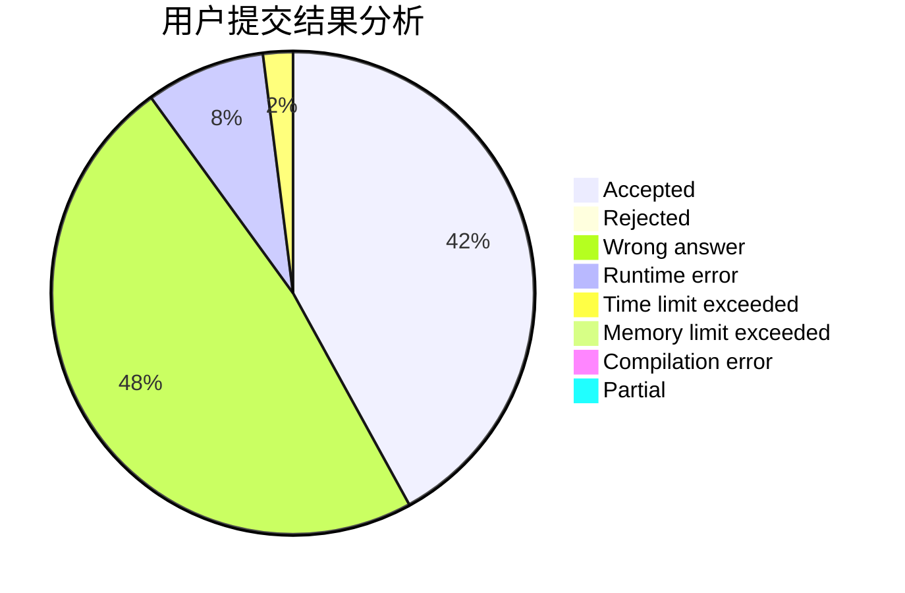
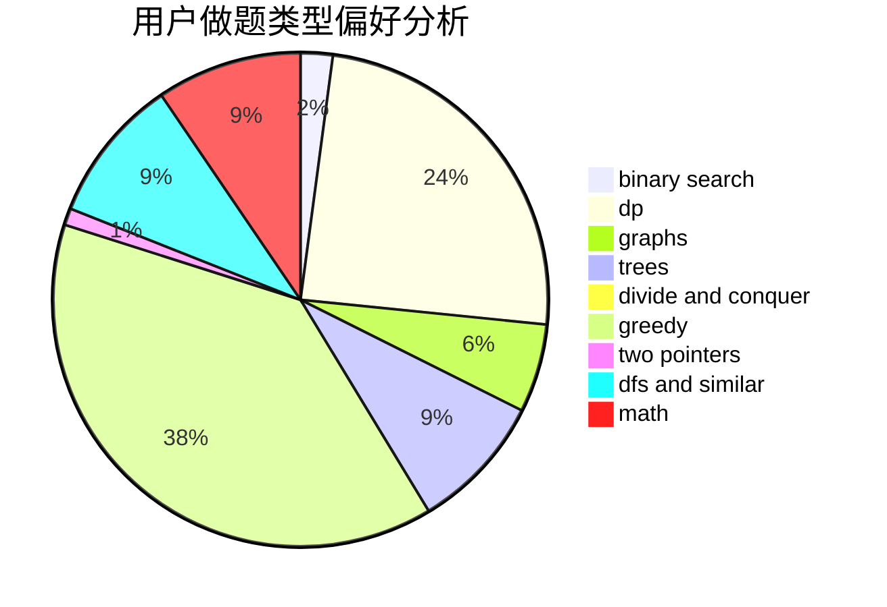

# chenkejin

<!-- tabs:start -->

#### **用户提交结果分析**

#### **用户做题类型偏好分析**

<!-- tabs:end -->
# 推荐题目
[1310C](https://codeforces.com/contest/1310/problem/C)
[1139A](https://codeforces.com/contest/1139/problem/A)
[1065F](https://codeforces.com/contest/1065/problem/F)
[472C](https://codeforces.com/contest/472/problem/C)
[611A](https://codeforces.com/contest/611/problem/A)
[466E](https://codeforces.com/contest/466/problem/E)
[866D](https://codeforces.com/contest/866/problem/D)
[356D](https://codeforces.com/contest/356/problem/D)
[1119B](https://codeforces.com/contest/1119/problem/B)
[1012C](https://codeforces.com/contest/1012/problem/C)
