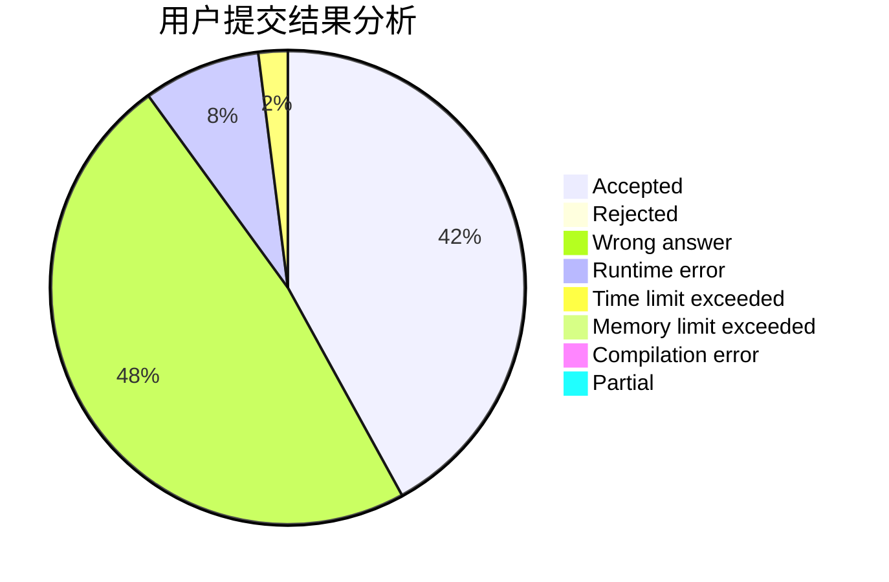
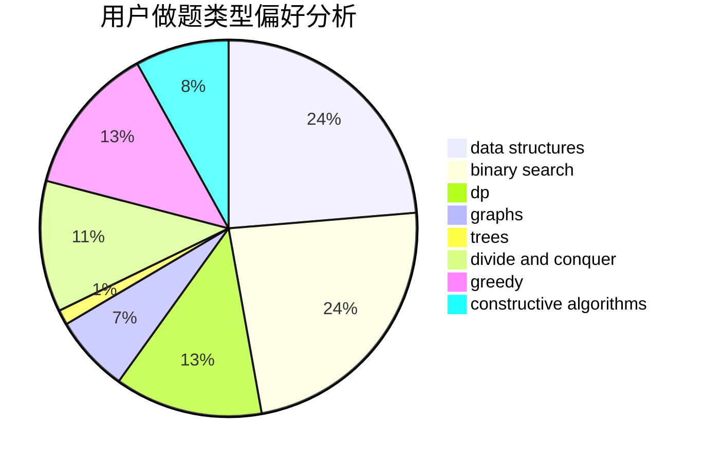
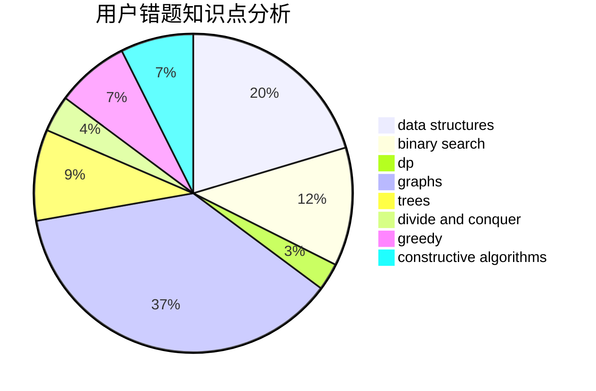

# chenkejin

<!-- tabs:start -->

#### **用户提交结果分析**

#### **用户做题类型偏好分析**

#### **用户错题知识点分析**

<!-- tabs:end -->
# 推荐题目
[1300E](https://codeforces.com/contest/1300/problem/E)		dsu,graphs,sortings,trees		  
[1136E](https://codeforces.com/contest/1136/problem/E)		binary search,
                        data structures		  
[1065B](https://codeforces.com/contest/1065/problem/B)		constructive algorithms,
                        graphs		  
[450B](https://codeforces.com/contest/450/problem/B)		implementation,
                        math		  
[591C](https://codeforces.com/contest/591/problem/C)		dsu,graphs,sortings,trees		  
[446D](https://codeforces.com/contest/446/problem/D)		math,
                        matrices,
                        probabilities		  
[848A](https://codeforces.com/contest/848/problem/A)		constructive algorithms		  
[328A](https://codeforces.com/contest/328/problem/A)		implementation		  
[1117C](https://codeforces.com/contest/1117/problem/C)		binary search		  
[1011F](https://codeforces.com/contest/1011/problem/F)		dsu,graphs,sortings,trees		  
