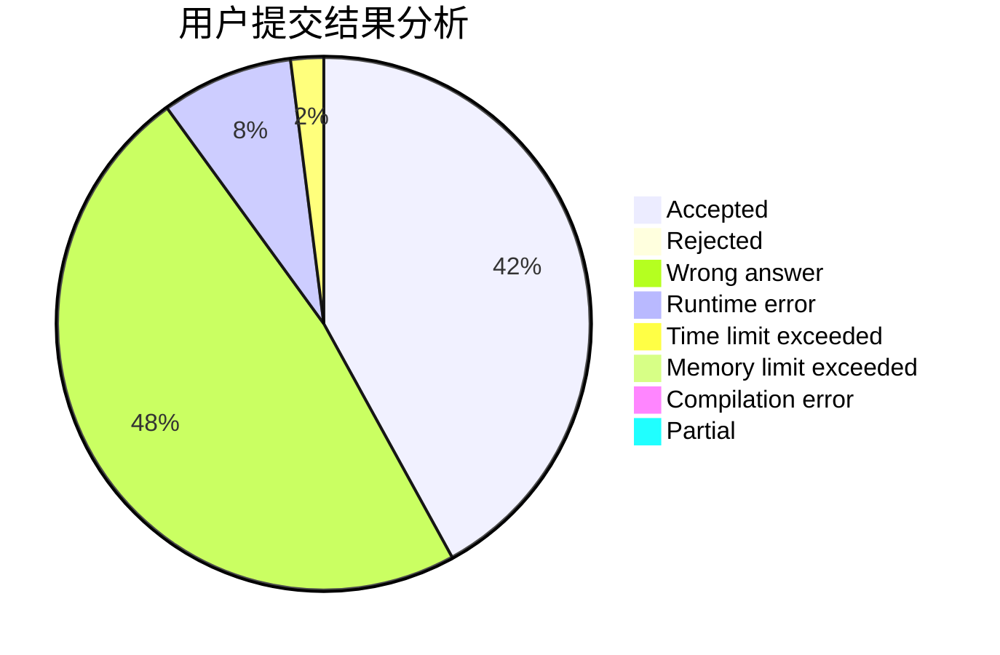
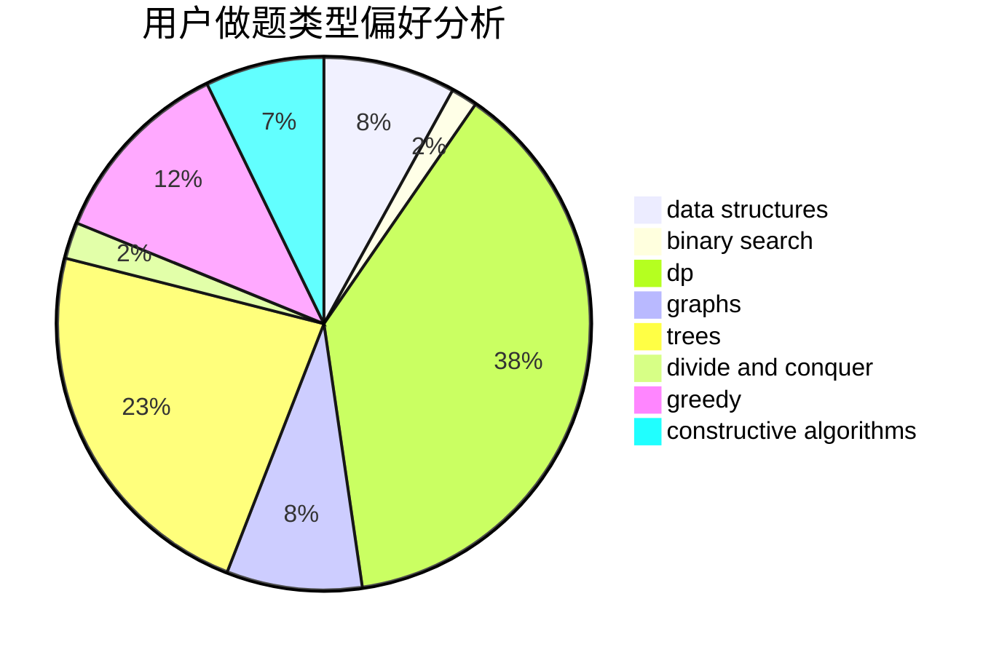
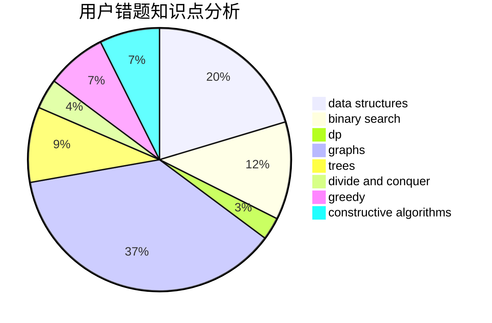

# chenkejin

<!-- tabs:start -->

#### **用户提交结果分析**

#### **用户做题类型偏好分析**

#### **用户错题知识点分析**

<!-- tabs:end -->
# 推荐题目
[1310C](https://codeforces.com/contest/1310/problem/C)		binary search,
                        dp,
                        strings		  
[1139A](https://codeforces.com/contest/1139/problem/A)		implementation,
                        strings		  
[1065F](https://codeforces.com/contest/1065/problem/F)		dfs and similar,
                        dp,
                        trees		  
[472C](https://codeforces.com/contest/472/problem/C)		greedy		  
[611A](https://codeforces.com/contest/611/problem/A)		implementation		  
[466E](https://codeforces.com/contest/466/problem/E)		dfs and similar,
                        dsu,
                        graphs,
                        trees		  
[866D](https://codeforces.com/contest/866/problem/D)		dsu,graphs,sortings,trees		  
[356D](https://codeforces.com/contest/356/problem/D)		bitmasks,
                        constructive algorithms,
                        dp,
                        greedy		  
[1119B](https://codeforces.com/contest/1119/problem/B)		binary search,
                        flows,
                        greedy,
                        sortings		  
[1012C](https://codeforces.com/contest/1012/problem/C)		dp		  
