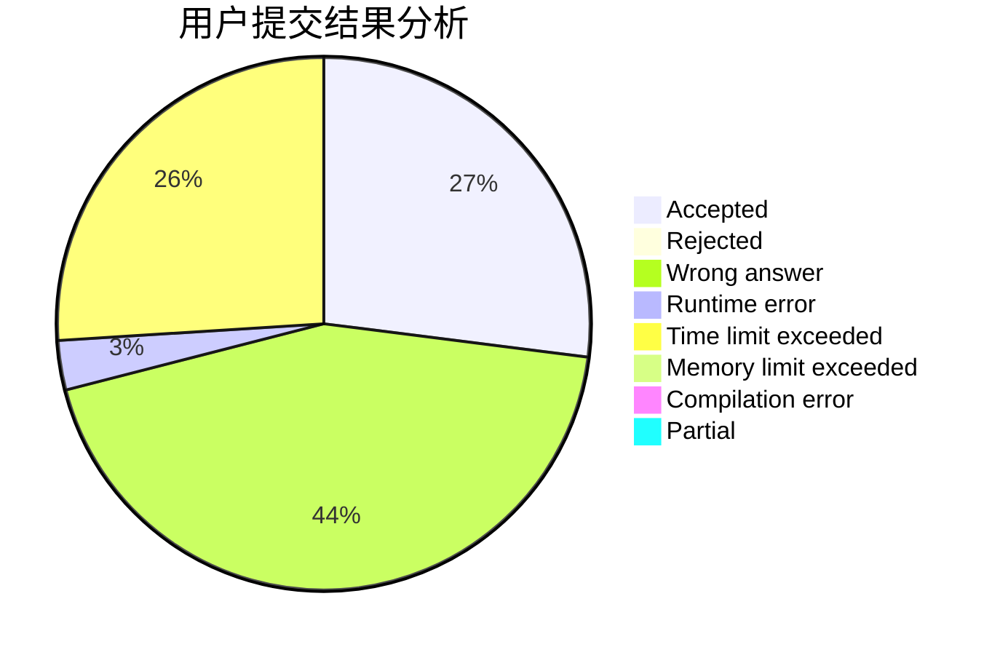
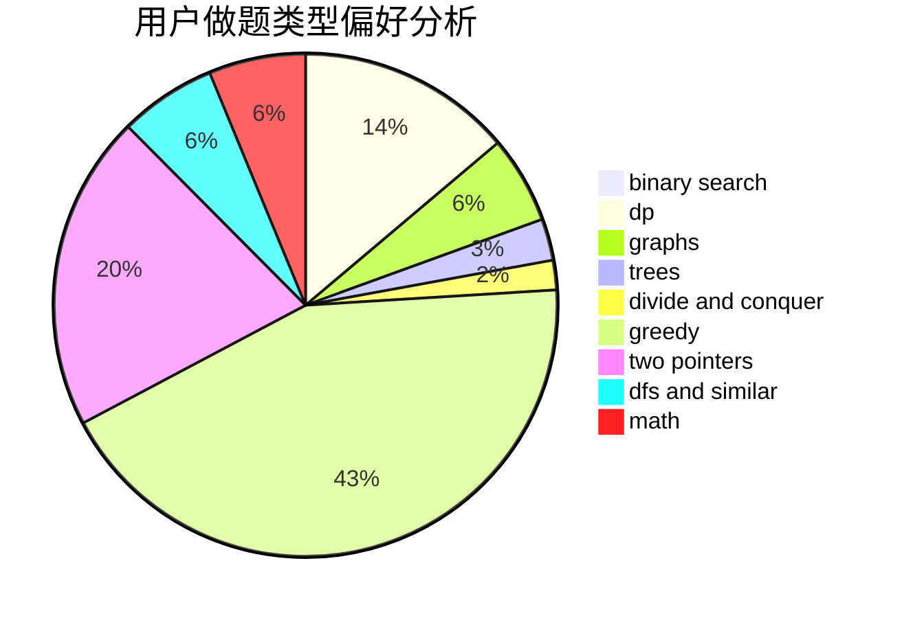

# chenkuowen

<!-- tabs:start -->

#### **用户提交结果分析**

#### **用户做题类型偏好分析**

<!-- tabs:end -->
# 推荐题目
[231C](https://codeforces.com/contest/231/problem/C)
[864C](https://codeforces.com/contest/864/problem/C)
[1156A](https://codeforces.com/contest/1156/problem/A)
[1105D](https://codeforces.com/contest/1105/problem/D)
[1161B](https://codeforces.com/contest/1161/problem/B)
[1092F](https://codeforces.com/contest/1092/problem/F)
[681E](https://codeforces.com/contest/681/problem/E)
[877F](https://codeforces.com/contest/877/problem/F)
[790A](https://codeforces.com/contest/790/problem/A)
[231A](https://codeforces.com/contest/231/problem/A)
