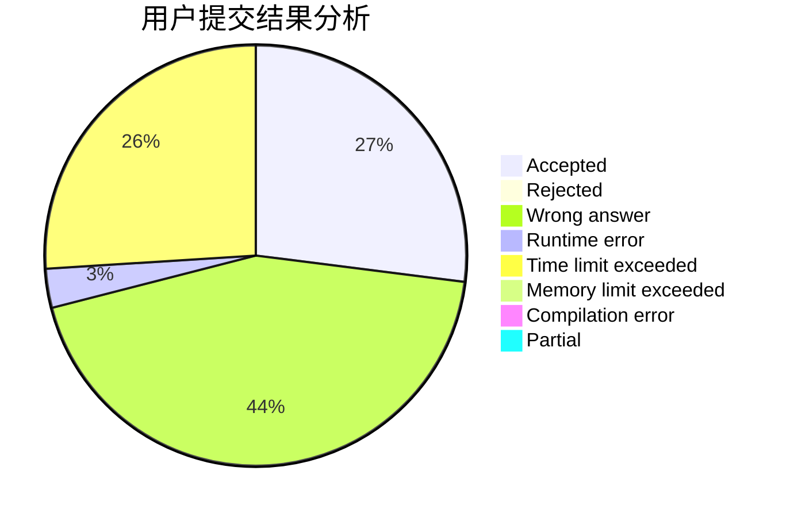
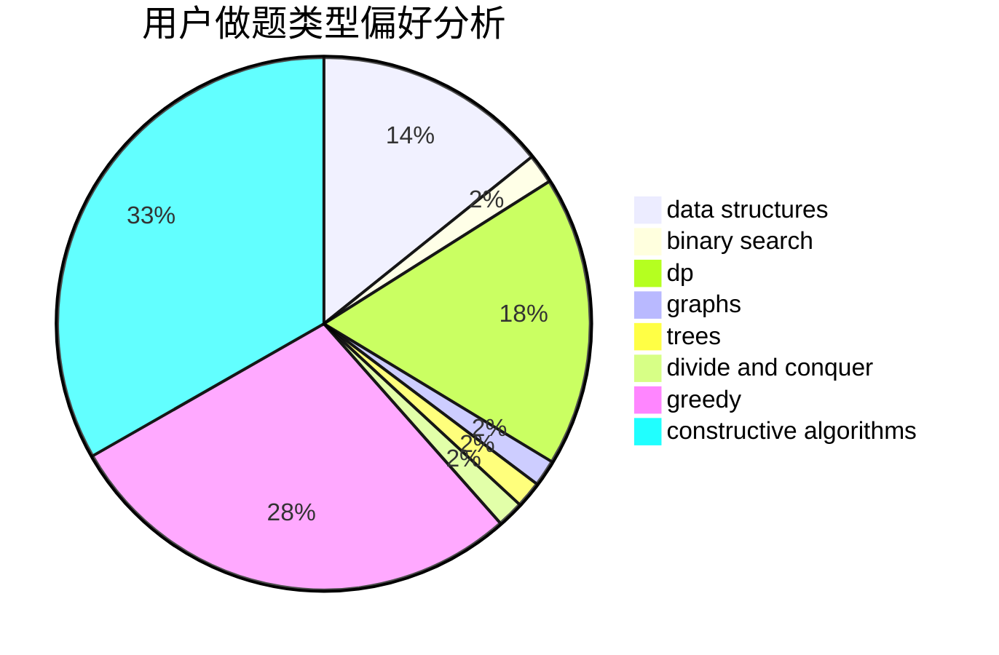

# chenkuowen

<!-- tabs:start -->

#### **用户提交结果分析**

#### **用户做题类型偏好分析**

#### **用户错题知识点分析**

<!-- tabs:end -->
# 推荐题目
[231C](https://codeforces.com/contest/231/problem/C)		binary search,
                        sortings,
                        two pointers		  
[864C](https://codeforces.com/contest/864/problem/C)		greedy,
                        implementation,
                        math		  
[1156A](https://codeforces.com/contest/1156/problem/A)		geometry		  
[1105D](https://codeforces.com/contest/1105/problem/D)		dfs and similar,
                        graphs,
                        implementation,
                        shortest paths		  
[1161B](https://codeforces.com/contest/1161/problem/B)		dsu,graphs,sortings,trees		  
[1092F](https://codeforces.com/contest/1092/problem/F)		dfs and similar,
                        dp,
                        trees		  
[681E](https://codeforces.com/contest/681/problem/E)		geometry,
                        sortings		  
[877F](https://codeforces.com/contest/877/problem/F)		data structures,
                        flows,
                        hashing		  
[790A](https://codeforces.com/contest/790/problem/A)		dsu,graphs,sortings,trees		  
[231A](https://codeforces.com/contest/231/problem/A)		brute force,
                        greedy		  
