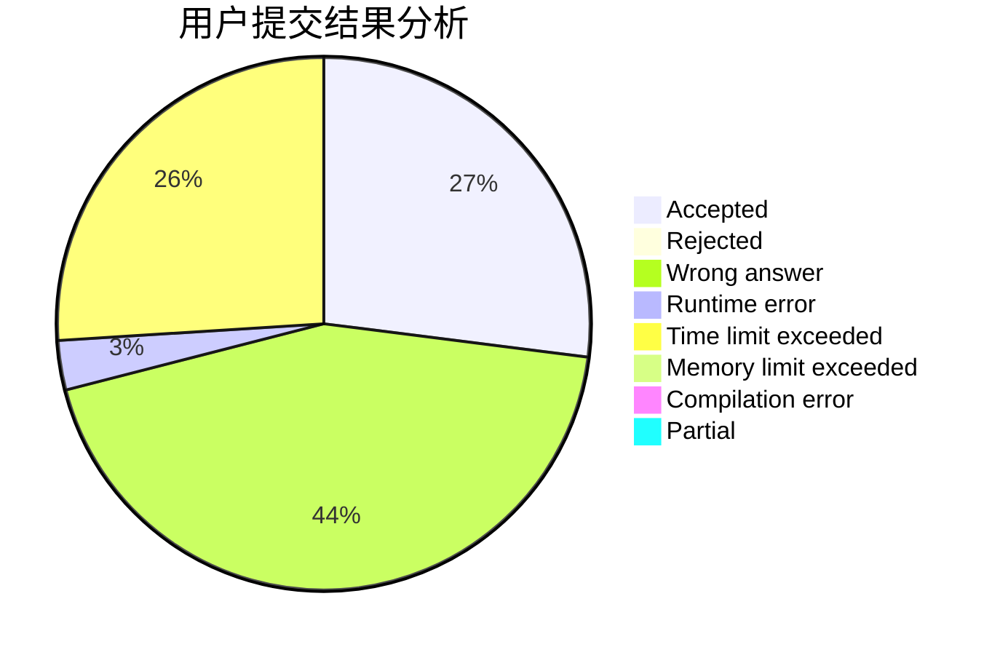
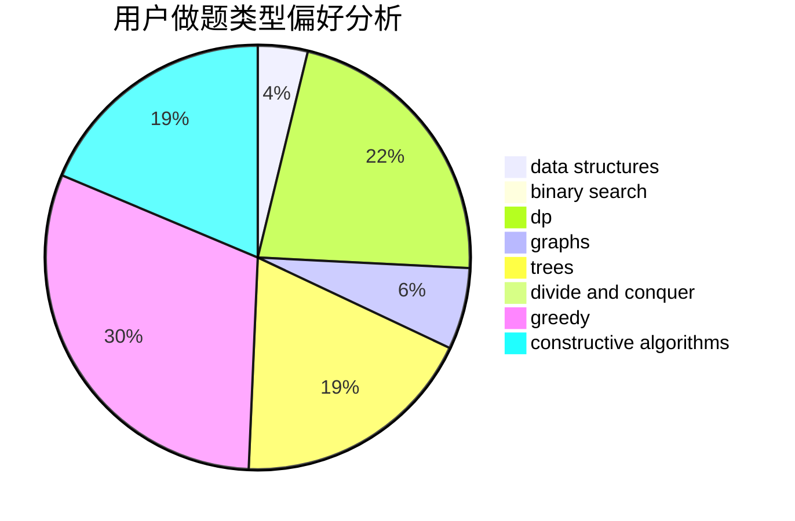

# chenkuowen

<!-- tabs:start -->

#### **用户提交结果分析**

#### **用户做题类型偏好分析**

#### **用户错题知识点分析**

<!-- tabs:end -->
# 推荐题目
[20A](https://codeforces.com/contest/20/problem/A)		implementation		  
[846A](https://codeforces.com/contest/846/problem/A)		brute force,
                        implementation		  
[1154A](https://codeforces.com/contest/1154/problem/A)		math		  
[1105A](https://codeforces.com/contest/1105/problem/A)		brute force,
                        implementation		  
[1158C](https://codeforces.com/contest/1158/problem/C)		constructive algorithms,
                        data structures,
                        dfs and similar,
                        graphs,
                        greedy,
                        math,
                        sortings		  
[1092D1](https://codeforces.com/contest/1092D/problem/1)		greedy,
                        implementation,
                        math		  
[660F](https://codeforces.com/contest/660/problem/F)		binary search,
                        data structures,
                        geometry,
                        ternary search		  
[85E](https://codeforces.com/contest/85/problem/E)		binary search,
                        dsu,
                        geometry,
                        graphs,
                        sortings		  
[770B](https://codeforces.com/contest/770/problem/B)		*special problem,
                        implementation,
                        math		  
[208E](https://codeforces.com/contest/208/problem/E)		binary search,
                        data structures,
                        dfs and similar,
                        trees		  
