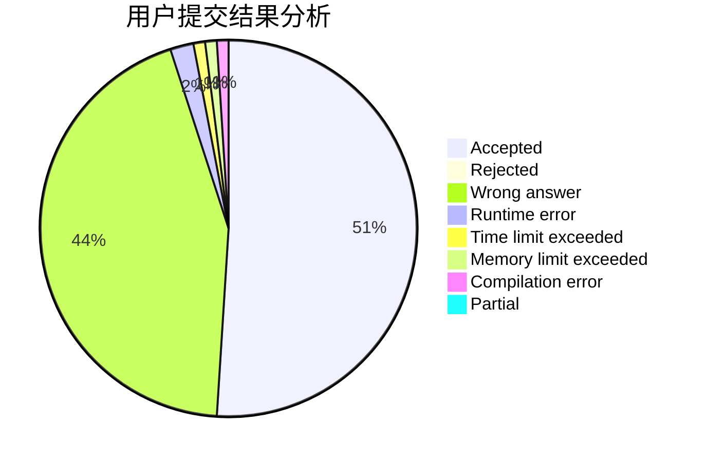
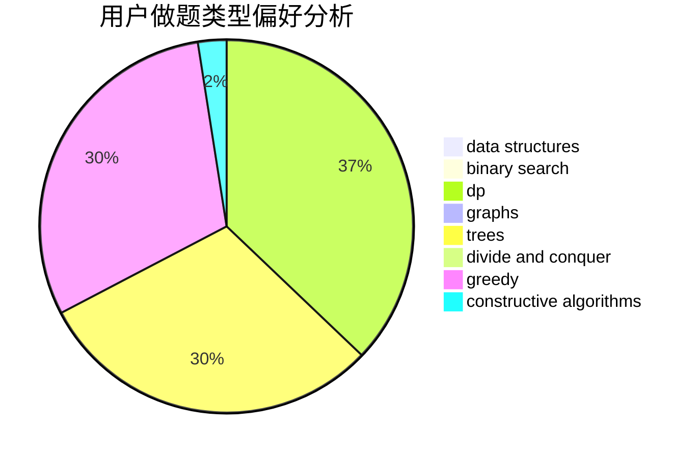
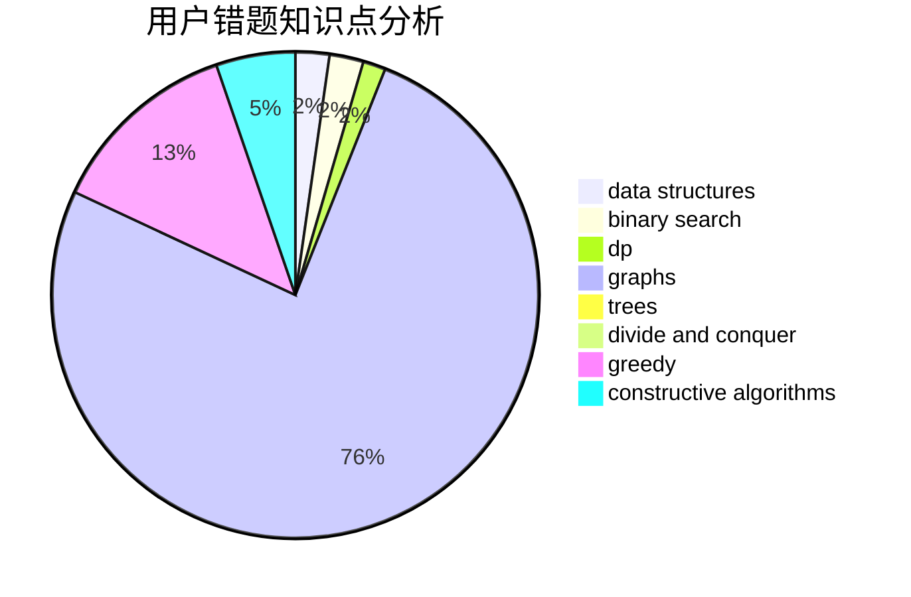

# Aphelios

<!-- tabs:start -->

#### **用户提交结果分析**

#### **用户做题类型偏好分析**

#### **用户错题知识点分析**

<!-- tabs:end -->
# 推荐题目
[380A](https://codeforces.com/contest/380/problem/A)		binary search,
                        brute force		  
[1060D](https://codeforces.com/contest/1060/problem/D)		greedy,
                        math		  
[380D](https://codeforces.com/contest/380/problem/D)		combinatorics,
                        math		  
[37D](https://codeforces.com/contest/37/problem/D)		combinatorics,
                        dp,
                        math		  
[380B](https://codeforces.com/contest/380/problem/B)		graphs,
                        implementation		  
[380C](https://codeforces.com/contest/380/problem/C)		data structures,
                        schedules		  
[1205B](https://codeforces.com/contest/1205/problem/B)		bitmasks,
                        brute force,
                        graphs,
                        shortest paths		  
[1064E](https://codeforces.com/contest/1064/problem/E)		dsu,graphs,sortings,trees		  
[1469E](https://codeforces.com/contest/1469/problem/E)		bitmasks,
                        brute force,
                        hashing,
                        string suffix structures,
                        strings,
                        two pointers		  
[1293D](https://codeforces.com/contest/1293/problem/D)		dsu,graphs,sortings,trees		  
