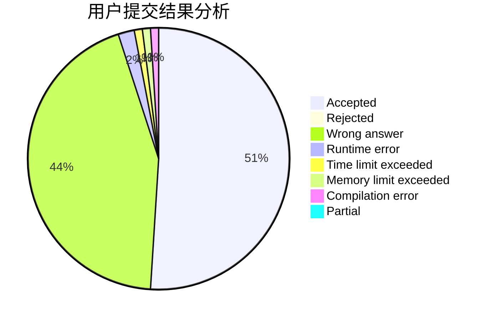
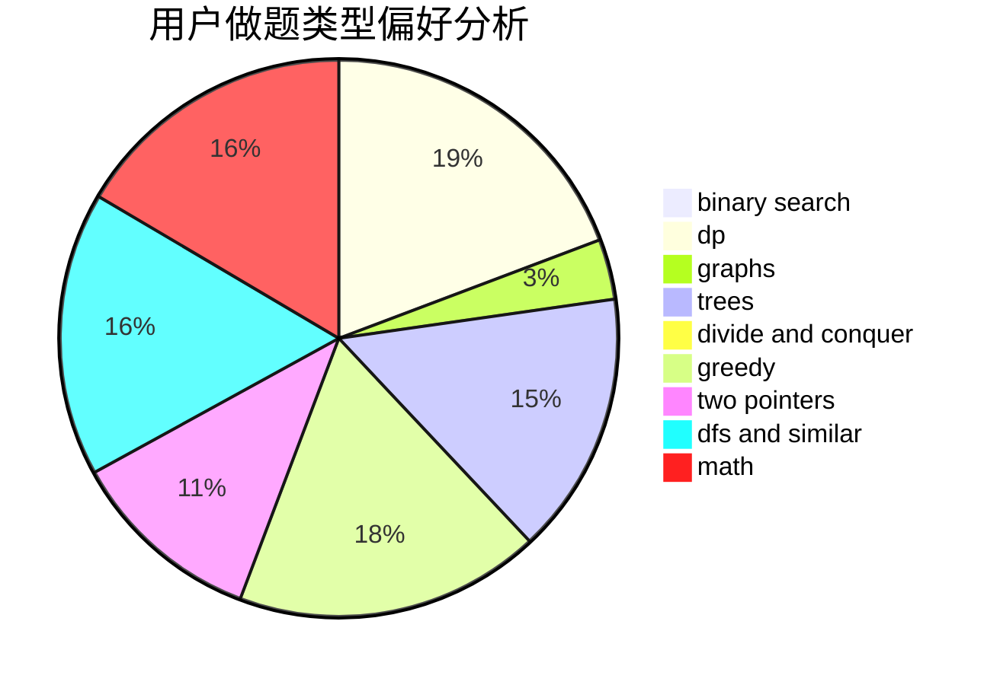

# Aphelios

<!-- tabs:start -->

#### **用户提交结果分析**

#### **用户做题类型偏好分析**

<!-- tabs:end -->
# 推荐题目
[380A](https://codeforces.com/contest/380/problem/A)
[1060D](https://codeforces.com/contest/1060/problem/D)
[380D](https://codeforces.com/contest/380/problem/D)
[37D](https://codeforces.com/contest/37/problem/D)
[380B](https://codeforces.com/contest/380/problem/B)
[380C](https://codeforces.com/contest/380/problem/C)
[1205B](https://codeforces.com/contest/1205/problem/B)
[1064E](https://codeforces.com/contest/1064/problem/E)
[1469E](https://codeforces.com/contest/1469/problem/E)
[1293D](https://codeforces.com/contest/1293/problem/D)
