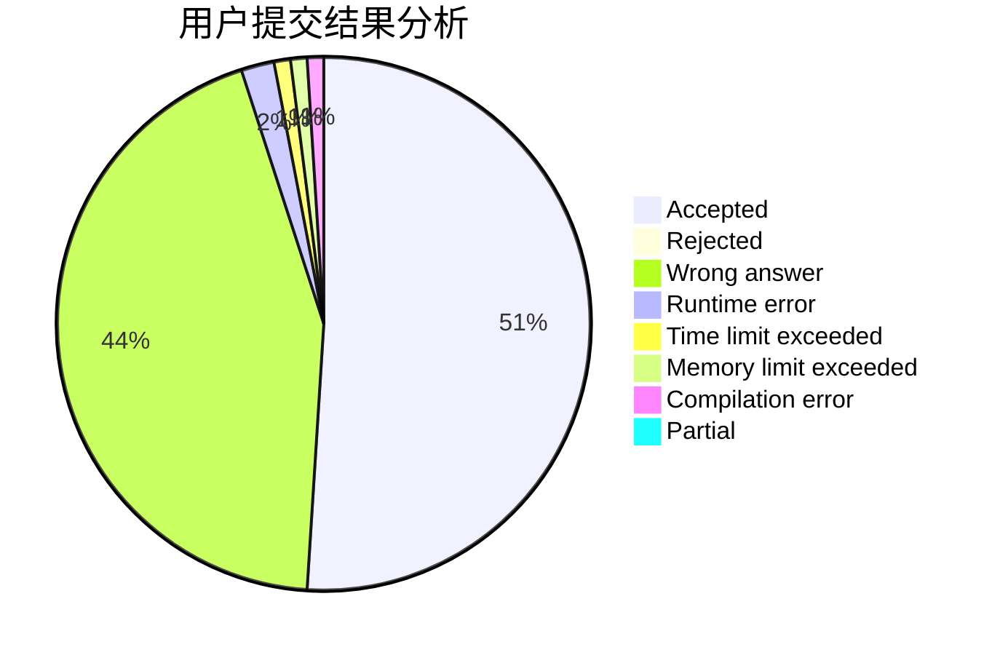
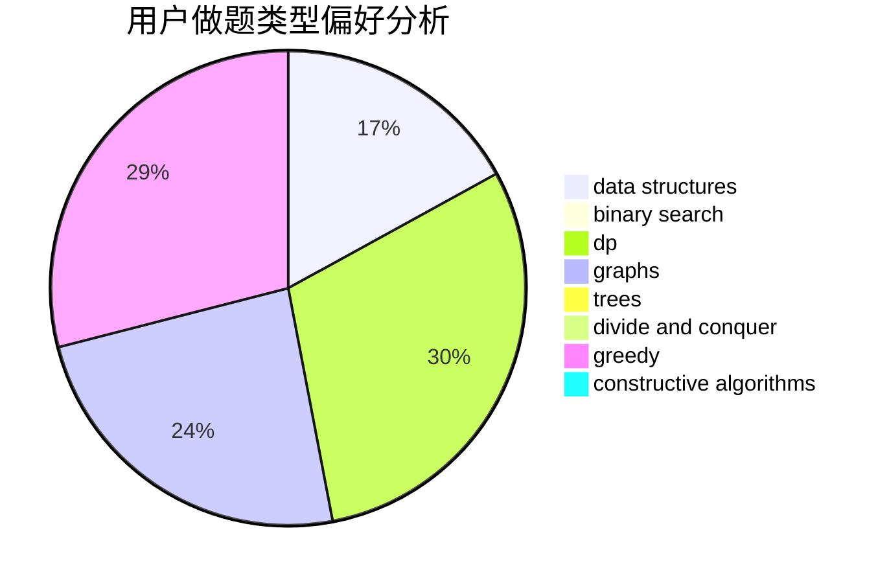
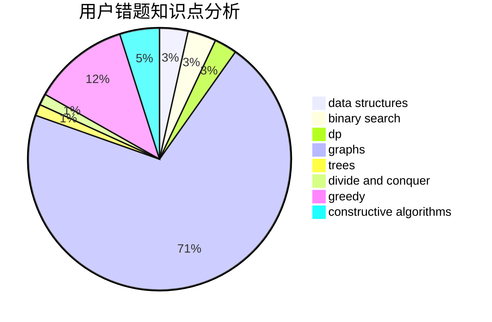

# Aphelios

<!-- tabs:start -->

#### **用户提交结果分析**

#### **用户做题类型偏好分析**

#### **用户错题知识点分析**

<!-- tabs:end -->
# 推荐题目
[354B](https://codeforces.com/contest/354/problem/B)		bitmasks,
                        dp,
                        games		  
[1060A](https://codeforces.com/contest/1060/problem/A)		brute force		  
[354E](https://codeforces.com/contest/354/problem/E)		constructive algorithms,
                        dfs and similar,
                        dp		  
[354A](https://codeforces.com/contest/354/problem/A)		brute force,
                        greedy,
                        math		  
[354C](https://codeforces.com/contest/354/problem/C)		brute force,
                        dp,
                        number theory		  
[354D](https://codeforces.com/contest/354/problem/D)		dp		  
[1200C](https://codeforces.com/contest/1200/problem/C)		math,
                        number theory		  
[1064B](https://codeforces.com/contest/1064/problem/B)		math		  
[1462C](https://codeforces.com/contest/1462/problem/C)		brute force,
                        greedy,
                        math		  
[1286C1](https://codeforces.com/contest/1286C/problem/1)		brute force,
                        constructive algorithms,
                        interactive,
                        math		  
