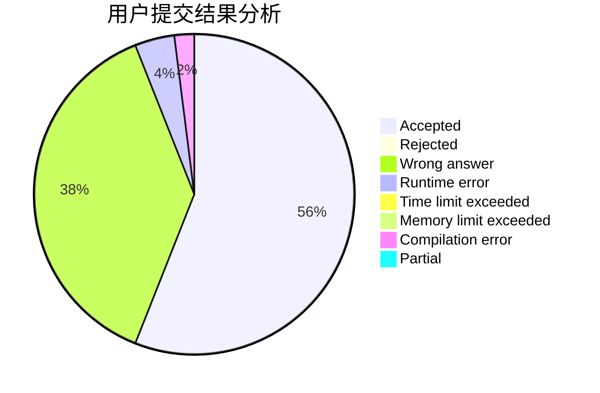
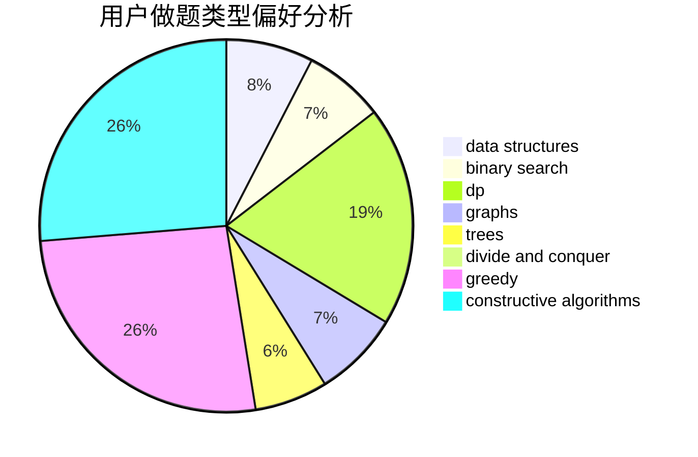
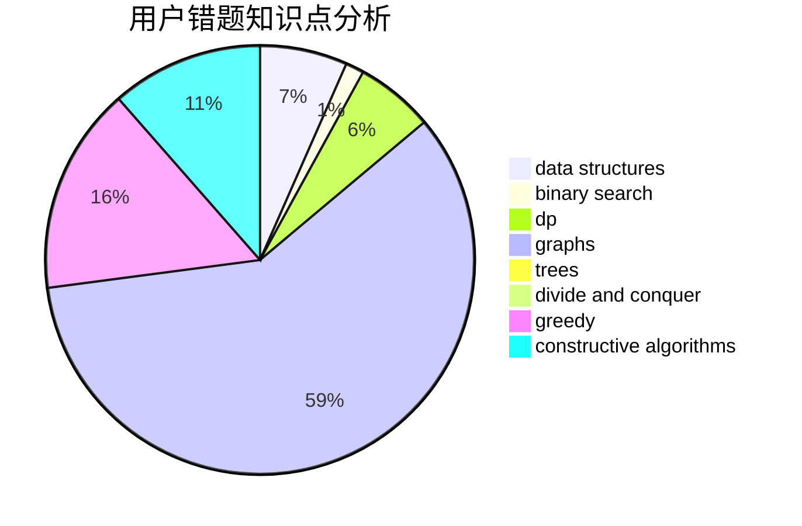

# chenquanwei

<!-- tabs:start -->

#### **用户提交结果分析**

#### **用户做题类型偏好分析**

#### **用户错题知识点分析**

<!-- tabs:end -->
# 推荐题目
[1089D](https://codeforces.com/contest/1089/problem/D)		graphs		  
[1285B](https://codeforces.com/contest/1285/problem/B)		dp,
                        greedy,
                        implementation		  
[339C](https://codeforces.com/contest/339/problem/C)		constructive algorithms,
                        dfs and similar,
                        dp,
                        graphs,
                        greedy,
                        shortest paths		  
[959C](https://codeforces.com/contest/959/problem/C)		constructive algorithms,
                        trees		  
[746G](https://codeforces.com/contest/746/problem/G)		constructive algorithms,
                        graphs,
                        trees		  
[923D](https://codeforces.com/contest/923/problem/D)		constructive algorithms,
                        implementation,
                        strings		  
[593D](https://codeforces.com/contest/593/problem/D)		data structures,
                        dfs and similar,
                        graphs,
                        math,
                        trees		  
[1285D](https://codeforces.com/contest/1285/problem/D)		bitmasks,
                        brute force,
                        dfs and similar,
                        divide and conquer,
                        dp,
                        greedy,
                        strings,
                        trees		  
[1033B](https://codeforces.com/contest/1033/problem/B)		math,
                        number theory		  
[612C](https://codeforces.com/contest/612/problem/C)		data structures,
                        expression parsing,
                        math		  
