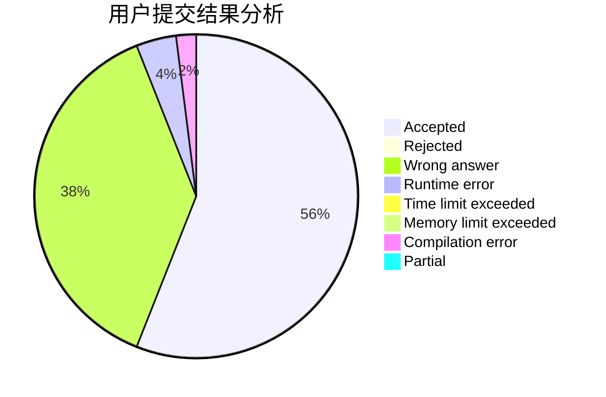
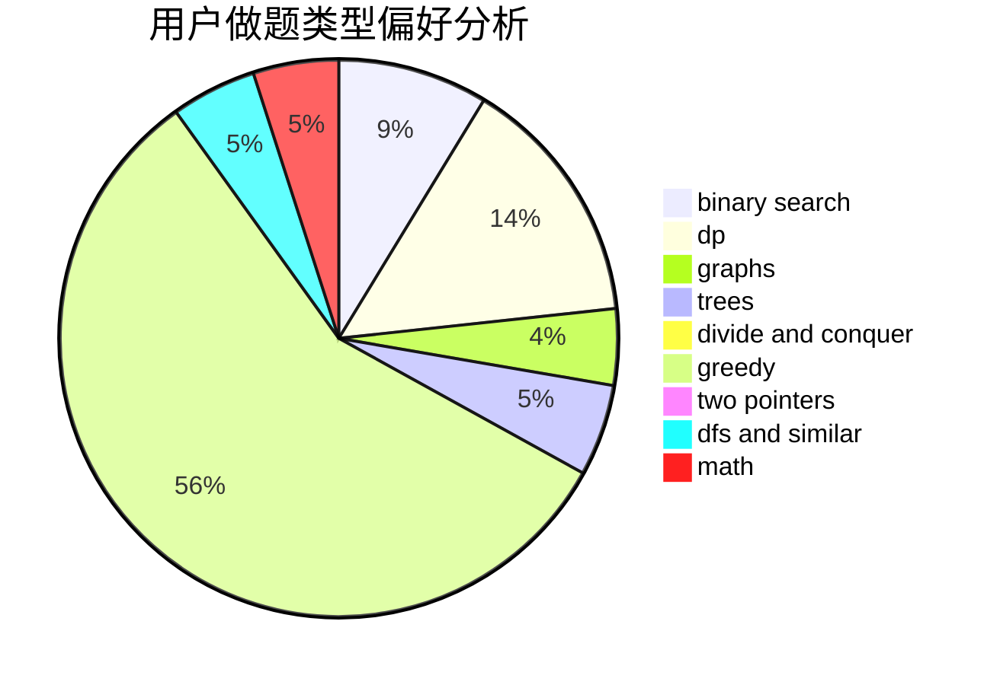

# chenquanwei

<!-- tabs:start -->

#### **用户提交结果分析**

#### **用户做题类型偏好分析**

<!-- tabs:end -->
# 推荐题目
[1089G](https://codeforces.com/contest/1089/problem/G)
[1292C](https://codeforces.com/contest/1292/problem/C)
[366C](https://codeforces.com/contest/366/problem/C)
[981B](https://codeforces.com/contest/981/problem/B)
[766C](https://codeforces.com/contest/766/problem/C)
[947B](https://codeforces.com/contest/947/problem/B)
[612A](https://codeforces.com/contest/612/problem/A)
[1292E](https://codeforces.com/contest/1292/problem/E)
[1033E](https://codeforces.com/contest/1033/problem/E)
[631E](https://codeforces.com/contest/631/problem/E)
