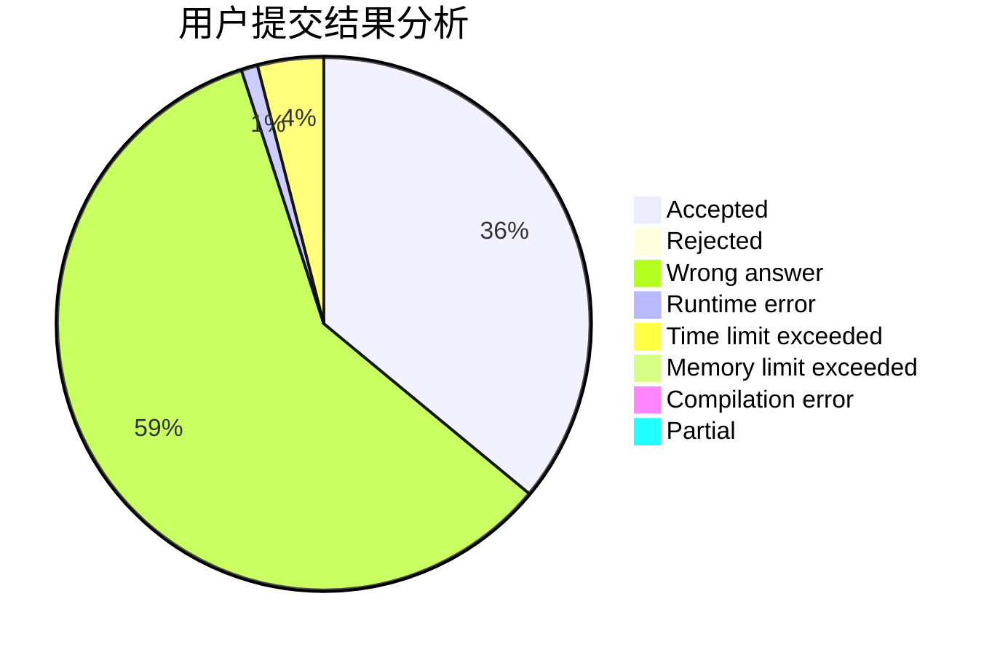
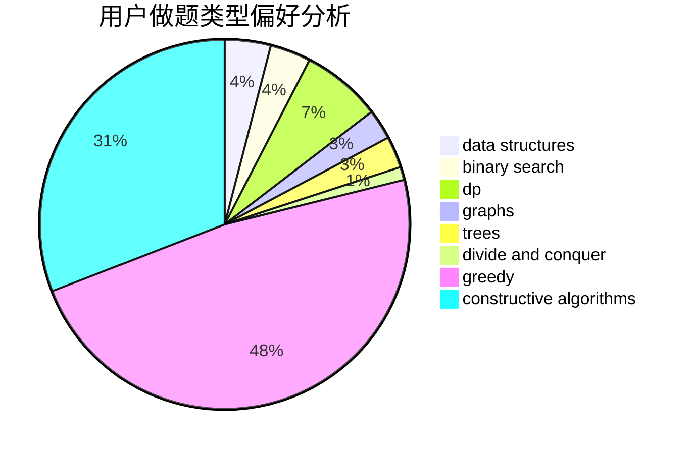
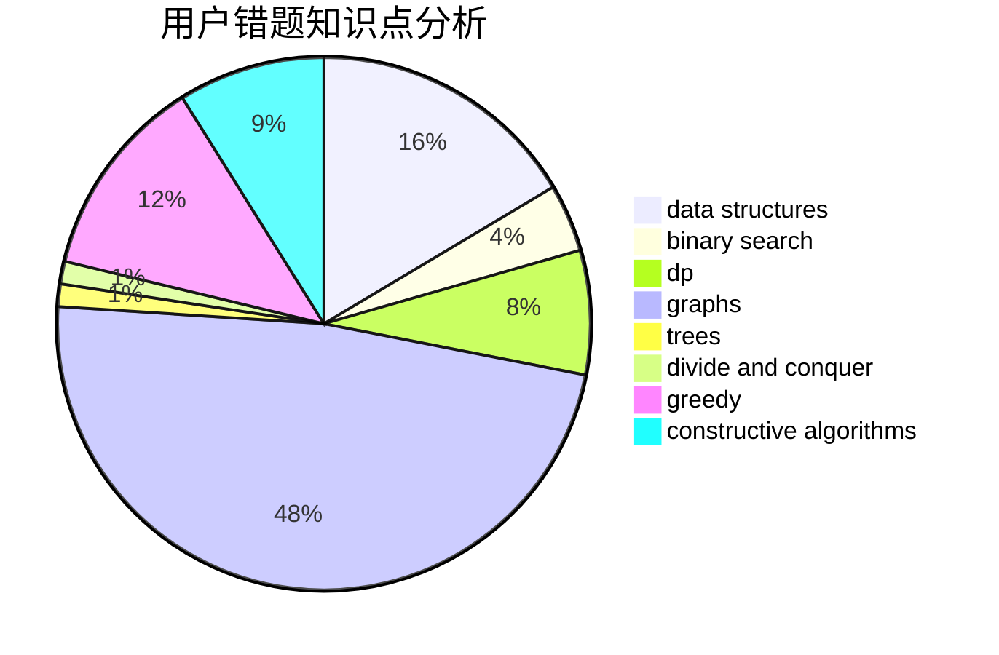

# chenshouao

<!-- tabs:start -->

#### **用户提交结果分析**

#### **用户做题类型偏好分析**

#### **用户错题知识点分析**

<!-- tabs:end -->
# 推荐题目
[1025D](https://codeforces.com/contest/1025/problem/D)		brute force,
                        dp,
                        math,
                        number theory,
                        trees		  
[923B](https://codeforces.com/contest/923/problem/B)		binary search,
                        data structures		  
[750H](https://codeforces.com/contest/750/problem/H)		dfs and similar,
                        dsu,
                        graphs,
                        interactive		  
[1184E3](https://codeforces.com/contest/1184E/problem/3)		data structures,
                        dsu,
                        graphs,
                        trees		  
[935F](https://codeforces.com/contest/935/problem/F)		data structures,
                        greedy		  
[402C](https://codeforces.com/contest/402/problem/C)		brute force,
                        constructive algorithms,
                        graphs		  
[762E](https://codeforces.com/contest/762/problem/E)		binary search,
                        data structures		  
[161C](https://codeforces.com/contest/161/problem/C)		divide and conquer		  
[979C](https://codeforces.com/contest/979/problem/C)		dfs and similar,
                        trees		  
[90E](https://codeforces.com/contest/90/problem/E)		dsu,graphs,sortings,trees		  
