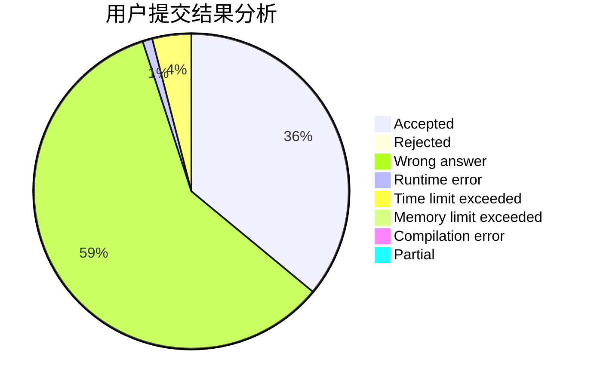
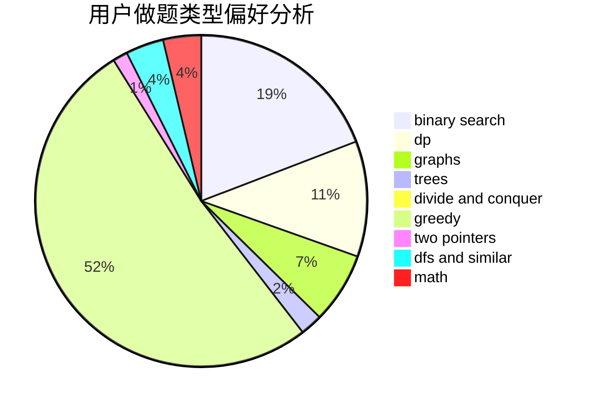

# chenshouao

<!-- tabs:start -->

#### **用户提交结果分析**

#### **用户做题类型偏好分析**

<!-- tabs:end -->
# 推荐题目
[1025G](https://codeforces.com/contest/1025/problem/G)
[946G](https://codeforces.com/contest/946/problem/G)
[771D](https://codeforces.com/contest/771/problem/D)
[1188E](https://codeforces.com/contest/1188/problem/E)
[957E](https://codeforces.com/contest/957/problem/E)
[430C](https://codeforces.com/contest/430/problem/C)
[781C](https://codeforces.com/contest/781/problem/C)
[187C](https://codeforces.com/contest/187/problem/C)
[993C](https://codeforces.com/contest/993/problem/C)
[924E](https://codeforces.com/contest/924/problem/E)
